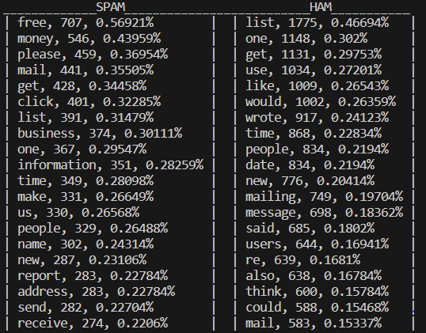
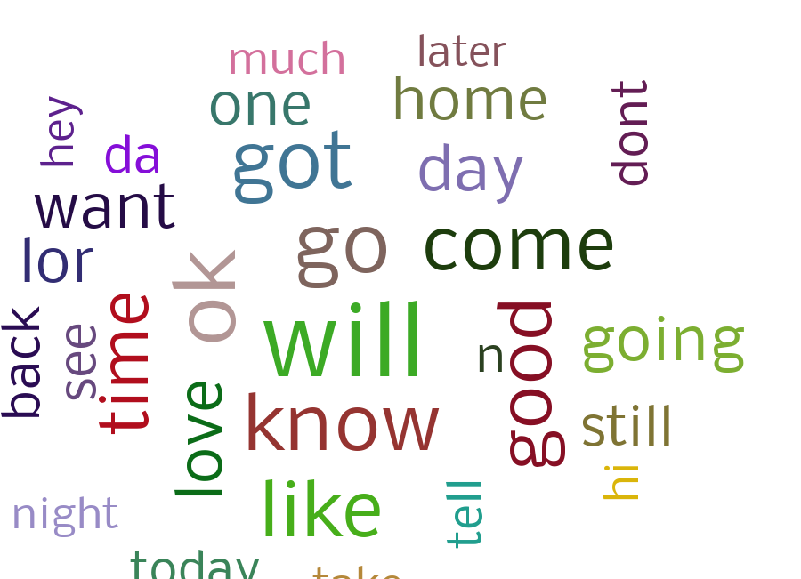
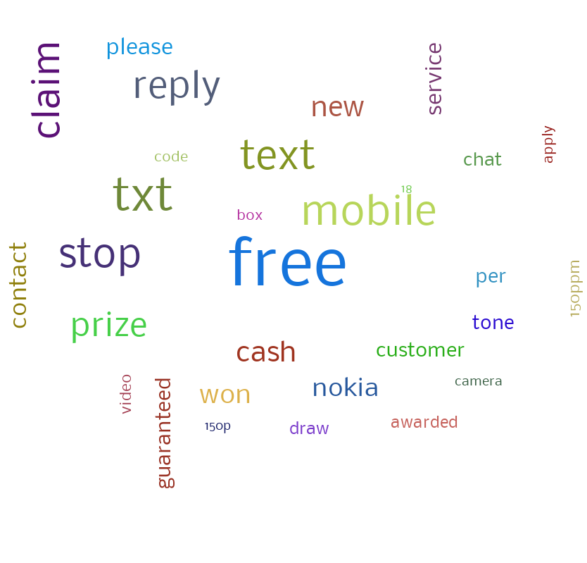
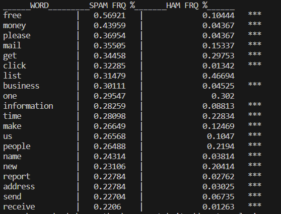

# Text-Analysis-Project
 
## Project Overview

This project was a lot of fun. When I was choosing an idea for my dataset, I thought back to an excercise I did in QTM2000, where we used a dataset of spam and non-spam emails and created a naive bayes model that classified a given email as either spam or non-spam. That was pretty fun, so I thought I might do something similar in a different setting. I got a dataset from Kaggle that included about 3000 emails (500 were marked spam and 2500 were marked "ham" or non-spam). The only cleaning I did outside of my initial data exploration script was deleting rows that included unusual characters and symbols that couldn't be read by the CSV module. I then used the CSV module to read the data and work it into 2 lists of word-frequency pairs - one for spam and one for ham. This took a good amount of processing power, especially when I had to validate each individual strippable as an English word using the words.txt file that we used in class. I decided to write my cleaned lists into a new CSV for efficiency so I could do further analysis. The goal for this project was to take a mess of emails and work it into a state where I took take a qualitative approach to understanding the differences between language in spam vs ham emails. I also learned valuable lessons in RAM usage, data processing, and module usage.

## Implementation
Right off the bat I knew I would need an external module to load the data in CSV form. I read the documentation of the csv module and was able to read the data without much trouble using the csv.reader method. I created 2 lists of emails with the content and whether or not they were spam. I filtered out non-words and non-English words, created a dictionary to get word frequencies, and then turned them back into a list of tuples to be sorted. With thousands of items per list, the cleaning script took around 6 or 7 minutes to run each time, mostly because of the word validation. I learned some good stuff from ChatGPT in this section, as I got a better idea of the csv.write method, and how RAM usage plays a factor in processing time and how to maximize performance. See [CSV Module and RAM Usage](https://chat.openai.com/share/c1ffe96f-97ad-472c-a3cd-5267049a1c07). I decided that instead of storing the data as a list, I would clean it up and then write the word-frequency pairs into a CSV. This way, I could section out my scripts. "data_exploration.py" is for cleaning, "cleaned_data_preprocessing.py" is for pre-processing, and "data_analysis.py" is where I drew my conclusions. 

For preprocessing, I reimported the cleaned data from the csv which saved loads of time, and I just subsetted the data to a minimum frequency, and omitted stopwords. I wanted to add frequency as a percentage of total word occurences, and while I initially read the data into a dictionary, I quickly realized that individual dictionary values are not mutable, so I chose to use a list of lists instead. I lastly wrote the data back into a final CSV for analysis.

## Results
I initially thought a little too big on the results part. I had spent so much time cleaning, processing, and subsetting the data that I was too eager to create some all-encompassing model that involved some complex module algorithm. I looked at some NLTK stuff and I figured that my data and results weren't all that suited for sentiment analysis or something similar. See [Analysis and Visualization Ideas](https://chat.openai.com/share/1e4493dd-551b-4d00-9aa2-946663980a3a) When I looked at the cleaned and processed data though, I saw that the answers were somewhat right in front of me. My goal at the beginning of the project was to turn the mess of emails into something interpretable, and when I looked at the top words in spam and ham after removing stopwords, the results were pretty surprising. Looking at the data before this state, there wasn't much difference between the two sets, and I felt like I hadn't really gotten anywhere with my project. But after removing stopwords, the top frequency words were significantly different between the sets and told a clear story.

Below is the results of the function "top_words_table()" from "data_analysis.py".

Words like "free", "money", "please", and "get" were at the top of the spam list but nowhere to be found in the top 20 words of ham. It became pretty clear that there are some big flag words that we can see for spam. I decided to make a wordcloud for each just to have a more static visualization that took into account scale using frequency. I did this using the wordcloud module as seen in "data_analysis.py". Below are the word clouds for spam and ham respectively.

Ham:

Spam:

I'm a big fan of word clouds and it's pretty clear there is a notable difference in keywords from spam vs ham. I got curious and decided to write a function that took the top spam words and found out where they were in the ham list. Below is the output for spam_words_match(). Note that the stars next to the row mean that the word occurs more frequently in spam emails than in ham emails.

While we knew that some words were flags, this makes it clear that certain words are bigger spam flags than others. For example, the frequency of "free" was about 5.6 times higher in spam emails than ham emails, but the frequency of "money" was more than 10 times higher in spam than in ham! The word "click" took the cake from the top 20, with a frequency nearly 25 times higher in spam. The only words in the spam top 20 that had a higher frequency in ham were "list" and the spelled-out number "one."

## Reflection

Overall this project went relatively smoothly. I was skeptical of the topic considering we had done text analysis excercises prior, but I felt like this project incorporated nearly every aspect we've learned in class from conditionals and iterations to modules and data structures. It felt great seeing an issue during data cleaning and thinking "Oh! I know what function I need to write to fix this." In terms of scope I think I chose a good project direction, although the size of my dataset might have been a bit large. I think my biggest weakness in the project was efficiency. I wrote about 17 functions for this project and the majority were related to cleaning and very bulky and ugly. I can imagine how hard it would be to explain some of these functions to someone who was unaware of the project. I think I handled errors well, but the time it took to run the first file halted my progress quite a bit as I was waiting minutes between each run to see the error or see if I had fixed it. ChatGPT, as always, was best for giving me ideas. The size and range of my dataset made me think I might need to standardize or normalize it, but I consulted ChatGPT, standardized the data in excel, and noticed that there was basically no change to the shape of the data, so I figured it wasn't worth doing in python anyways. See [Normalization vs Standardization](https://chat.openai.com/share/c4fc9e44-7864-4525-9530-9a9b1ba7b29a). 

As for what I learned and what I wish I knew, I'm absolutely in love with the CSV module. Excel and R are both some of my biggest strengths, and being able to marry them to python is undoubtedly useful for me professionally. I learned quite a bit about interpreting and handling errors, as well as chaining functions into eachother by returning the corresponding objects. If I did this beforehand, I would have starting subsetting the data much earlier into the process, or choosing a smaller dataset to cut down on processing load. I also went quite a while into this project before thinking to validate my dataset with "words.txt" or the NLTK stopword list. Those were really what turned my analysis from nothing to something. I also wish I had a more clear direction of what the steps of my project would have been before I got into it. I almost let the code drive the direction of my project rather than the other way around. I often have trouble coming up with ideas on how to move forward, so I just take it step by step and do the next thing that pops up. This meant that I spent a lot of time going back and modifying previous functions and files because I wasn't thinking far enough ahead. Overall I feel pretty good about my end result and it has certainly been one of the more engaging projects during my time here at Babson.
