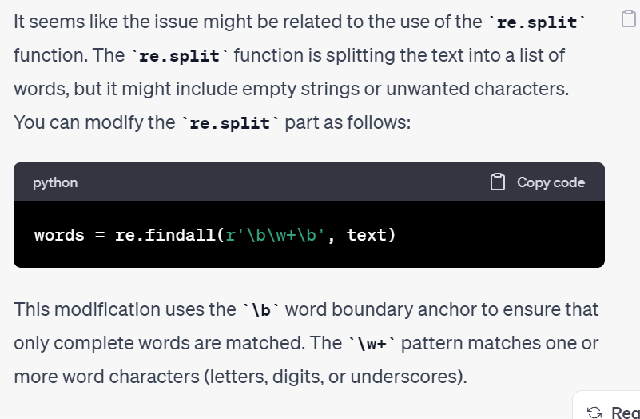
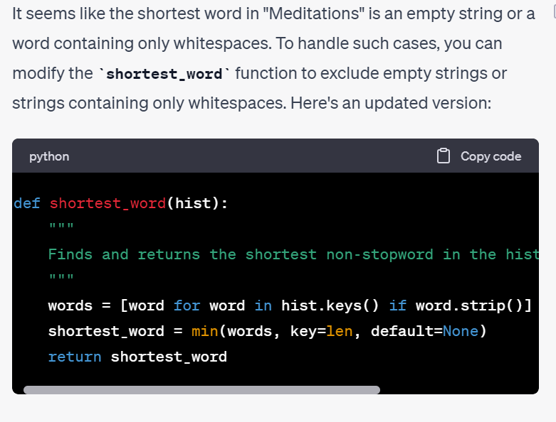
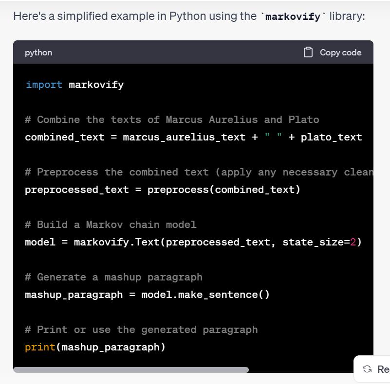

# Text-Analysis-Project

## Project Write Up

**1. Project Overview** (~1 paragraph)

*What data source(s) did you use? What technique(s) did you use to process or analyze them? What did you hope to create or learn through this project?*

For this project, I used two primary data sources: "The Republic" by Plato and "Mediations" by Marcus Aurelius which were both made available to me through Project Gutenbery. Orginally, I wanted to use the Reddit API to do sentiment analysis on the "Am I The Asshole" subreddit where people share personal conflicts they have been having and ask if they are in the wrong. Unfortunately, Reddit started making developers pay for their API as of this past summer, so I couldn't move forward with that. Instead, I browsed the top 100 most downloaded books on the Project Gutenberg website and saw that "The Republic" and "Meditations" were both on that list. I was vaguely familiar with both and knew they were very popular philosophy texts, so for the purpose of analysis, I thought they would be interesting to compare.

As for techniques, I used text processing, word frequency analysis, stopword removal, and Jaccard Similarity computations to gain insight into the lexical differences between to 2 famous texts. Additionally, my project dove into the intriguing realm of text synthesis using Markov chains to generate a unique paragraph blending the writing styles of both Plato and Marcus Aurelius. Overall with this assignment, my goal was to showcase a multifaceted approach to text analysis that provided both statistical insights and creative exploration of text generating techniques.

**2. Implementation** (~1-2 paragraphs)

*Describe your implementation at a system architecture level. You should NOT walk through your code line by line, or explain every function (we can get that from your docstrings). Instead, talk about the major components, algorithms, data structures and how they fit together. You should also discuss at least one design decision where you had to choose between multiple alternatives, and explain why you made the choice. Use shared links and/or screenshots to describe how you used ChatGPT to help you or learn new things.*
**Major Components**

**Text Processing**
The initial steps take the .txt file using the URL, reads it, and processes it for analysis. This involves removing non-essential characters, converting the words to lowercase and generating a frequency dictionary.

**Statistical Analysis**
Several different functions were used to run different tests on the books in order to compare them with one another. A crucial key at this step was removing stopwords for which I used the stopwords.txt file that we have used previously in class; this made it so that the analysis could focus on more meaningful and content-rich words. These functions included finding the length of the books, the longest/shortest words, the lexical difference, the most common words, etc.

**Jaccard Similarity**
Jaccard Similarity measures the lexical similarity between texts by comparing word sets. This is important because it captures the similarity of content without paying attention to the order of the words. This is especially important in the context of philosophical texts where the significance lies in shared concepts and ideas rather than the precise language matching.

**Markov Text Syntesis**
I combined the two texts using Markov Chains to generate a unique paragraph blending the writing styles/philosophical ideas of the two authors. Markov chains are a probabilistic model that predicts the likelihood of a word based on the previous word in a sequence. This method goes beyond mere statistical analysis and dives into a creative exploration to showcase a blend of both distinct voices (even though the paragraphs don't make much sense...haha).

**Design Decision**
I created this project in the order of topics I just described (processing first, then statistical analysis, jaccard similarity, and finally markov synthesis) which made it quite difficult when it came time to do Markov text synthesis and all stop words had been removed. To deal with this, I realized I had the choice of creating a copy of my original dictionary in my preprocessing function that I could use to keep the stopwords and save them for later analysis, or I could run my markov_paragraph function first before it goes through preprocesssing so it includes everything (including punctuation, spacers, etc). I chose to run my markov function at the beginning of the program before processing either text to give the generated text more authenticity and include punctation that the authors would use. The main downside in this decision is that the .txt files include everything before Project Gutenberg's stamps "THIS PROJECT STARTS HERE" & "THIS PROJECT ENDS HERE" which make up less than 0.1% of the .txt files but it is worth noting that they are included in the text synthesis.

**Chat GPT**

Here in my processing function I was attempting to use the re module for the first time and thought re.split would be adequate for splitting the text into different words, but it was not working properly. I plugged the line into ChatGPT and explained my goal for the function and it instead showed me to use re.findall and introduced me to the concept of using word boundaries so that only complete words are used. This became especially helpful because in 'The Republic' the author often uses colons between words which my previous function counter as one word (for example- because:this) was counted as one which ruined the results of my longest_word function.

Here I was having trouble because the shortest word for 'Meditations' was returning an empty string. I needed help figuring out how to proceed. Originally I put the entire thing in a for loop and had an if statement "if not " ":" but that did not work because (what I assume is) there were places in the book with more than one space. So instead of " " it would be "  "or "   " which is why I plugged in my line and explained what I wanted the function to perform.

For this function, I asked for an introduction to Markov Text Synthesis and how I could incorporate it into my project. It showed me the markovify module as well as some basic functions that were included in the package like like "markovify.Text", x.make_sentence(), and what state_size was. I learned a lot from this basic outline of how I could go about generating text. I used a similar line for combining my text and creating my model, but when it came time write the paragraph, I had it run in for loop with a maximum sentence length to keep it from getting to wordy.

**3. Results** (~2-3 paragraphs + figures/examples)

Present what you accomplished in your project:

- If you did some text analysis, what interesting things did you find? Graphs or other visualizations may be very useful here for showing your results.
**Text Analysis**
Most simply, 'The Republic' is almost 3 times the size of 'Meditations' with an over 145,000 word difference. The lexical difference, which is unique words divided by total words, is 10.53% for 'The Republic' and 17.53% for 'Meditations' which means that Marcus Aurelius uses a broader vocabulary than Plato does as he has more unique words present in his work. Also from analyzing frequencies, it is clear the time and geographic differences between the writings. Plato wrote 'The Republic' in ancient Athens around 380 BCE; it is also important to note that Plato was a professional philospher. Marcus Aurelius on the other hand was not a philosopher; he was the Roman Emperor between 161-180 CE and 'Meditations' was a personal writing that he never intended to be published. There is 500 years and many miles between the writing of these books which is made even more apparent with the word frequencies where included in 'Mediations' top 10 we see words like "thou", "thy", and "thee." Another interesting thing to note about the frequency of words, the term "man" is in the top 10 for both works. Finally, their Jaccardian similarity coefficient is 0.2865. The coefficient ranges from 0 to 1 where 0 is not at all similar and 1 is identical. Our score indicates moderate levels of similarity between the 2 sets, but still it is not very high so there are still significant differences.This was to be expected because 'The Republic' is a Socratic dialogue about the nature of justice, the ideal state, and the role of individuals within that state while 'Meditations' is a personal writing that reflects on Stoic philosophy, offering practical wisdom and guidance on how to navigate ones life's challenges with virute, resilience, and self-discipline. 

**Markov Text Synthesis Examples**
"As for example; My son, we were just now describing as perfect guardians. You mean the true way of life. In the first step is taken up with difficulty by no means impresses the reader further reminded of the state, is also called truth and certainty of numbers, when thus disengaged from the sun? Those creatures that are capable of sharing either wholly or partially in the circumstances of his power, he immediately becomes unjust as not even to let off? What Socrates answered unto Perdiccas, why he should get another too much of human things? I replied; but still remaining to us as being good in a confused chaos, and the best men in the Hernican dialect for the common view of these classes does temperance belong? Both the brothers touch upon the manifold changes and mutations of one class is reflected on the side of a Corinthian girl as his like and unlike? We are told of them."

"Yet if he opposes him? He can hardly be. Like a bad speaker, therefore, I said, our guardians are to stand up and down among the three classes in the same name, had been put to, by reason of the extraordinary length of your sin? Either all things should pity us and dispute our statement, can we administer any soothing cordial or advice to him, to whom you will understand my original meaning in what way good or bad habits. At Antiochia the soldiers had been stirred by adverse circumstances to such and such things, wherein the conceit, and opinion! Induce her not to live, but thou shalt find but the play itself were at excessive charges. Certainly; they will bring the result that the higher of the city either the knowing is wise? But if a man who is the more strange and newfangled names to diseases."

"Suppose that a warrior into that which is of any sense will not be perfectly good and the embroiderer will have many wants, and many an army of his. That will be out of love has been inherited by many philosophers after so much that which thou sayest is true of most, if not more, beautiful. Thus, we do not put itself in the hymeneals shall be by eradicating jealousy. Now imagine that the votaries of the Republic, and were to look to their natural constitution, subject to alteration; and then trace their combinations in life and virtue! But he may sometimes command what is that thy nature, as matters of life—rules of deportment or fashions of dress. And can any one is sure to have both these propositions, he further illustrates by the general constitution of man, is divided from another point in the argument, owing to the point. Her immortality is demonstrated by the intimation to which to look down, and heap together in her need would be smooth and heavenly. The little matter of our bodies so many only, as reason in that."

**4. Reflection** (~1-2 paragraphs)

*From a process point of view, what went well? What could you improve? Was your project appropriately scoped? Did you have a good testing plan?*

I think overall the project was successful. I originally wasn't sure if I was going to be able to get to the Markov Text Synthesis, so I'm happy I took the time to figure that out although the output doesn't make a ton of sense. This I know is because my training set is so small (only 2 texts with a state size of 2 words). It makes me think an interesting future project would involve combining all philosophical texts from a certain time period and using them to train our model and see what the output would be. In terms of improvement, I think I could do some more structural analysis (ie: how long are sentences on average, how many paragraphs) to note more about writing style. Possibly also some sentiment analysis, even though I assume both would come accross as rather neutal, I think it would be interesting to see. I think I appropriately scoped this project; I started last Tuesday on 10/31 and have allowed myself a proper amount of time to get it done. I think my testing plan also worked well; I would usually run the code or include a print statement every few lines. The only struggle I had with testing was my original code for my markov_paragraph function would take around 3-4 minutes to go through the entirety of the combined text which required me to do a lot of waiting around in order to properly debug it.

*From a learning perspective, mention what you learned through this project, how ChatGPT helped you, and how you'll use what you learned going forward. What do you wish you knew beforehand that would have helped you succeed?*

I think I finally have a strong handle of dictionaries and other data structures. For this project alone, I had to use dicts, lists, tuples, and even learn about sets for it to be successful. This helped refresh me on what their purposes are and what they are each capable of. ChatGPT was exceptionally helpful with idea generation and debugging. When I originally was designing my project plan I kept asking Chat for different ideas and whether what I wanted to do was feasible or not. It was what suggested calculating the Jaccardian Similarity Coefficient because before this project I had never heard of it. It was also a helpful teacher for newer concepts like using the markovify module which I also hadn't heard of before this project. Going forward, I know I'll better be able to apply my knowledge of data structures onto different projects. I also think going forward I'll be more open to using ChatGPT for idea generation in the project design phase because I found it very helpful for suggesting forms of analysis I had never even heard of. I don't think I needed to know anything beforehand past what we've already learned solely because I enjoyed the challenge of teaching myself and encountering new problems. The only thing I wish I had known was that the Reddit API was inaccessible for free (unless you wait 8-12 weeks) because I spent 1.5 hours planning my original project around that, but I definetely should have checked if the API was available before I started.