# Text-Analysis-Project
 
## Project Overview

For this project, I used a [Kaggle dataset](https://www.kaggle.com/datasets/uciml/sms-spam-collection-dataset?resource=download) with thousands of spam and ham (non-spam) SMS messages. I decided to use SMS messages instead of spam emails due to the seemingly increased prevalence of SMS spam messages and decreased prevalence of spam emails (which is likely due to the increased effectiveness of spam email detectors). To analyze these spam (and ham) messages, I examined the most common words that appear in spam vs. ham messages, conducted sentiment analysis, and generated new spam (and ham) messages using Markov analysis. In addition to creating various visualizations of the data, my goal of this project was to answer three questions: (1) What are some common words that would suggest that a message is spam? (2) Do spam messages tend to be more optimistic overall yet more extreme (either very positive or negative)? (3) How good is AI at generating fake spam messages?

## Implementation

There are four major components of the spam analysis project, which include data processing and the three data analysis models (common words, sentiment analysis, and Markov analysis). Instead of putting all components into one `.py` file, I decided to dedicate one `.py` file to each component and one entry `.py`. Doing so enables the user to get the summary statistics/graphs for all models (via the entry `.py` file `main_app.py`) in addition to examining additional statistics/graphs for each model and generate additional example output (which is particularly interesting for the Markov analysis) as desired. In terms of the algorithm, the data processing component transforms the data into various data structures (dictionaries/histograms, lists, and strings), which are then inputted into the various data analytics functions (`most_common_words`, `top_unique_words`, `sentiment_analysis`, `sentiment_analysis_averages`, `markov_analysis`), and the outputs of these functions are, if relevant, inputted into the visualization functions (`bar_chart_word_freq`, `word_cloud`, `bar_chart_sentiment_analysis`, `combined_bar_chart`). Since, for a set of related functions, the output data type of the preceding function is the input data type of the following function, the data flows relatively easily from source to destination. This usability aspect is why I did some data structure transformations inside the function (as opposed to optimizing the input and output data type for each individual function) to more effectively link each function together. 

In terms of ChatGPT, I used this resource to learn new methods to input data (import CSV as a dictionary), transform data into different data structures (list of tuples into two lists), analyze data with different libraries (`markovify` for markov analysis), and visualize data with different libraries (`pytagcloud` and `IPython` for word cloud,  `matplotlib` for bar graph). I also used ChatGPT to resolve errors (needing to install packages). Example screenshots are shown below:

*After asking ChatGPT how to generate a word cloud, ChatGPT suggested using the “wordcloud” library. However, since the library requires Microsoft Visual C++ 14.0 or greater, I asked ChatGPT for some other suggestions.*
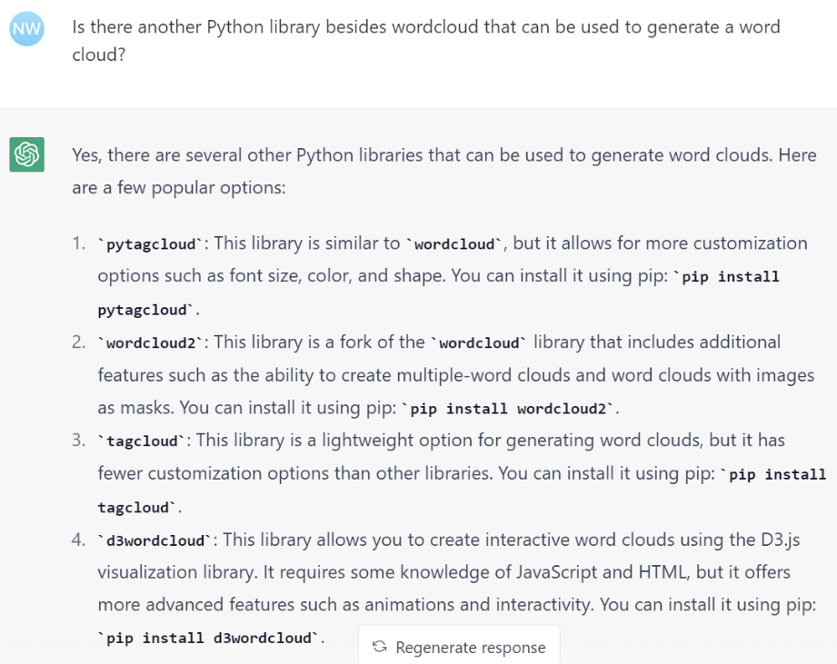
*The “pytagcloud” library looked like a promising choice, and since my intended parameter for my word cloud function is a list of (word, frequency) tuples, I asked ChatGPT the following:*
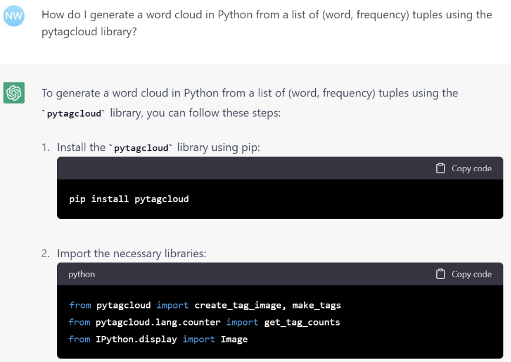
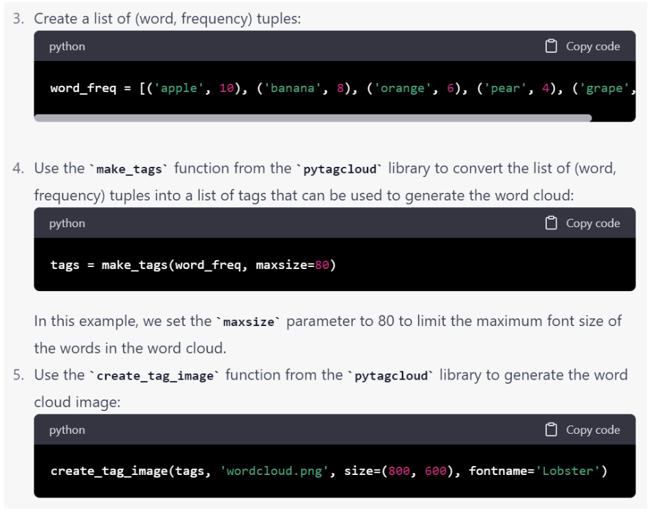
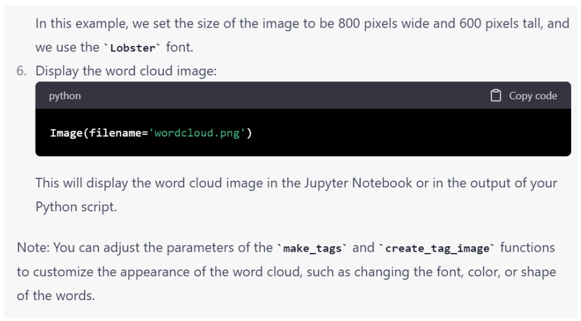
*I did not recognize the IPython library and was unable to import it, so I asked ChatGPT the following questions:*
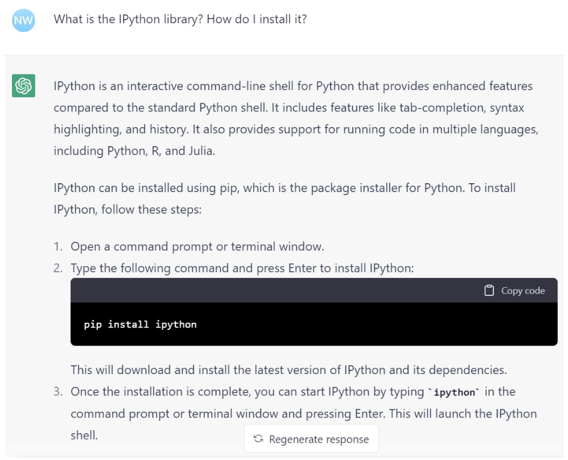
*I got a “ModuleNotFound” after running the code, so I asked ChatGPT how to fix it:*
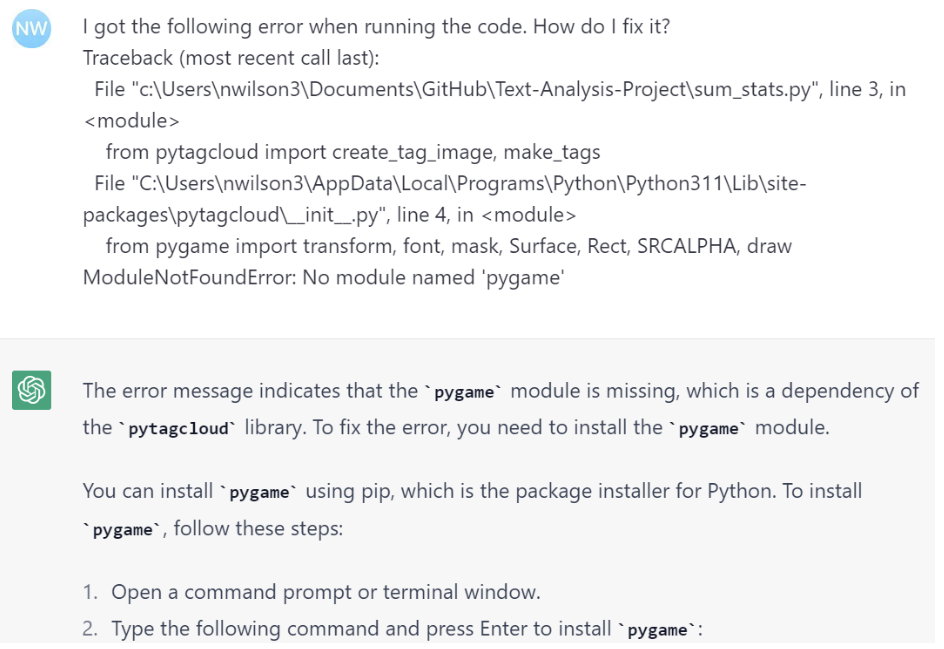
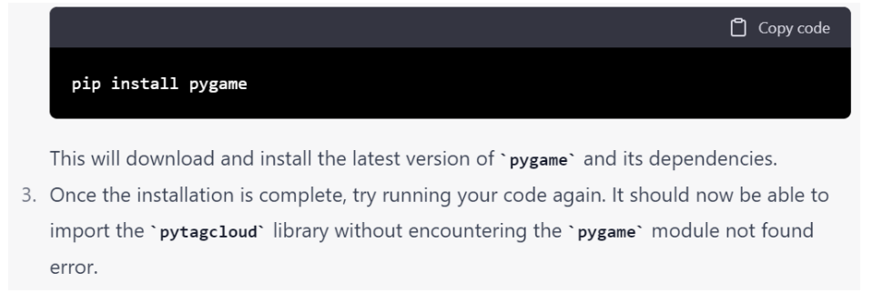
*After encountering similar errors and installing simplejson, the word cloud was generated successfully.*

## Results

### Common Words

For the most common words analysis, I found the 10 top words that appear in spam messages but not in ham (non-spam) messages (at least according to the dataset). From this we can infer that, if a message has any of these words, it is likely a spam message. Conversely, I also found the 10 top words that appear in ham messages but not in spam messages (at least according to the dataset). From this we can infer that, if a message has any of these words, it is likely not a spam message. Bar graphs with the two sets of words are shown below, in addition to word clouds with the top 30 words (that appear in spam messages but not in ham messages and vice versa; shown on the left and right respectively). 
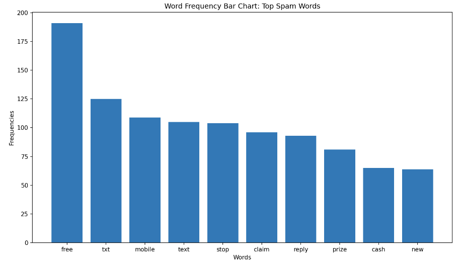
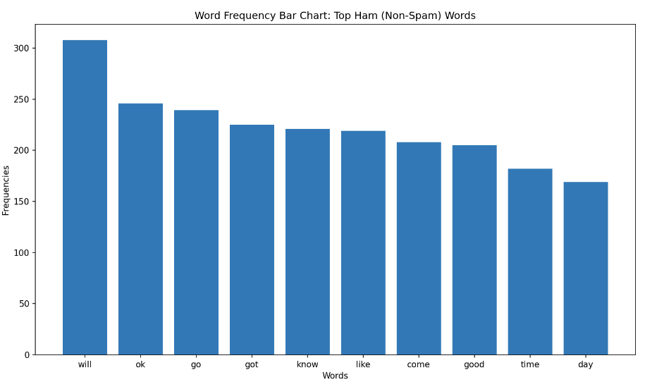
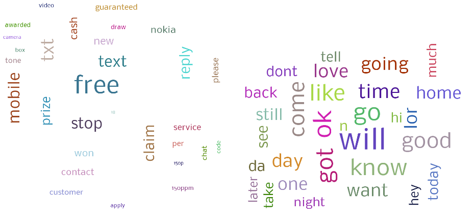

### Sentiment Analysis

For the sentiment analysis, as expected, I discovered that spam messages tend to be more optimistic overall (as indicated by the higher average sentiment for spam, shown in the graph as *S Avg.*). Furthermore, spam messages tend to be more dramatic than ham, meaning that the positive messages tend to be more positive (as indicated by the higher average sentiment for spam with positive sentiment, shown in the graph as *S Avg. Pos.*), and the negative messages tend to be more negative (as indicated by the lower, more negative average sentiment for spam with negative sentiment, shown in the graph as *S Avg. Neg.*). The bar chart with the average sentiment values for spam and ham is shown below:
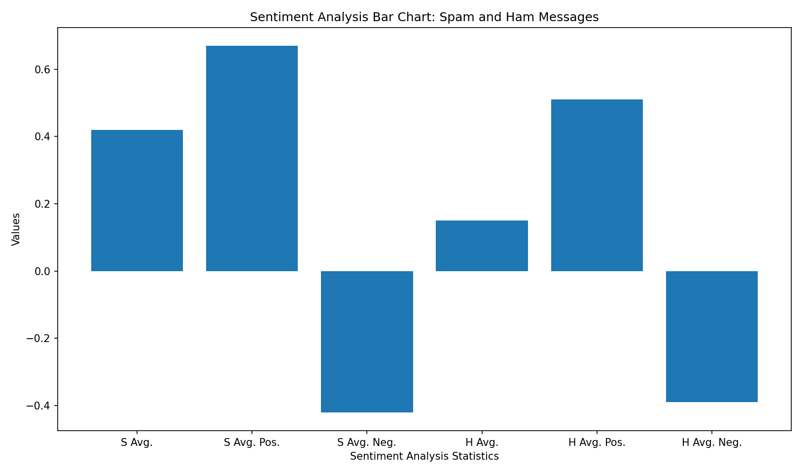

### Markov Analysis

Finally, I conducted Markov analysis to generate spam and ham messages. The accuracy of the output seems to vary, with some messages more realistic than others. Five example outputs for spam and ham are shown below:

**Spam messages**
1. 1 year special cinema pass for 2 is yours. call 09061744553 now! videochat wid your mates, play java games Dload polyH music, noline rentl.
2. 2End send STOP to 87070.
3. Your mobile number *************** WON a guaranteed �1000 cash or a �500 prize!
4. Nyt.EC2A.3LP.msg@150p Knock Knock Txt whose there to 80082 Your unique user ID is 1172.
5. Get a brand new mobile music service is now in the next 24hrs.

**Ham messages**
1. FRAN I DECIDED 2 GO BAK 2 COLLEGE!
2. How are you up to eyes in philosophy Ok lor.
3. I'm nervous because of course now he may have to leave the house.
4. Uhhhhrmm isnt having tb test bad when youre sick But i oso sian tmr haf 2 meet lect…
5. What are you going to the mail box Your dad is back in the + sign, choose my number and decided to keep in mind Aah bless!

## Reflection

From a process perspective, I felt that I was able to effectively plan and execute on the types of analysis and visualization methods that I had in mind. In terms of improvement, although the planning stage was important, I think that I should have moved onto the coding stage earlier to leave more time to address mistakes that I did not anticipate in the planning stage. I do feel that my project was appropriately scoped with the right level of breadth and depth, and I had a decent testing plan (made sure that each function and each section of the function was working properly before starting to code other functions that relied on the output of that function).

From a learning perspective, I learned different ways of importing and transforming data into different types, as well as new data text analysis techniques and packages to use for those techniques in addition to visualization methods. ChatGPT helped me do all of that in addition to resolving occasional errors. As someone who is concentrating in Business Analytics and Quantitative Methods and is working towards becoming a business analyst, I will be on the lookout for opportunities to use these techniques in future classes and in my career. In terms of things I wish I knew beforehand that would have helped me succeed, a few things come to mind: (1) Planning data processing steps often takes longer than expected (2) Sometimes there are problems with the dataset that one only discovers after running models (3) It takes a while for the functions to load when there are thousands of data points.