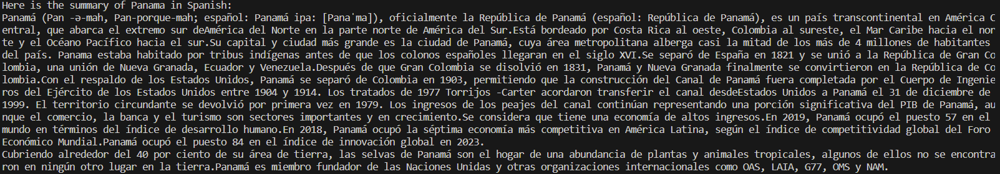
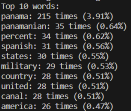
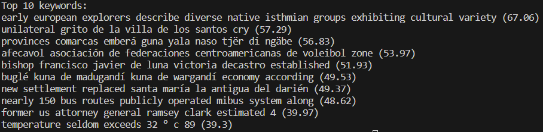

# Text Analysis Project

## Project Overview
For this project, I used a combination of data sources and natural language processing techniques to perform text analysis on a Wikipedia page. I decided to choose the Wikipedia page of Panama, my home country. The primary goal was to extract useful information from the wWikipedia page about "Panama" and analyze the text. I used various libraries, including **nltk, googletrans, and rake_nltk** to analyze the text and **mediawiki** to extract the Wikipedia page. I decided to choose the Wikipedia page for Panama because I am curious to see the different analysis that I can do to the page, and what are the outcomes. The project aimed to achieve three main objectives: translate the page summary to spanish, identify the top 10 words on the page (excluding stopwords and special characters), and extract the top keywords from the page.

## Implementation
In this project, three major components played pivotal roles. Firstly, the utilization of the MediaWiki API to access Wikipedia's "Panama" page content provided an efficient alternative to direct webpage scraping. Additionally, the Natural Language Toolkit (NLTK) was instrumental in various natural language processing tasks, including text tokenization, stopwords removal, and keyword extraction using the Rake algorithm. Lastly, the Google Translate API, facilitated by the googletrans package, seamlessly translated the summary to Spanish, eliminating the need for building a translation system from scratch.

Several key algorithms were applied for text analysis. Word Frequency Analysis involved tokenization, filtering of stopwords, numbers, and punctuation, and the use of the Counter to identify the top 10 most frequent words, shedding light on the primary topics covered. The Rake Keyword Extraction algorithm efficiently extracted keywords and key phrases based on word frequency and co-occurrence, generating the top 10 ranked keywords from the page. Various data structures, such as a Set for Stopwords, Counter for Word Frequencies, and List for Clean Tokens, were employed to streamline data handling and analysis.

The decision to leverage the MediaWiki and Google Translate APIs rather than developing scraping and translation systems from scratch simplified the code by utilizing robust existing packages. However, it necessitates reliance on external service availability and usage limits. Throughout the project, ChatGPT proved invaluable in providing coding assistance, helping to troubleshoot issues, and offering guidance on how to tackle various tasks, enhancing the overall development process.

Here is an example on a way that I used ChatGPT:
- I asked ChatGPT 'How to print the top 10 words in python with rake_nltk' and this was its response:
    

## Results
The text analysis provided several interesting insights about the Wikipedia page for Panama. The summary of Panama in spanish allowed non-English speackers to access essential information about the country and will try to let readers understand and see the official language of Panama. The top words on the Panama page included *panama (215 times), panamanian (35 times) and percent (34 times)*. And the top keywords included significant fraces that are critical aspects of Panama's history and geography.
The project demostrated the value of automated text analysis in extracting key information and enabling language translation, benefiting individuals who seek information in different languages.

Here are some specific expamples of my result:
1. Panama's summary in spanish:
    

2. Top 10 words:
   This are the top 10 words seen in the Wikipedia page of Panama. You will see the words, followed by the number of times the word appears and the percentage overall.

    

3. Top 10 keywords:
    The top 10 keywords are key phrases in the Wikipedia page of Panama extracted by analyzing the frequency of word appearenaces and its co-occurance with other words in the text. You will see the phrase followed by its score, ranked from highest to lowest.
    
    

## Reflection
This project provided valuable insights into extracting text from an API, analyzing that text and natural language processing. It showed me the power and availability of Python libraries inprocessing and analyzing text data. However, I faced many challenges such as ensuring that the libraries where imported correctly, the data sources were okay, and debugging issues with NLTK stopwords and tokenization. One thing that went well was taking time upfront to plan out the logical steps and component libraries I would need to use. Breaking the project down into discrete parts like getting the text, cleaning it, analyzing it, etc. made it more manageable.

From a learning perspective, this project gave me good practice with real-world NLP techniques like tokenization, stopword removal, and keyword extraction. I also got exposure to new libraries like MediaWiki, NLTK, rake_nltk and googletrans. ChatGPT was very helpful in recommending relevant libraries and providing examples for things like text cleaning and keyword extraction. This definitely sped up my development process. ChatGPT also helped me when I wanted to do something and didn't know how; it gave me helpfull advice. 

Going forward, I wish I had known more about the available NLP libraries in Python. I could have explored more options or done with the tools. But overall it was great hands-on learning experience.

