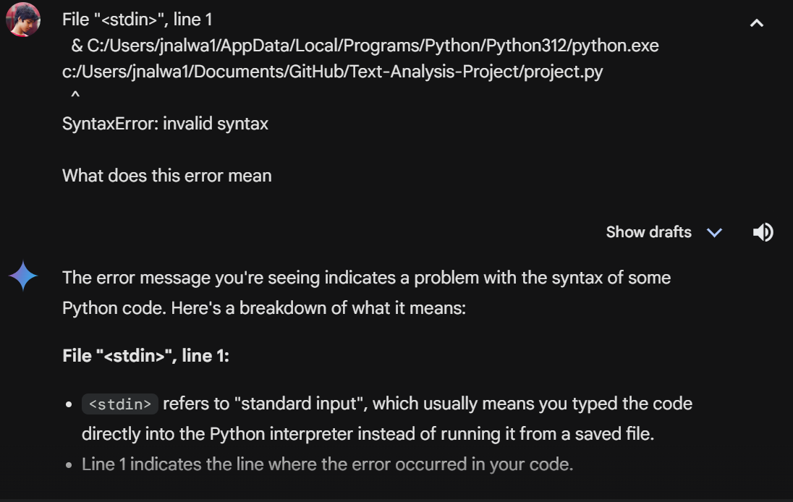
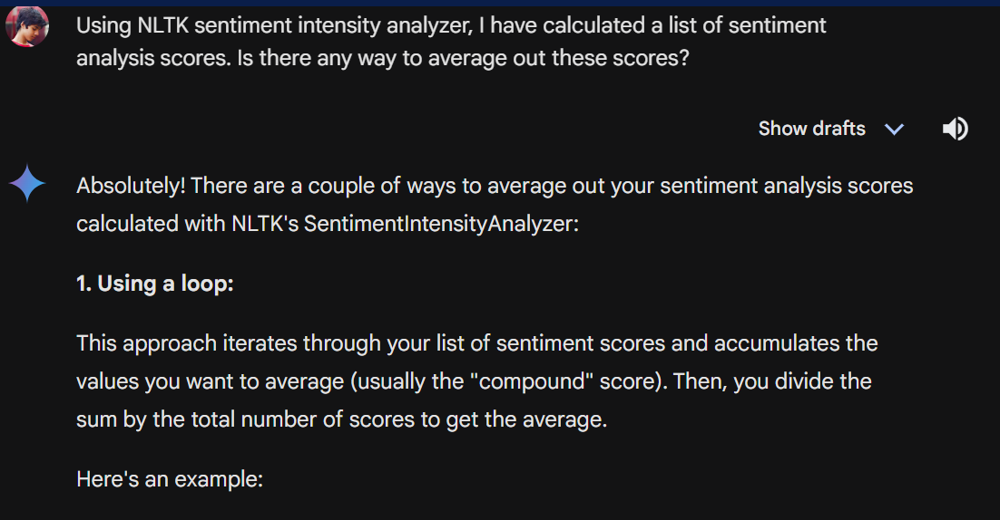
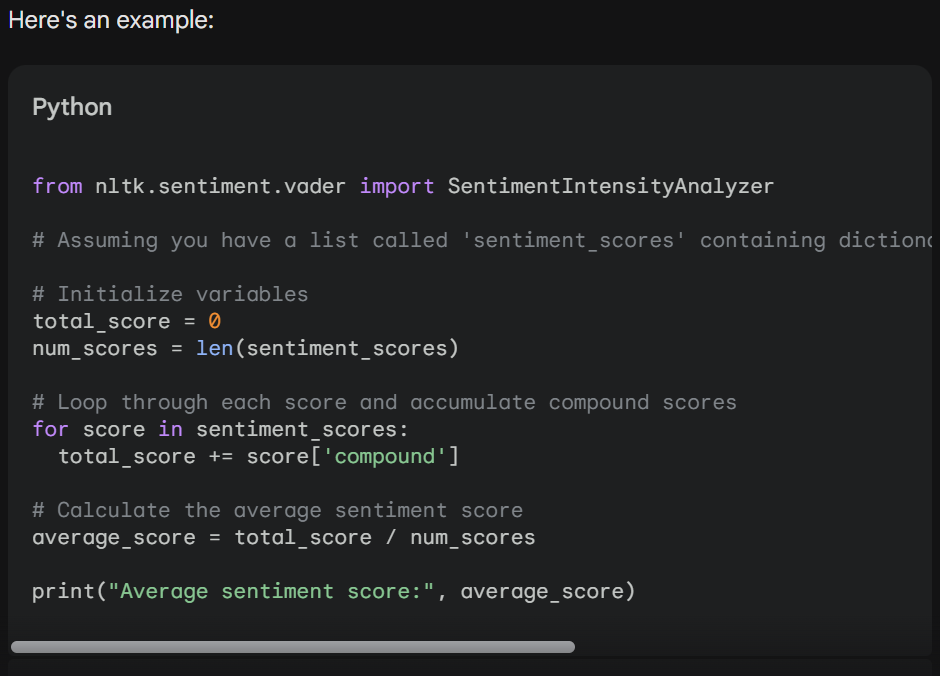
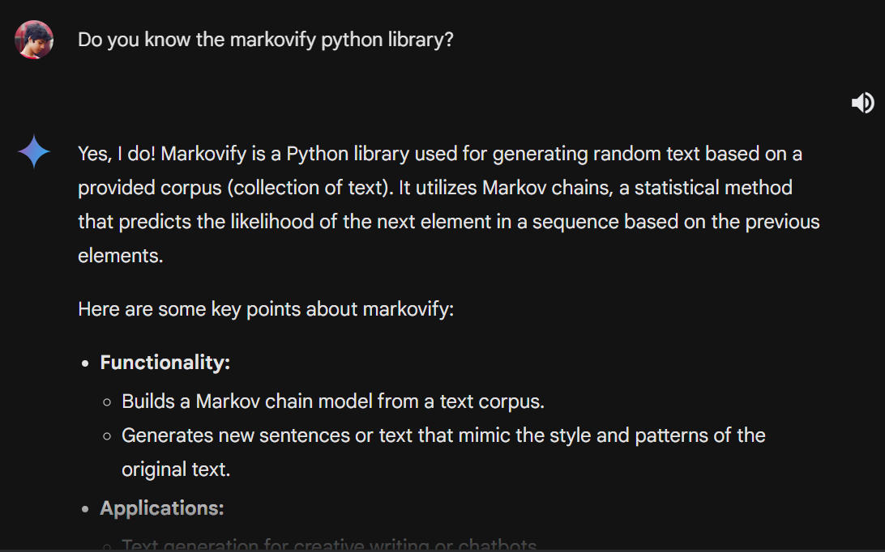
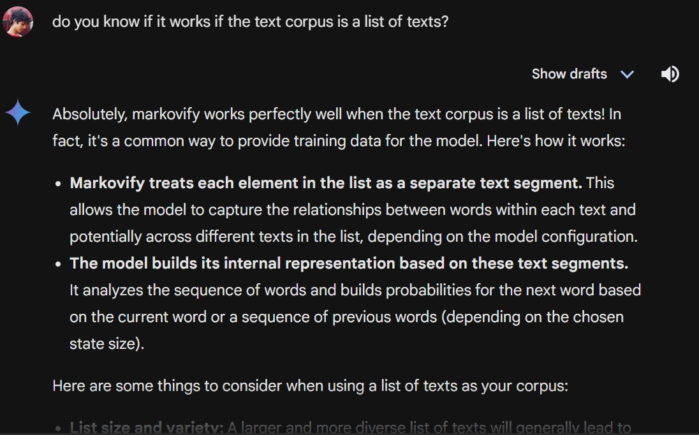

# Text-Analysis-Project
## 1. Project Overview
In this project, I used IMDB as my data source using the Cinemagoer library in order to access data from the website. I specifically sourced reviews of Avengers: Endgame from IMDB. I then used NLTK to do a sentiment analysis of each review before averaging out the overall sentiment scores of the set of reviews. The sourced set of reviews then acted as a corpus to generate a new set of reviews using Markov generation. Similarly, the sentiment scores of the Markov-generated reviews were calculated and averaged out to compare how accurately did the generated reviews match the sentiment of the original reviews. Lastly, using the OpenAI API, ChatGPT 3.5-Turbo generated its own set of reviews of Avengers Endgame, and the sentiment scores of these reviews were calculated and averaged out. I did this to compare the average sentiment scores of the three sets of reviews to see the efficacy of Markov generation as compared to ChatGPT's text generation at matching the sentiment. My hypothesis is that while the advanced ChatGPT model would be more articulate and understandable as generated text, because it doesn't use the original reviews as a corpus, it won't match the sentiment as much as the Markov-generated reviews. However, the Markov-generated reviews may not always make sense or be written in perfect english.

## 2. Implementation
To implement this project, the first thing I needed to do was source the data from IMDB. I did this using the Cinemagoer library. After sourcing the reviews from the database using Cinemagoer functions, I stored the reviews in a list. I did this in order to keep each review separate making sure positive, neutral and negative reviews had their own sentiment scores calculated rather than storing it as one string and skewing the calculation of the sentiment score. After storing all 25 reviews, I calculated the average sentiment score and outputted it before using Markov text generation to generate 25 new reviews based on a corpus of the IMDB reviews. I followed this by using the OpenAI API to get ChatGPT to generate 25 unique reviews of Avengers: Endgame based on its own datasets and corpus. I did both the Markov generation and ChatGPT generation in separate functions for debugging and organization purposes. All of the reviews were stored in separate lists so the sentiment score calculator function could run on each list separately, storing and outputting the average sentiment scores. The final output was each review (original and generated) as well as the average sentiment scores of each set of reviews. When figuring out a way to do Markov generation, I had to choose between using the Markovify library by itself or combining it with the Spacy library. Using the spacy library would allow the generated text to be more advanced and legible. I chose to use the Markovify library by itself because I wanted to compare the Markov generation specifically to ChatGPT generation. Essentially, by using just the Markovify library on the IMDB corpus, I would get text generated purely based on the IMDB replies, rather than it being edited to be more legible, thus I believed it was the best representation of Markov generation for my analysis.

I used Google Gemini to help me figure out efficient ways to calculate average sentiment scores as well as to learn more about the libraries I was using. I chose to use Google Gemini over ChatGPT for two reasons. Firstly, since I was using the OpenAI API, I did not know if ChatGPT would give me answers/solutions that would not require me to write my own code. Secondly, I believe that when it comes to Python, Google Gemini provides assistance in a concise and understandble way. I used AI like this to make sure that the libraries were implemented correctly, and the results that I was aiming to find were not incorrect or changed. I also took advantage of Gemini to help me with errors that I ran into. The manner in which Gemini was used is noted in comments and also in the below screenshots.

## 3. Results
My hypothesis boiled down to believing that the Markov-generated reviews would be less legible but more similar in sentiment score as compared to the GPT generated reviews. I feel like the results of the project matched this hypothesis. Below are examples of Markov generated reviews.

**Markov Reviews:**
_1. The first 2 hours there was a close 8/10, the fanboys who give it a second time?We have seen too many references to previous Marvel films, and is not original either.The heroes are far too smoothly for my feelings towards this film, but im not sugar coating my opinion like it is trying to be so many in Endgame with a cliffhanger, I was hoping there would be the end she also got disappointed.The dialogue struggles to be amazing about the movie.This was a close 8/10, the fanboys who give it a fear that they'd written themselves into a hole?Not much to write about, it made every marvel movie before it worth the hype. you think that would be one scene it shows how intuitively they work together and it was up to Infinity War, and the overall running time is unnecessarily long._

_2. The last hour is spectacular, great to see these characters all together at least 5 times, and it's one of my favourite characters are a joke.After the movie, and stood up to me i would wait for torrents buy my gf wanted to see these characters all together at least one line that put a smile on my score to...Acting was empty and going nowhere, CGI was almost no action, it was unnecessary endless dialogs, flashbacks and seconds chances.There's very little in the Marvel franchise.That's all I have never witnessed in a corny script that feels like it has to be sympathetic or at least 5 times, and it's one of them. Like they were pretty much telegraphed to do so long before the movie I got maybe 3 light chuckles out of those films, I knew immediately that they are deliberately doing this to clip his wings._

As we can see from the above reviews, the legibility and sentence structure of the text is not 100% proper. Sometimes, it is difficult to understand the exact sentences, however, the overall gist and sentiment of the review is understandable through the text. This is due to the fact that Markov generation is probability-based, generating sentences based on the likelihood of subsequent words appearing in the corpus. Thus, it is a randomized recreation that shares the same emotion as the corpus, without being as legible.

**ChatGPT Reviews:**
_1. Avengers: Endgame is one of the most epic and satisfying conclusions to a film series that I have ever seen. The movie does an incredible job of tying up loose ends and providing closure for the beloved characters in the Marvel Cinematic Universe._

_The action sequences are breathtaking, with some of the most memorable and exciting moments in any superhero movie. The visuals are stunning, and the special effects are top-notch. The writing is also top-notch, with a perfect blend of heart, humor, and suspense._

_What really sets Avengers: Endgame apart, however, is the emotional depth of the story. The film explores themes of sacrifice, loss, redemption, and the bonds of friendship and family. The performances from the entire cast are excellent, with Robert Downey Jr. and Chris Evans delivering standout performances._

_Overall, Avengers: Endgame is a must-see for any fan of the MCU or superhero movies in general. It is a fitting and satisfying conclusion to over a decade of storytelling, and I cannot wait to see what the future holds for these iconic characters._

_2.  Avengers: Endgame is a thrilling and emotional conclusion to the Marvel Cinematic Universe's Infinity Saga. The film is packed with intense action sequences, heartfelt character moments, and surprising twists that will keep you on the edge of your seat from start to finish._

_The performances from the ensemble cast are exceptional, with Robert Downey Jr., Chris Evans, and Scarlett Johansson delivering particularly powerful performances. The film also does a great job of balancing humor with the more dramatic elements, resulting in a rollercoaster of emotions for the audience._

_One of the standout aspects of Avengers: Endgame is its spectacular visual effects. The epic battles and stunning set pieces are a feast for the eyes, and the film's cinematography is top-notch throughout._

_Overall, Avengers: Endgame is a fitting and satisfying end to the Avengers series, and a must-see for any Marvel fan. It's a true cinematic event that will leave you wanting more, even as you say goodbye to some beloved characters._

The ChatGPT reviews are structured almost identically each time, with every review being positive in sentiment. These reviews are written in perfectly structured and legible English, highlighting the advanced nature of OpenAI's text generation. However, the similarity of each review and the fact that they are all positive show that rather than representing real opinions, these reviews are just generated walls of text that don't seem to match the sentiment of the original reviews.

To track the sentiment of each set of reviews we can compare the average compound sentiment scores. The average Markov sentiment score is a 0.434 compound score. Meanwhile, the average GPT sentiment score is a 0.986 compound score. Both of these numbers are very different from each other. The average compound score for the original review set is 0.333, which is a lot closer to the sentiment score of the Markov-generated reviews than it is to the GPT-generated reviews. Thus, the results aligned with the hypothesis.

## 4. Reflection
During the process of putting together the text analysis tools, after brainstorming and hypothesizing, I felt that I had a structured direction to follow that wouldn't be too difficult to accomplish. I did not anticipate there to be many roadblocks throughout the process as the overall idea is quite straightforward. However, I failed to realize that my lack of knowledge regarding the many libraries being implemented as well as the OpenAI API made the process more difficult than expected. I had to read through multiple documentation files, tutorials and Gemini responses in order to successfully complete the project. I could improve the process by being more well-versed in the tools that I would be using before the beginning of my project. For example, I wanted to be able to output the results to a file so it would be easier to parse, however, I didn't know how to implement such a function. By the time, I googled a solution, I realized that I would have to go back and change a lot of the code to be able to implement the solution. Thus, being more prepared in terms of knowledge and tools would be helpful.

Additionally, I can improve this project and its scope by being more thorough in development of the Markov generator as well as the results. The original review set is a very small sample size of 25, thus, the Markov generator had a very limited corpus to base its text generation on. Additionally, running the experiment multiple times and averaging out the results of multiple iterations would also allow me to find more concrete and specific data that isn't skewed. For all I know, the data that I just analyzed could be an outlier and inaccurate. However, throughout the project, I learned about the different methods of text generation and analysis. I also got to work on learning API implementation and got a taste of the many different Python libraries that exist to create multiple tools for any scenario. Gemini also helped me learn about new errors and libraries as well as gave me inspiration on how to approach solving different aspects of the project (for example, the calculator algorithm). Going forward, I will use my learning about these tools as well as the "programmer's perspective" that I have continually devleoped throughout this course in order to better understand, plan and build projects.