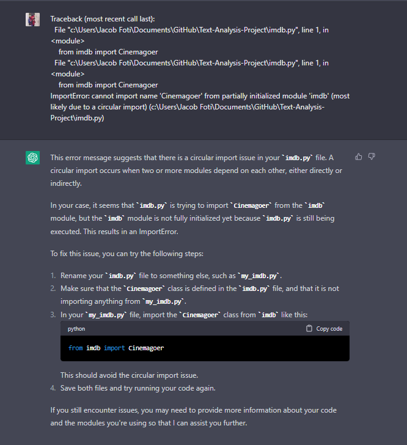
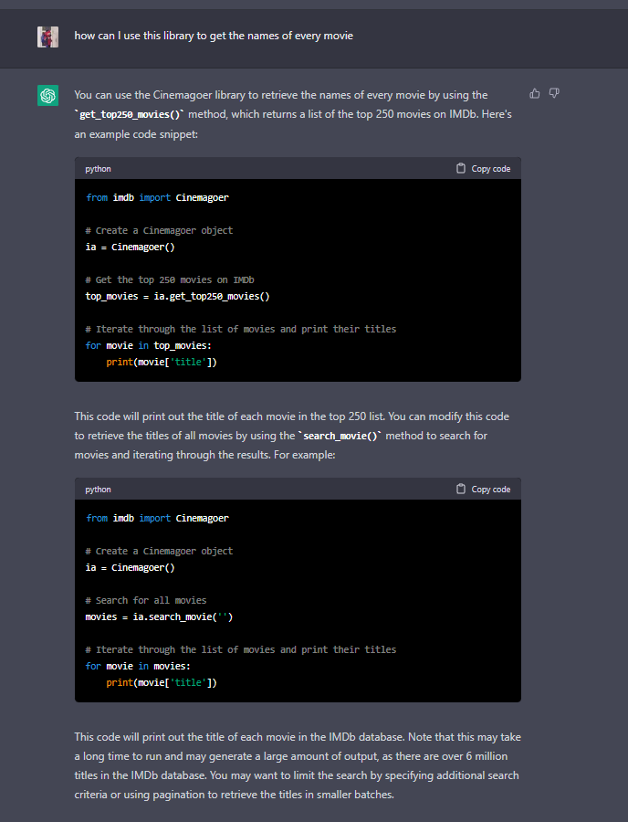
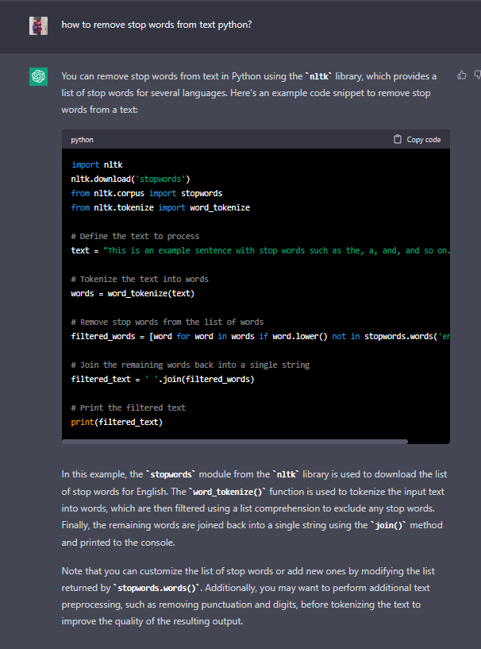
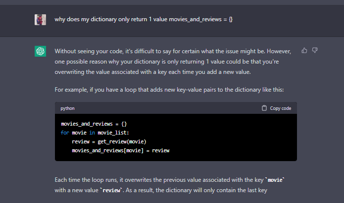
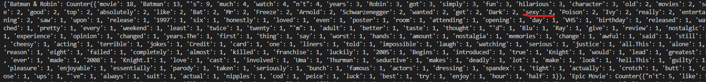

# Text-Analysis-Project
 
## 1. Project Overview

For data sources, I only used IMDB/Cinemagoer. I wanted to learn how to use text analysis with nltk to be able to process the reviews I extracted from Cinemagoer. I removed stop words, most punctuation, and was able to compute the frequency of words in each review. I wanted to create a script that would take 5 random terrible movies and figure out the frequency of words that aren't stop words, which I did successfully in my eyes. My learning goals were to struggle. Seriously, i wanted to have a ton of errors so that I would have to figure them out... and I did, and it was stressful. I got to experiment with Cinemagoer, string, collections, random, and nltk, but most important, I learned how to read documentation and ask ChatGPT for help when it comes to finding things in the documentation that I want to use for my code.

## 2. Implementation
This script extracts 5 random movies from the list of 100 bottom movies from IMDB, gets the reviews for them, strips the reviews of stopwords and most punctuations, then returns a dictionary with the 5 movie titles as keys and frequency of words in each review as values. I designed this script in a tower-like format, starting at the top of the tower and finishing at the bottom. There are 5 'floors' or functions to this tower, each floor cascading into one another. The top floor chose 5 random integers, the 4th floor used those integers to pick random movies from the bottom 100 movies from imdb, 3rd floor extracts reviews from those movies, 2nd floor strips most punctuation and stopwords from those reviews, and the 1st floor takes those filtered reviews and returns the word frequency for each movie's reviews. One major decision I had to make design-wise was actually that tower-format. There are many functions I could have combined, however, I wanted to improve readability and make it easier to debug (because I knew I would have some..) In my opinion, I am really proud of my design decision and it really helped me when debugging. NLTK's word tokenizer was really helpful in splitting the words up into a list for me, which was very synergistic with its stop words doc which I could use to remove stop words from that list. The counter from collections also synergized well with the filtered reviews that I had, easily being able to count the frequency of each word without me having to write a lot of loops to do that. The major algorithm I use is on the top floor, which was just a randomizer for numbers between 0 and 99, but every function used this randomizer in order to find the original 5 movies to use and because of this, it was integral to my script. A few things I learned along the way will be expressed in the screenshots. You'll see I encountered problems with importing the library at first as well as debugging. ChatGPT was an essential part of this learning process.

## 3. Results
To be honest, my project didn't do anything crazy, it was really calm, but took a lot of time and debugging in order to get all of the moving parts to work the way they were intended to. One interesting thing I found, as can seen in the screenshot below that someone called Poison Ivy sexy in a movie review, twice. In all seriousness, the results were so that I could analyze the keywords people used to describe these movies. All of these movies are amonst the most terrible of all films on IMDB, and I wanted to see why that may have been the case. While I didn't do it in this project, the applications for these results are vast. For example, I could take this data, upload it to excel, and make a chart to show which words were the most. 

I'm happy with the results at the moment. It's something I may definitely want to use in the future, but with different applications. Being able to use text-analysis to find the frequency of words has many applications to real-life, for example, surveys and questionnaires filled out from focused groups. My next project I want to do is figure out how to upload this data into excel or use pandas so that I can manipulate it and play with it. 

 

## 4. Reflection
From a process POV, this assignment went really well. It definitely took a while to do, but I really liked that we were able to use ChatGPT in order to help us figure out problems regarding our code. This felt very much like the process I'd do in real-life if I were to have to code something, and I really like how you allow us to use all of our resources available in order to solve these problems. For improving sake, I could have definitely went further by making the chart to show which words were the most frequent, however, I want to learn how to do that with pandas and I'm not too sure if I'm ready for pandas yet, I want to keep focusing on the fundamenetals first. My project was appropriately scoped and I had an idea on what I wanted to do before I even started, which was really helpful. Next time though I want to create a little text document completely planning what I want to do with pseudo-code, would have made it easier for me nonetheless. 

Like I said above, the biggest thing I learned from this project was how to learn on my own. I asked simple and clear questions to ChatGPT to help me with most questions I had, and I was also able to learn how to (somewhat) read API documentations which will be very helpful in the future. I wish I knew how to make a cleaner terminal for output, my dictionary looks disgusting at the moment and I wish there was a way to make it more organized (I know there is but I don't know what it is). I also learned a lot about these new libraries and the depth some of them can really go. 