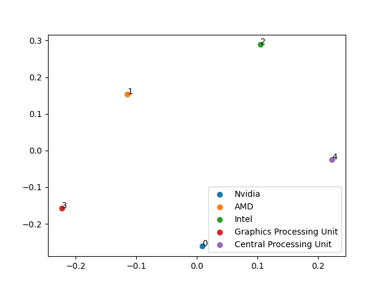

This project explores text data from the subreddit r/marvelstudios to find which Marvel movies are currently generating the most discussion. Using Python and different text analysis techniques, I worked to analyze post titles for mention frequencies of popular Marvel movies, commonly used non-stop words, overall community sentiment, and clustering patterns of the content. The goal was to gain insights into what Marvel content is trending and how fans are reacting to it.

The script is organized around a main workflow defined in reddit.py, broken into components that include data collection, keyword frequency analysis, word frequency analysis, sentiment analysis, and clustering. Reddit post titles were collected using the praw API from the details from the .env file. A list of Marvel-related keywords generated by ChatGPT were compared against titles to count movie mentions. Non-stop words were extracted using NLTK and analyzed with Python's counter. VADER sentiment scoring from NLTK was used to classify post tone as positive, neutral, or negative. Cosine similarity between post vectors was computed, reduced using MDS, and plotted with matplotlib where each point was color-coded by Marvel movie mentions.

ChatGPT was used to assist with the cosine similarity and dimensionality reduction logic, integration of sentiment analysis, code structure and modularization, and documentation. These parts were more complex, and GenAI assistance helped accelerate development and clarify implementation decisions.

From the results, Daredevil was the most mentioned topic (77), followed by Avengers (49), Doomsday (48), Thunderbolts (33), and Spider-Man (29). Other frequently discussed titles included Endgame, Iron Man, Loki, Black Panther, and Thor. The most common non-stop words were "daredevil" (75), "mcu" (72), "born" (60), "new" (54), "avengers" (49), "marvel" (49), "doomsday" (46), and "spiderman" (30), among others. These suggest a blend of excitement for character returns and broader MCU narratives. Sentiment analysis showed that 45.0% of titles were positive, 30.6% neutral, and 24.4% negative.

The clustering visualization revealed that mentions of Daredevil, Thunderbolts, and Doomsday were fairly distinct and tightly grouped, indicating a more focused discussion. Meanwhile, Spider-Man and Avengers related posts were more spread out, suggesting varied conversation contexts. A cluster of gray (non-movie-specific) posts highlighted the general discussions and speculation happening within the community.

Overall, the project went smoothly. The Reddit API was reliable, and modular code made the script easier to manage. ChatGPT significantly sped up the development of clustering and sentiment analysis, especially where I encountered difficulties with cosine similarity, vectorization, and plot generation using MDS. I also relied on ChatGPT to help structure the entire script, from separating functions, implementing environment-based credential loading, and making the script run from a single main() entry point. Some challenges included balancing keyword matching to avoid undercounting or overcounting and interpreting MDS projections. Through this project, I improved my understanding of text vectorization, sentiment analysis, and visualization techniques. The process reinforced how GenAI tools can support complex tasks while still requiring thoughtful oversight. 

