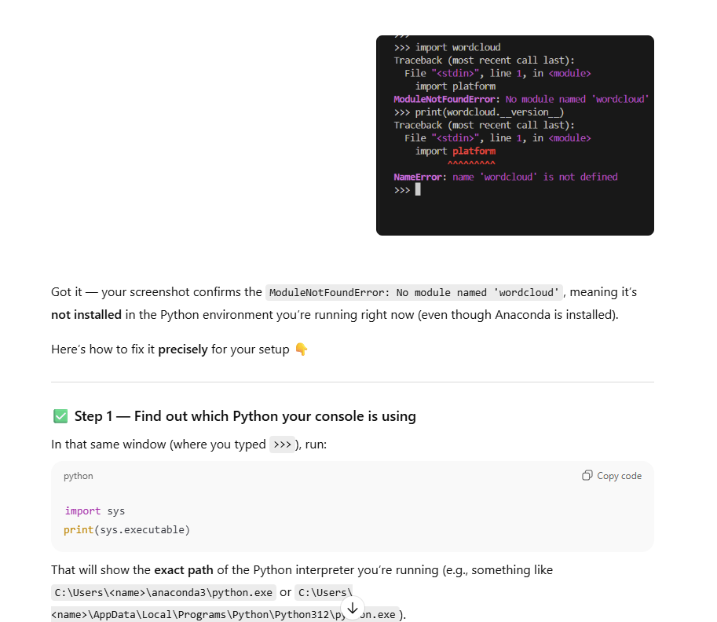
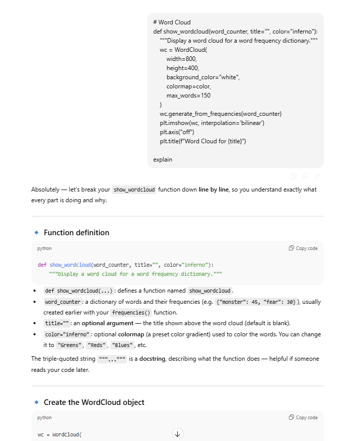
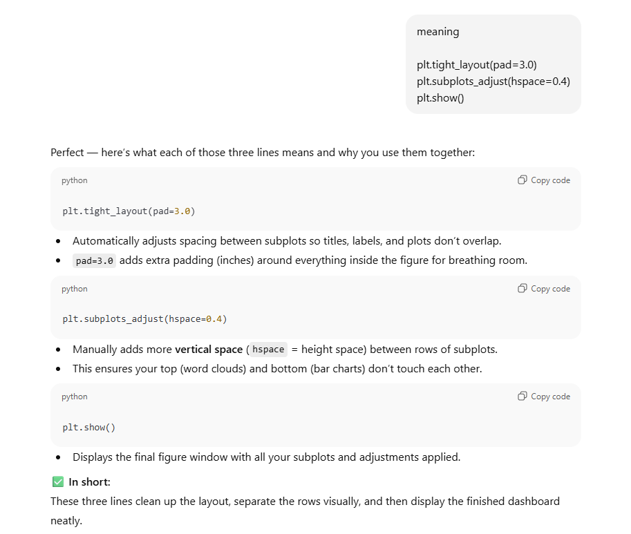
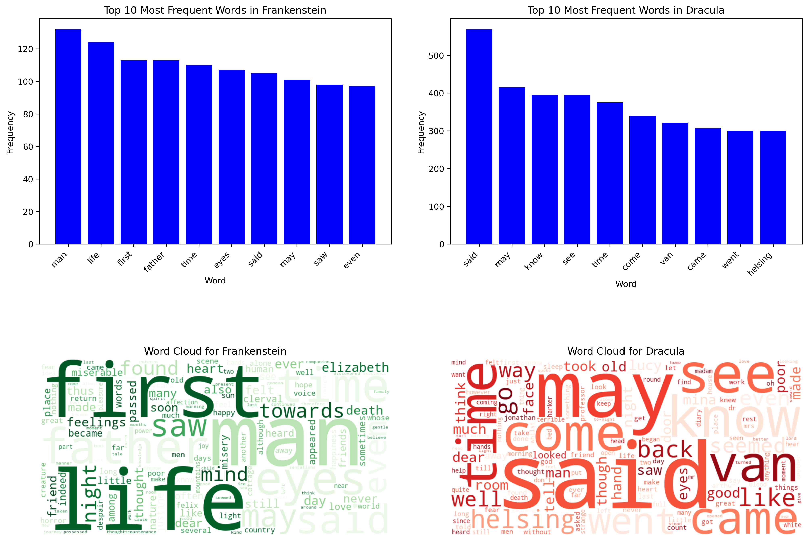

# Text-Analysis-Project

Please read the [instructions](instructions.md).

---

## Project Overview
Using files from Project Gutenberg, I analyzed Frankenstein by Mary Shelley and Dracula by Bram Stoker. I chose these two texts because they are both classic Gothic novels from around the same era. I wanted to see what similarities and differences might appear between two novels that share the same genre but differ in their themes and storytelling styles. I cleaned the text by removing extra non-letter characters, so only the words remained. Then, I broke the text into individual words by splitting it wherever there were spaces or punctuation marks, removed common stop words, and compared how often different words appeared in each book by counting their frequencies and looking at which ones showed up the most. I measured how rich the vocabulary was by looking at how many unique words each novel used over the total, and I created simple word clouds and bar charts to show the most frequent words. Finally, I used the VADER sentiment analysis tool from the NLTK library to see whether the endings of the two stories felt more positive or negative. 

---

## Implementation
The program has several main stages: getting the data, cleaning and filtering it, analyzing it, and creating visuals. First, it downloads the novels from Project Gutenberg and saves them in the repository, ensuring that they are not re-downloaded if they are already there. The text is stored as strings, then cleaned by removing punctuation, numbers, and other symbols, and converting everything to lower cases to keep the words consistent. Then, the words are split and stored in a word list. The program downloads a document with stop words and creates a set, using it to remove stop words from the word list. In the analysis portion, each word’s frequency is stored in a dictionary to show how often it appears in each book. The program then calculates simple statistics like average word length, sentence length, and vocabulary richness to describe each author’s writing style. Using matplotlib, the program creates charts and word clouds from this data. The resulting plot is saved in the images folder for later viewing. Finally, the program uses the VADER sentiment analysis tool from the NLTK library to see whether the endings of the two novels are more positive or negative. 

One design decision I made was how to handle stop words. For other texts, I would have removed words like "said", "went", or "can," but I decided to keep them because they showed the narrative differences between the two books. Dracula had a lot more verbs and retellings of someone doing something, while Frankenstein used more nouns and abstract descriptions. However, I removed words like "one", "shall", "nor", and "upon," since they appeared frequently in both. Some of these are indicators that the novels were written during the 1800s, but they do not add much to a comparison of two novels from the same period. Another choice I made was to switch from analyzing a Wikipedia article on Gothic fiction to adding a second novel instead. I wanted to try using a different data source, but after a few tests, I realized the article didn’t add enough depth, so I chose to compare two full novels from Project Gutenberg.

## Documentation of AI Usage

---

## Results
### Word Frequencies 
#### Frankenstein’s Top 10 Words:
man, life, first, father, time, eyes, said, may, saw, even 

#### Dracula’s Top 10 Words:
said, may, know, see, time, come, van, came, went, helsing

The content of Frankenstein’s plotline and its unique language is more evident in its most frequent words. The novel has a more focused theme that is constantly repeated, like mankind, the creation of life, and how Victor Frankenstein was the “father” of the Creature. It was surprising that the word “creature” did not appear more often and was far less repeated than “Elizabeth,” despite the Creature having a stronger presence in the story. 

Dracula uses more dialogue-based and action-based words like “said,” “come,” and “went.” This makes sense, since the novel is formatted as a series of journal entries and letters, and the characters are describing events. Two of the top ten most frequent words, “van” and “helsing,” make up the last name of one of the major characters, who the other characters reference often, Abraham Van Helsing.

### Summary Statistics
#### Frankenstein
- Total words after stop word removal: 34,477
- Average word length: 6.49
- Average words per sentence: 25.56
- Type–Token Ratio (vocabulary richness): 0.21

#### Dracula
- Total words after stop word removal: 68,243
- Average word length: 5.60
- Average words per sentence: 19.81
- Type–Token Ratio (vocabulary richness): 0.14

These numbers suggest Frankenstein uses longer words and more varied vocabulary, while Dracula relies on shorter, more repetitive language.

### Sentiment Analysis of Novel Ending
#### Frankenstein
- Negative: 0.1922
- Neutral: 0.7493
- Positive: 0.0585
- Compound: –0.31

#### Dracula
- Negative: 0.0302
- Neutral: 0.7572
- Positive: 0.1126
- Compound: +0.2832

Frankenstein ends with the tragic death of Victor Frankenstein and the Creature’s declaration that he will end his own life. Unsurprisingly, sentiment analysis found that the novel’s tone leaned negatively. On the other hand, Dracula ends with the defeat of the vampires, leading to a more positive tone.

---

## Reflection
From a process point of view, the project mostly went smoothly. I started by only analyzing Frankenstein, and I did not run into any major issues. The biggest challenge came when I decided to add Dracula halfway through the Computing Summary Statistics section. With just one text, I didn’t need to use the code more than once, so my program ran linearly. When I added Dracula, I just copied and pasted my Frankenstein code and changed the text to Dracula. This meant my program had a lot of repeated code, and I was constantly overwriting variables. I fixed this by converting most of my code into functions. Something I can improve is my sentence detection function. I only use periods as separators, so it does not account for sentences that end with exclamation or question marks. I think the project was appropriately scoped. The novels were diverse enough to have substantial differences to analyze, but they are still related under the genre of “1800s European Gothic novels,” and therefore contained interesting similarities. My testing plan was simple but effective. In addition to printing my results at the end, I ran print checks in the middle of each major stage to make sure the outputs looked correct before moving to the next section. This includes the number of cleaned words, full frequency list, and the extracted novel endings. Doing so helped me catch mistakes early and confirm that each function worked as intended. I also ended up keeping the number of cleaned words in my insights, since I thought it added some value. 

From a learning perspective, my biggest takeaway was how important it is to stay organized and break the project into smaller, more manageable pieces. At first, I just wrote everything in one section, but it became hard to keep track of once I added a second text. Turning repeated code into functions made the program easier to manage and reuse. I mostly used AI to help me debug my work and generate functional code. Then, I would ask it to explain its output until I understood it enough to be able to summarize it in a comment. I needed the most help for the visualization section, since I was unfamiliar with matplotlib. I wish I had known how much time it takes to edit and debug code after changing my project focus. Going forward, I will make more detailed outlines for each section of my program before I start coding instead of trying to figure it out along the way.