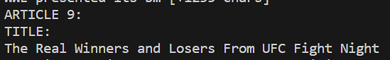
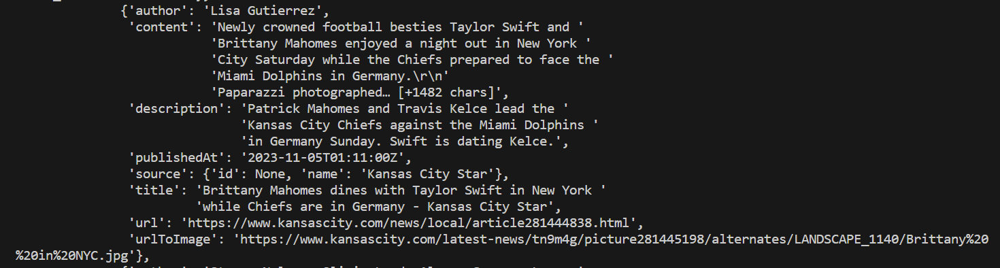
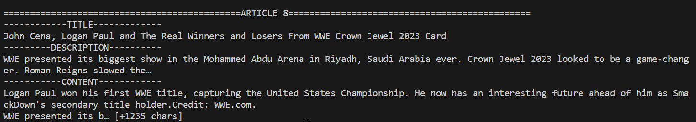
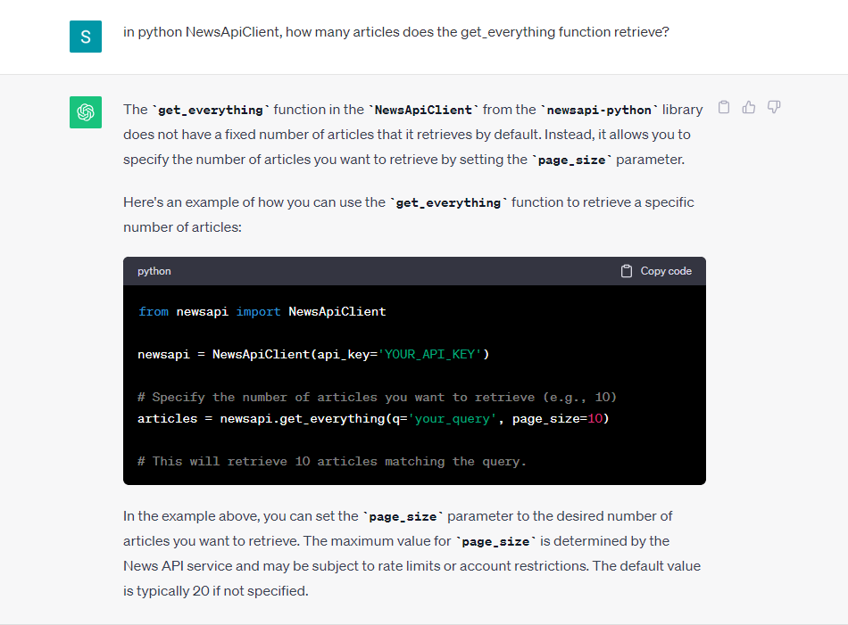

# Text-Analysis-Project
 
# **1. Project Overview**
I used the *NewsApi* data source, and using a keyword searching technique I made a function that combined all articles relating to a basketball player or team into a list of dictionaries. I then made another function to print this list of dictionaries in a more convenient-to-read format. Through this project, I hoped to create the foundation for another program that could continuously return news articles related to a list of teams and players that the user was interested in. 

<sub> I also had a plan to use the *IMDB* database and sentiment feature in the *Natural Language Toolkit* to return an average score for a movie based on written reviews. However, this ended up being a little out of scope, but hopefully I can come back to it later.</sub>

# **2. Implementation**
I have 3 major components in my program. For the first component, the `get_category_sources()` function, a key change I made was converting the list to a format that the NewsApi functions would recognize. Originally, this function returned a list, but strangely the parameters in the NewsApi functions don't use lists, they use a string where each items is separated by a comma, which I would probably change if I were them. 

A key choice I made in the second component function, `get_basketball_news`, was splitting the keywords and searching each one individually. For example, when putting `'Los Angeles Lakers'` as the parameter, instead of searching the string as a whole, it searches `'Los'`, `'Angeles'` and `'Lakers'` separately. I made this choice because I noticed that in some articles, some players such as Luka Doncic's name had special characters, so if the user entered `'Luka Doncic'`, it would not return those articles that used the special characters. By splitting up the string, the program will still capture all articles mentioning `'Luka'`. This returns some irrelevant articles, such as this UFC Article when searching `'Los Angeles Lakers'`, which appears because of the `'Los'`. 

Ultimately, I'd rather have too many articles than too few. 

# **3. Results**
My results were mostly making the format returned by NewsApi legible by normal people, as the database's default format is extremely hard to read. This is what an example of an article as NewsApi returns it, printed using `pprint`:

Even using `pprint`, this format was very difficult to read, so I made another function that removes the items that the user doesn't care about, and putting it in an easy-to-read format. 


I was also only able to access the top 100 sports articles, which limited my options heavily, as my programs could never return such a large number of articles that I had to invest more time to analyzing the text. 
```python
newsapi.newsapi_exception.NewsAPIException: {'status': 'error', 'code': 'maximumResultsReached', 'message': 'You have requested too many results. Developer accounts are limited to a max of 100 results. You are trying to request results 1980 to 2000. Please upgrade to a paid plan if you need more results.'}
```

If I could access more articles, such as the top 2,000, I would think about creating code that analyzes the average sentiment of all articles about a player, a team, or maybe a trade. This is the part I asked ChatGPT about: 

The NewsApi database also had very few sports sources, being limited to Bleacher Report, ESPN, and Fox Sports for basketball related news. Having access to more sources such as local news channels for each team would provide even more options for analyzing league-wide sentiments. 

# **4. Reflection**
In terms of what went well, the API Database was surprisingly easy to use. Converting online resources into Python data types is made very simple by using online APIs and data libraries, and it opens up many possibilities for things that I had never thought of. I also learned a lot about how Python might be used in creative and productive projects. 

However, there is also much I could have improved on. I mentioned earlier some of my ideas for data analyzing techniques that I had thought of implementing but did not consider necessary given the small amount of data I was allowed to retrieve. Had I chosen a different, larger data source, I would've probably had more freedom and motivation to expand on what I built. Hopefully, going forward, I can learn to implement my ideas more effectively. 