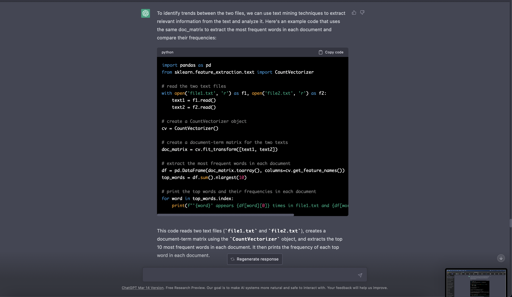
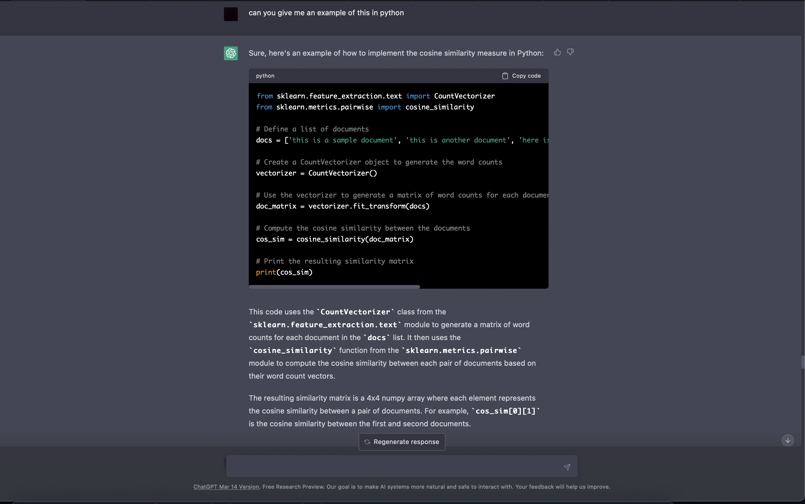
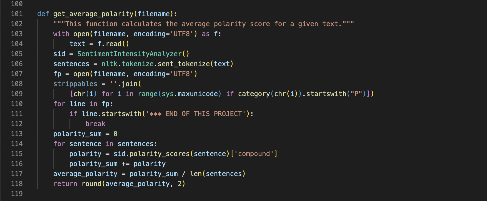
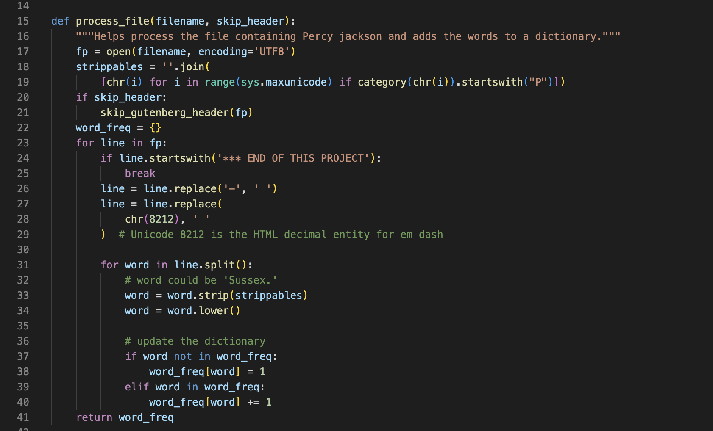
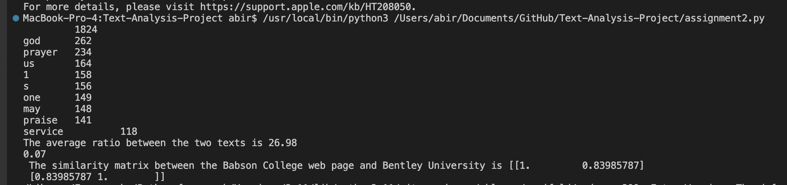

# Text-Analysis-Project
 
Please read the [instructions](instructions.md).
### Project Overview 
In this project, I have used two different data sources. I have used the Gutenberg library and I have also used 
Wikipedia as a source. I used the Gutenberg texts to carryout the normal processes like processing the file, removing stop words 
and find the most common words. I used the Babson and Bentley wikipedia pages to check their cosine similarity and plot it using MDS. 
I decided to not use the Gutenberg texts because they did not have much similarity between them. During this project I was hoping to learn 
more about python libraries and how we can use them to get information from the internet to make programs. I believe that I was able to 
accomplish my goal of learning more about different libraries. 

### Implementation 
In this project, I have taken a book by the author Percy Jackson. I was able to download a .txt version of the book and save it 
in the data folder of the project. After accessing the file from the data folder, I then processed the file by removing all of 
special characters in the file and continuing to create a word frequency dictionary in the same function. I created another 
function to remove all the stopwords from the dictionary and also created another function to find 10 most common words in the file. 
From a design perspective, I wanted to be able to analyse the text in a way through which a person can gauge a lot of information about
the text without actually reading it. That's why I also created a function to calculate the average polarity of the text. Another 
method I used to analyse the text, was to compare it to some other author's work (Charles Dickens) to see how similar two different
books by two different authors can be. 

A part of the project where I had to take a design decision with multiple alternatives was when I was creating the function to figure
to calculate the cosine similarity between two objects. The decision was between continuing to use the Percy Jackson text and the 
Charles Dickens text from Gutenberg, or to use some other data source for the rest of the analysis. I decided that it would be best to
use the Wikipedia data source for this part of the project because I believed that it made more sense to compare Babson College and 
Bentley University as they were liklier to have a higher similarity which would mean that we would be able to see a more insightful result 
from the function as we would be able to check just how similar their web pages are. I also was more inclined to use the Wikipedia data 
source because I felt that by using multiple data sources I would be able to gain more knowledge about navigating different data sources. 

### Results 
I believe that I was able to get good and insightful results from my project from both data sources. From the Gutenberg data source, I 
was able learn about the polarity of 0.07 with which Percy Jackson writes his novels. By findind the most common words after removing 
the stop words from the dictionary I was able to gauge that this given text from Percy Jackson is heavily related to god and religion. I 
was able to infer this as some of the most common words were "praise", "service", "god", etc. We were also able to tell how different 
the two texts from Gutenberg were from each other as after comparing them we got an average ratio of 26.98. 

From the Wikipedia data source, we were able to tell the similarity between the Babson College web page and the Bentley University web 
page. The cosine similarity matrix showed us that they had a similarity rating of 0.83985787. We also were able to plot this matrix using 
the MDS system. 

### Reflection
I believe that I did not have a good process during this assignment. This was mainly because after reading the assignment instructions
I felt very overwhelmed from the beginning because I had never used a library for any coding language to this depth and did not think I 
would be able to. Eventually, I was able to use ChatGPT to help me learn more about these libraries and how I can use them to create 
useful insights about data collected from different sources. Going forward, a main change I want to bring to my process is to be able 
to control myself from not getting flustered. I believe that because I got flustered, I was not able to understand the code and libraries
to my fullest capabilities, and that is why I was not able to do as well as I could have. To summarise, I believe I learned a lot through 
this project, not just about coding, but also about how to approach projects in the future. 