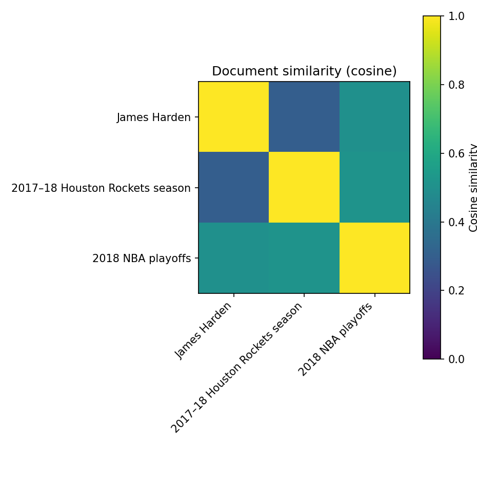
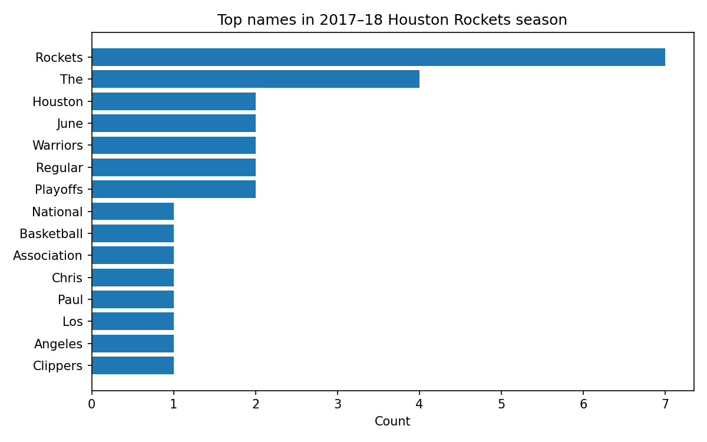
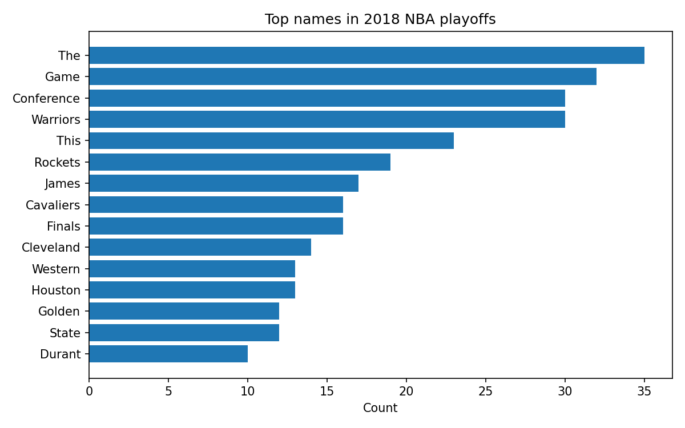
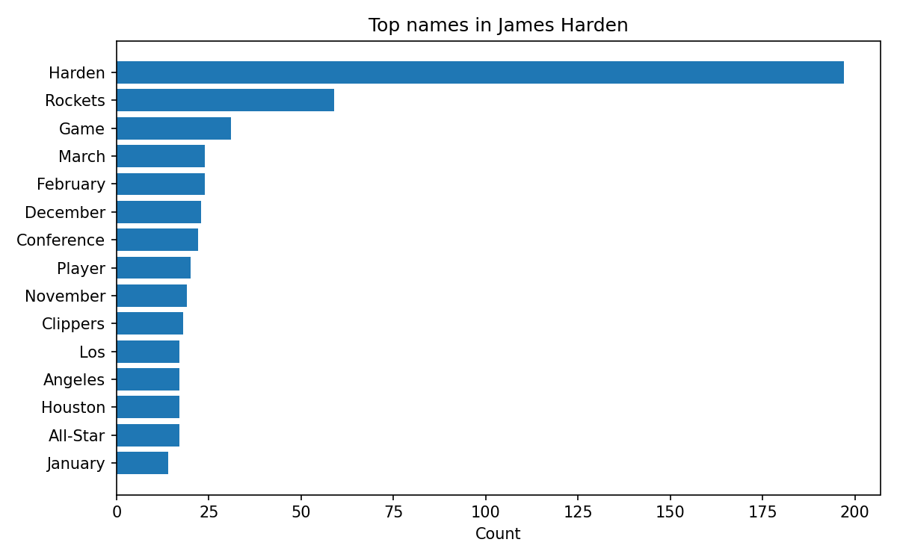
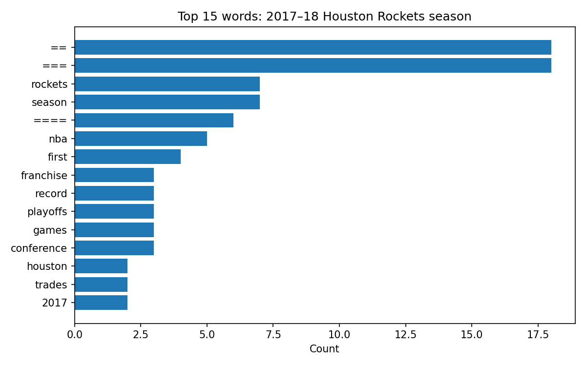
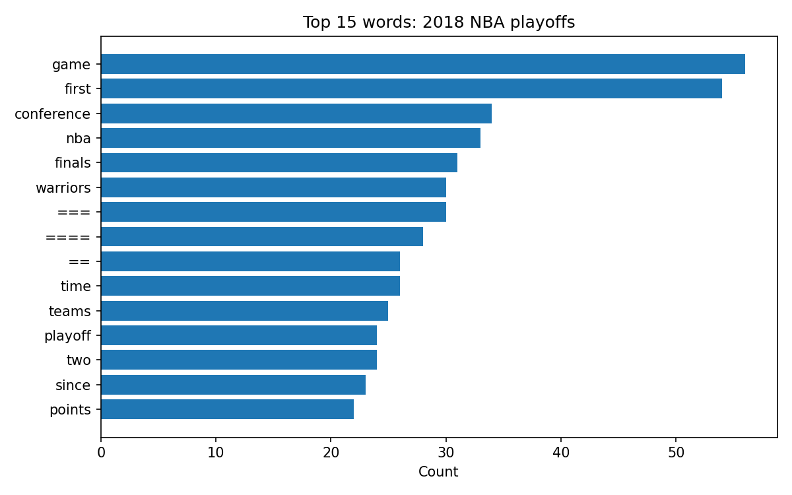
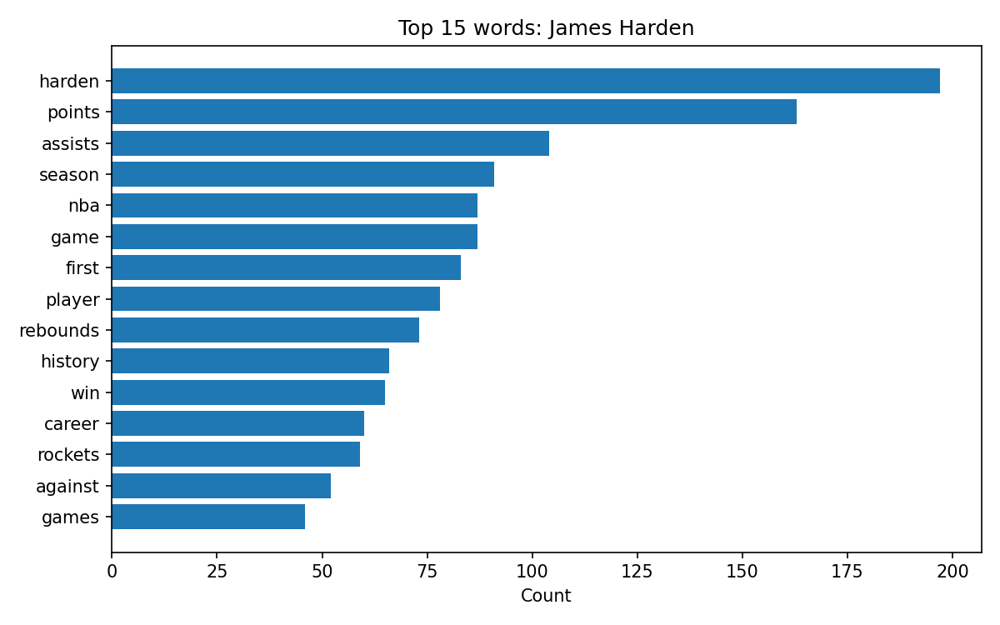

### Text-Analysis-Project

# Project Overview 
For this specific Python project, I decided to use one of the data sources suggested by the project instructions, which is Wikipedia. I decided to explore about specifically “James Harden,” “2017–18 Houston Rockets season,” and “2018 Western Conference Finals.” The reason why I am choose this is because I have been a basketball fan for over 10 years and I have also played varsity basketball in my highschool team. My favorite player inside of the National Basketball League is James Harden and he has been someone that I really look up to. Something that has been in my mind for a long time is how James Harden despite having a lot of achievements like MVP and Allstar, people would not put him on par as other greatest of all time player because he has never won a championship team. The closest he has ever gone in the playoffs is the 2018 Western Conference Finals and for me everytime I have flashbacks watching the playoffs in 2018 I get very sad because it was a perfect oppurtunity for James Harden to prove himself to be one of the best playser in the League. Without the championship, also James Harden is considered a great player during regular season, he will be labeled as a playoff choker who never really proved himself when things really mattered.

For this Python project, I want to download the articles on Wikipedia using the mediawiki python package and clean the text by removing citation brackets in order for it to be easier processed. From my machine learning class QTM3635 we learned a lot of data cleaning and tokenization, so I want to perform a tokenization process with a stopword list simialr to my QTM class. However, rather than having a URL for the stoplist, I have used Chatgpt to create a tiny stoplist for my project. I am also performing bag of words representation, comparing which words are the most frequent within the season and which words are most frequent within the playoffs. From this project, I really want to see how different do people think James Harden performs during the playoffs compared to the regular season. I will do so by changing the raw data from the web text into structured data.

# Implementation
For implementation, I decided to have two python files, one on downloading the information from wikipedia and the other on text analysis. For the first data acquisition code, I used python to do some data acquisition and cleaning by the recommended mediawiki feature within python. I fetched information from three wikipedia pages regarding James Harden and the 2017-2018 Houston Rockets Season. I was able to strip all of the citation markers and was able to store the data within a Python dictionary. Additionally, Chatgpt recommended that I used the JSONL feature where it will have one JKSOn object per line consisting of the title and the content. Secondly, I had code for analysis, which tokenize the data and uses bag of words representation. The stop list I used allows me to identify actual words that are useful for the experiment and get rid of random words such as "that, and, of". I coded the data so that it will print top 15 words per document, compare the season page and the WCF page to find words that are common in one but not the other , compute cosine similarity for the three document pairs, and scan for capitalized tokens to get likely proper names. 

At the same time, I have gave my code for the two documents and asked Chatgpt to give me more detailed and complex code for better graphs and models and it was able to produce very interesting results, where I added a page called "part 3 chatgpt". I used a detailed prompt to chatgpt to do more detailed data cleaning and tokenization. I was able to explore the feature of "matplotlib" where it adds a lot of visualization layer to my code. It also added "ensure_fig_dir()" to make a figure folder within the respository and use "slugif" to turn titles into file names. All of those features are beyond my knowledge of python but I appreciate that the professor allows us to use Chatgpt to help us because it can really teach me how I can improve my code and introduce me to very useful and interesting code and features that I have not know before. With the guidance of chatgpt, I was able to create a lot of visual graphs, plos for top words used per document, plot for season versus the western eastern conference, plot for cosine heatmap, and plot for proper names of all. 

# Results 

With the help of Chatgpt, I was able to create a lot of the plots however, I was unable to find the statistical differences of James Harden but shows more of the textual differences. For example, the cosine similarity heatmap allows me to se that the words within the wikipedia page 2017-2018 rockets season and the playoffs are more similiar to each other compared to the page directly about James Harden. With this skill, we are able to compare documents in the futher and determine their similarity. Although the harden page was still related to the seasons page, the harden page focused more on his personal statistics. 
The bar chart for the top 15 shows us that the most popular words are like "harden", "point", "assist", etc. This also shows us the article is more surrounded the specific matchups rather than the specific player. However, I noticed that it included "=" and "==" within the bar chart and realized the limiation of my data cleaning where I was unable to merely tokenize the basketball related insights where I believe a longer stop list would be better. 
On the proper names chart, I am able to identify the opponents of the Housten Rockets of that year which is the Warriors and Cavaliers, which where all teams that the Rockets have faced in that season.

# Reflection
I feel like what went well of the project is that I was able to data clean and successfully draw data from the files and I was also able to use Chatgpt to create plots that were very interesting for me. It showed me a more advanced version of my data and it really allowed me to explore my project even more. However, I believe there is room for improvement for data cleaning where a lot of the common words within the charts are punctuation or words that is not really related to basketball. I would imagine a longer stop list will help this and clean the data and only include the data I want. At the same time, my code and the extent of the data I am pulling is unable to tell me the differences between the lanaguge used in the 2017-2018 season compared to the playoffs. I would imagine that I should probably get the data from social media like reddit rather than wikipedia because wikipedia is all unbiased facts where reddit has more personal bias and emotions where I can analye people's comments on James Harden and the difference of their attitude towards James Harden during the playoffs. If I could do this again, I would focus more on statistics where I can compare the statistics of James Harden and analyze how much worse of a player he becomes when he played the playoffs throughout his career. 

Other than that, I feel like I had a lot of fun doing this project and definetly was able to explore more skills and strengthen my textbook knowledge of python.