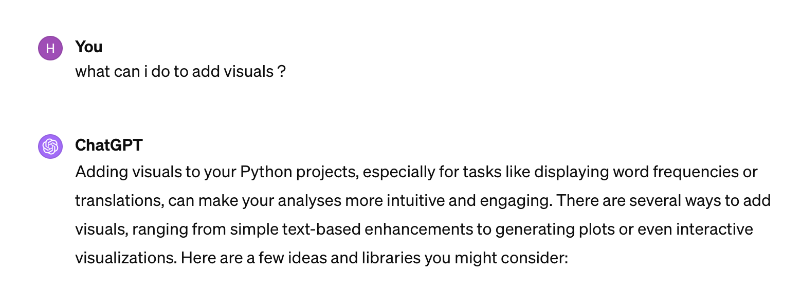
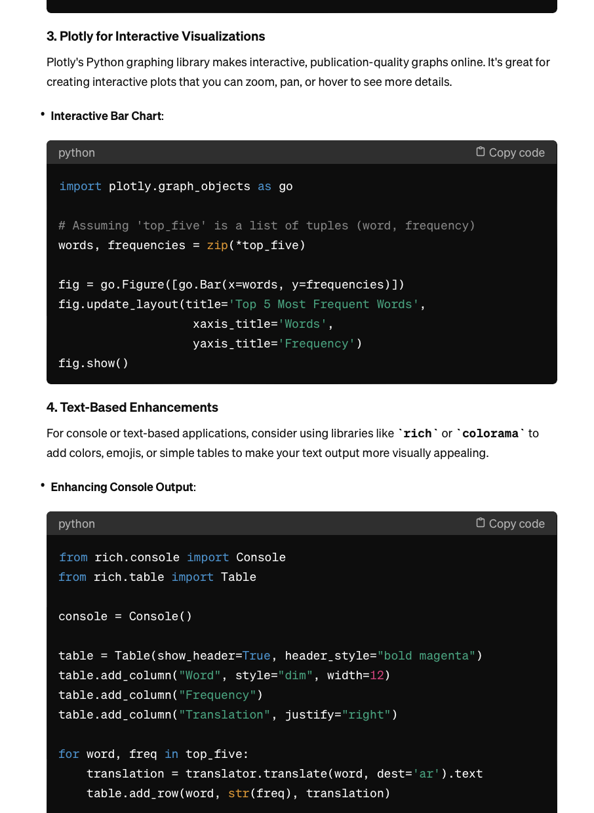
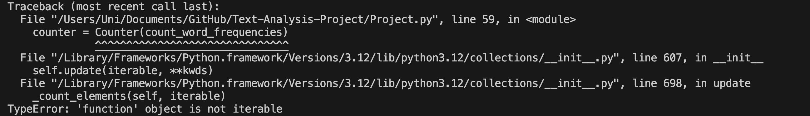
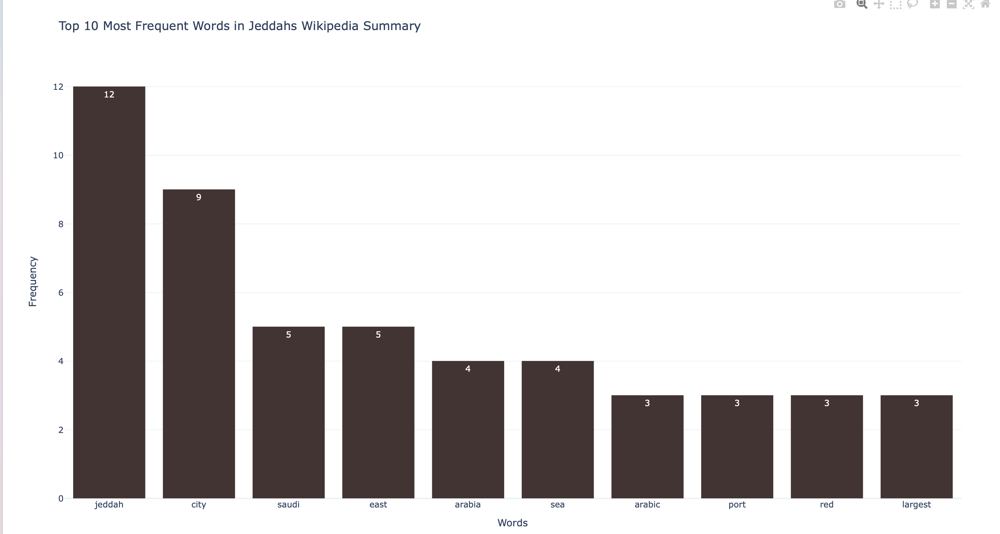
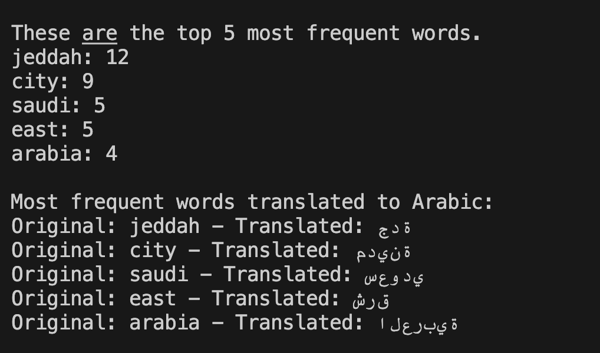

# Text-Analysis-Project

## Project Overview
In this project, the primary data source utilized was Wikipedia, accessed through the `mediawiki` package, to fetch detailed information about Jeddah, including its title and summary. Additionally, I used of the Natural Language Toolkit (NLTK) for processing English stop words. The techniques used in the analysis included removing punctuation and converting text to lowercase, stop words removal to focus on meaningful content, and word frequency counting to identify the most common words in the text. Also, I used the `googletrans` package to translate the top 5 most frequent words from English to Arabic, highlighting a multilingual processing aspect. For visualization, `plotly.graph_objects` was used to create a bar chart, visually representing the frequencies of the top 10 words. The overarching goals of this project were multifaceted: to gain practical experience with basic natural language processing (NLP) tasks, perform exploratory data analysis on textual data, practice using APIs for data retrieval and analysis, create engaging interactive visualizations, and I explored using multilingual text processing. Through this project, the project aimed to help my skills in Python programming for data science, particularly in text processing, NLP, and data visualization, while learning to navigate and utilize external data sources and APIs effectively.

## Implementation
At a system architecture level, the project is structured around several key components that interact to process, analyze, and visualize text data from Wikipedia, specifically focusing on the page about Jeddah. The system can be broken down into the following major components:

### Data Retrieval
The project employs the `mediawiki` API through its Python wrapper to fetch textual data. This component is responsible for accessing Wikipedia's vast repository of information, selecting the Jeddah page, and retrieving its title and summary. This step is crucial as it lays the foundation for the subsequent analysis by providing the data.

### Data Processing and Analysis
Once the data is collected, it undergoes a series of processing steps to clean and normalize the text. This includes removing punctuation, converting all text to lowercase, and excluding common stop words using a list provided by the `nltk` library. The processed text is then analyzed to count the frequency of each word, employing Python's dictionaries to map words to their frequencies efficiently. This component not only prepares the data for analysis but also performs the initial analytical step of identifying word frequencies.

### Data Visualization
For visualizing the analysis results, the project uses `plotly.graph_objects` to create an interactive bar chart displaying the top 10 most frequent words. This choice allows for an engaging representation of the data, enabling users to visually grasp the most common themes or topics within the Wikipedia summary of Jeddah.

### Translation
In addition to analyzing word frequencies, the project integrates a translation feature using the `googletrans` library, translating the top 5 most frequent words from English to Arabic. This component highlights the project's multilingual capabilities, enhancing its applicability to diverse linguistic contexts.

### Design Decision: Stop Words Removal
A critical design decision in this project involved the handling of stop words—common words that are typically removed before analyzing text. The choice was between manually curating a list of stop words and using an existing list from the `nltk` library. The decision to utilize `nltk`'s comprehensive stop words list was driven by the desire for a robust and easily maintainable solution, allowing the project to use an authoritative source of stop words and avoid the time-consuming task of manual list maintenance.

### Utilization of ChatGPT
Throughout the development process, ChatGPT was instrumental in overcoming challenges and learning new concepts. For instance, when faced with the task of creating an interactive bar chart, ChatGPT provided detailed guidance on using `plotly.graph_objects` for visualization, offering examples and explanations that clarified the process. Also, ChatGPT offered insights helping with multiple errors I had while writting my code. These interactions with ChatGPT enabled a deeper understanding of the tools and techniques employed, ultimately contributing to the project's success. 

## Results
Dominant Themes and Keywords: The analysis uncovered that certain words appeared more frequently than others, hinting at dominant themes or aspects associated with Jeddah. Through text analysis and visualization, the project uncovered keywords and themes central to Jeddah's depiction on Wikipedia.

Translation Insights: By translating the top words into Arabic, the project bridged language barriers and potentially offered insights into how Jeddah is represented or discussed in different linguistic contexts, enhancing the analysis's depth.

This endeavor not only demonstrated the power of simple NLP techniques in extracting meaningful insights from raw text but also highlighted the potential for further exploration,to gain a more nuanced understanding of textual content. The interactive bar chart served as an effective tool for presenting these findings, emphasizing the importance of visual aids in data analysis.

## Reflection

### Process Reflection

**What Went Well:**
- **Data Retrieval and Processing:** The use of the `mediawiki` package for fetching data and the subsequent text processing to remove stopwords and count word frequencies were successful, allowing for a solid foundation for analysis.
- **Visualization:** Implementing an interactive bar chart with Plotly to visualize the word frequencies was a highlight, effectively communicating the results of the analysis.

**Areas for Improvement:**
- **Scope and Planning:** While the project had a clear initial scope, exploring additional NLP techniques like sentiment analysis or thematic clustering could provide deeper insights. The project scope could be expanded in the future to include these aspects.

### Learning Reflection

What Was Learned:
- **Technical Skills:** The project was instrumental in learning about text processing basics, such as cleaning text data and conducting frequency analysis. The translation feature and visualization with Plotly also added valuable skills in handling multilingual data and data presentation.
- **Use of External Libraries:** Utilizing libraries like `mediawiki`, `nltk`, `googletrans`, and `plotly` enhanced my understanding of how to leverage external resources in a project to achieve complex tasks efficiently.

**ChatGPT's Role:**
- ChatGPT played a crucial role in overcoming technical hurdles, especially with syntax and library usage. Its guidance on visualizing data with Plotly and suggestions for improving the text analysis pipeline were invaluable.

**Future Application:**
- The skills and techniques learned through this project, particularly in text analysis and visualization, will be highly beneficial in future projects that involve natural language data.
- The experience of using ChatGPT as a learning and troubleshooting tool has demonstrated the potential of AI-assisted development, a practice I intend to continue leveraging.