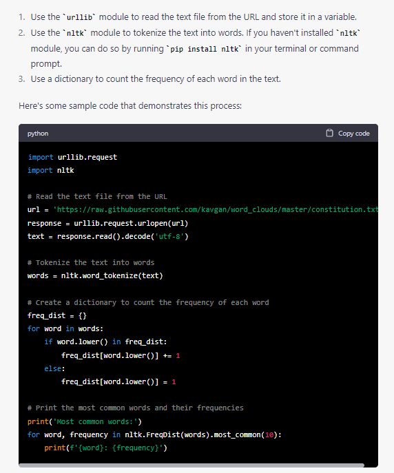
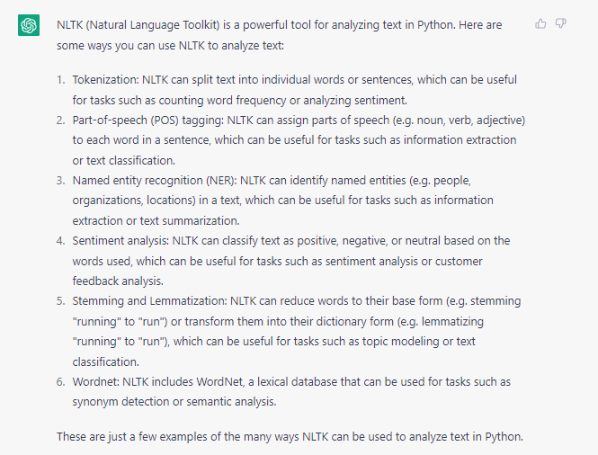
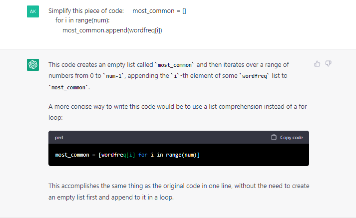

# Text-Analysis-Project

## Project Overview

For this project, I mainly used the data source Project Gutenberg to analyze different books. For the different techniques, I did the basic text analysis such as the frequency of words, finding most common ones. In addition to this, I also tried to look at the different part of speeches in a book as well as looking at the sentiment scores (what the overall vibe of the book sound like). From this project, I hoped to learn different ways to implement code for natural language processing in a way that humans cannot. Take the part of speech, for example, it would be hard for a human to even have a general idea of how many words are in a book, let alone how many of each part of speech is within the text. 

## Implementation

To start off this project, I explored Project Gutenberg to look for books that I was familiar with so I can compare my own understanding of the text to the result of the natural language processing. From there, only three books caught my eyes which were *Little Women*, *Frankenstein*, and *The Great Gatsby*. I decided to use one of them (*Little Women*) to conduct a basic text analysis. For the other two books, I decided to compare the general vibe of the text. For both analysis I wrote separate python files: **book_analysis.py** and **compare_books.py**. I did import book_analysis.py to the comparison file to continue to use the basic text analysis functions even in the compare_books.py.

At the start of the project, I was having a hard time getting rid of punctuations from the text when the url is being read. It didn't make sense to me since I was using code from the analyze_book.py assignment we did in class. After looking into it, I figured out that the reason being is when the url is being read it returns a string and going back to the analyze_book.py, the file was directly opened from vscode and so the type was different. I turned to ChatGPT for how to correclty analyze text when the url is read and it provided me with the nltk word tokenize method.

!

When implementing this method, I successfully got a word list. However, the code was somehow recognizing punctuation as a separate string which is a problem because words like don't or won't will be separated into three strings. For example, the word don't will be tokenized as 'don', ''', and 't'. In the end, I decided to write my own code instead of using ChatGPT.
When I was starting to use the nltk library, there were so many options so I asked ChatGPT what are some ways I can use nltk to analyze text in python. From the result given, I decided to use three of the techniques including Part of Speech tagging, sentiment analysis, and stemming. 

!

There were also times when I asked ChatGPT to simplify some code into one-liners. The following image is an example.

!

## Results

Through this project, I was able to look at the book *Little Women* more in depth. It was interesting to see the difference in just the common words and the common stemmed words. When looking at the regular common words, it made sense that the character names were included as a few of the top ten most common. What was suprising was that the the list of common words after stemming the text was similar to the one with the regular words. While writing the code, I thought that after stemming the text, words that have the same roots will be combined together. Different from what I expected, the characters' names remain one of the top ten common words. Besides the stemming of the text, the Part of Speech tagging analysis was quite what I had expected. The most common being nouns is probably a common ground for most books, following up being prepositions is expected as well as it connects a relation between a noun and another word. What was unexpected from this result is the third most common which is adjectives. I would think that verbs would come first since they're more essential to a completion of a sentence but apparently that's not the case. 

Looking at both *Frankenstein* and *The Great Gastby*, I tried to compare the books using sentiment scores, specifically the positive and negative scores. The results here were quite surprising as well. Having read the books, I thought that *The Great Gatsby* would be more positive and *Frankenstein* would be more negative. The results did show that *Frankenstein* was more negative but the difference is not apparent. It also showed that *Frankenstein* was more positive than *The Great Gatsby* which I thought was interesting because from my memory I thought Frankenstein was towards a sad side of a story of how a man is created by a scientist. At the same time, it also makes sense since the book is all about **life** so there is a lot of positivity there aout having hope to live a good life even though he was created as a creature. 

## Reflection

Overall, I thought that the project was really fun where the results were different from my expectations. Through this project, I also learned different methods of text analysis and the vast ability of python to be able to do a lot of different techniques. The biggest takeawy I had from this project is definitly how convenient coding it by seeing a glimpse of how python can make a lot of events easier to do. Reflecting back on the time I spent on this project, I think I spent more time than I would have liked trying to figure out how to make specific code work such as the url problem I had than spending more time on the actual analysis of the text. There were more techniques I would've wanted to apply such as comparing the text of the book to the Wikipedia site of the book or comparing the sentiment score of the text to the sentiment score of reviews on the respective movies of the book.

From this project, I also developed a reliance on ChatGPT. Before this project, I had never used ChatGPT before but after using it I found myself going to it whenever I had a problem. However, sometimes it also does not really answer the essence of my question so going forward I think its better that I rely on myself. 