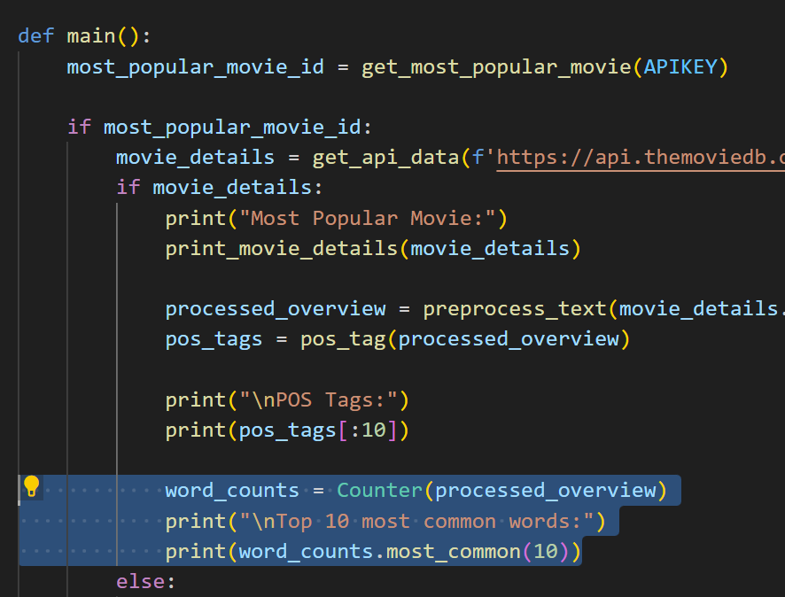
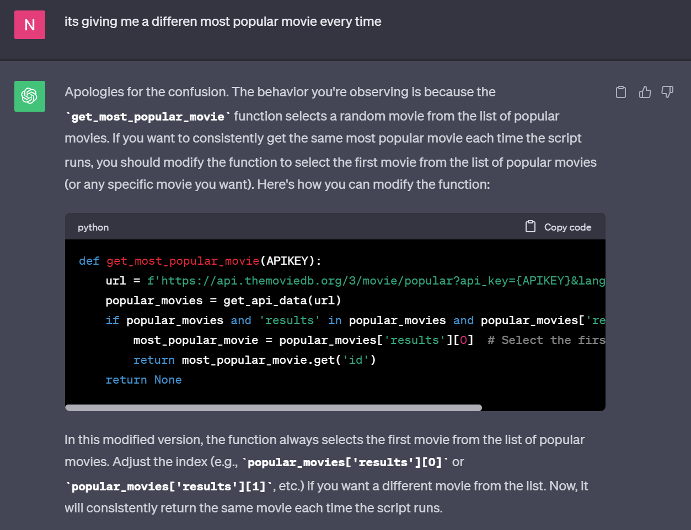
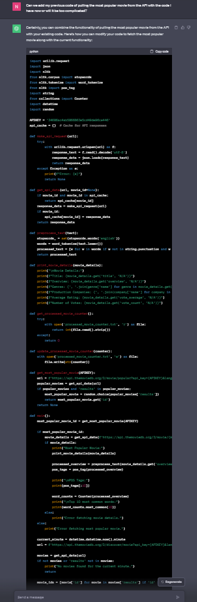
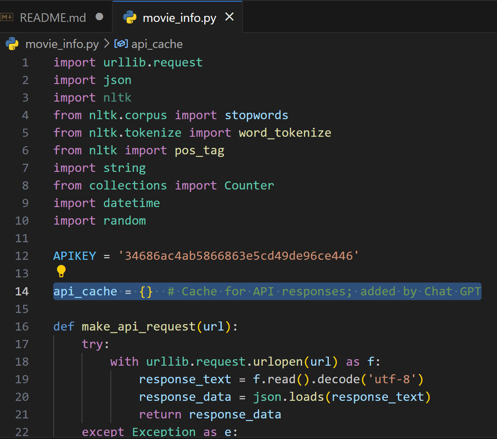

# Text-Analysis-Project
 
Please read the [instructions](instructions.md).
## Project Overview

In this project, I chose to explore movie data from the popular movie database, The Movie Database (TMDb), utilizing their API. I tried to analyze various movie attributes and draw insights from the data collected. My main focus was to process movie overviews and analyze the word frequencies, part-of-speech tagging, and the top common words in the overviews. I aimed to gather and print details of a random movie and the most popular movie at the moment and display relevant information. Through this project, I hoped to better understand the textual characteristics of movie overviews and possibly identify patterns or trends that might be prevalent in popular movies.

## Implementation

Initially, my choice of using The Movie Database (TMDB) was driven by a desire for more hands-on practice with API keys. I started by setting up the necessary imports such as urllib.request, json, and nltk to do the data fetching and text processing. I created functions to get the API requests, caching of API responses to make sure that users do not get the same movie response over and over again. I also made it preprocess movie overviews by eliminating stop words and punctuation. During this phase, I encountered a challenge with managing exceptions while making API requests. I had an error with nltk but was able to figure it out by reading what the exact error was. I found out that certain parts of nltk had not been downloaded yet in my python. Another error I had was with the same movie coming up over and over again. I wanted to make it so my code would generate a new movie and its details each time, along with the most popular movie currently.

For the text analysis, I used the Natural Language Toolkit (nltk) for tokenizing text, removing stop words, and performing part-of-speech tagging, which played a crucial role in comprehending the textual composition of the movie overviews.

During the implementation, I utilized ChatGPT to address some of the errors encountered and to refine the code structure. While some errors remained unresolved, the guidance provided was valuable in understanding possible causes and areas for improvement. However, Chat GPT did not help with all errors. Despite specifying the errors and seeking recommendations for resolution, the suggestions from ChatGPT didn't resolve the issues after implementation. The interaction with ChatGPT, though not fully resolving all issues, provided a platform for better understanding of the errors and potential areas of refinement in the code. An example of how I was able to use Chat GPT is when I asked "I have this code so far, are there any methods to simplify my code? I want to make sure it is running as efficiently as possible," and it responded with the following: 

## Results

In this project, I got to play around with The Movie Database (TMDb) API, which was interesting. I wrote a Python script that not only fetches movie details but also dives into the language used in movie overviews. Using the Natural Language Toolkit (NLTK), I analyzed the text to find out which words pop up most often.

I had a few issues with finding the most popular movie as it gave me a different one each time I ran the script, although there should only be one. I included the screenshot below of what I said to Chat GPT and the answer it provided:

The language of popular movies as well as random movies are all about adventure and drama. Words like "investigates" and "journey" were frequently use in movie descriptions. I also used NLTK to tag parts of speech in the first ten words of the movie overviews. It's quite interesting to see the mix of nouns and adjectives used to set the scene for potential viewers.

I mentioned it previously, but I added a random movie to the popular movie so we could see a new result each time as the popular movie does not update that frequently. Based on the current minute when you run the script, it picks a different movie to analyze. So every minute, you get new movie details and a fresh analysis of its overview, which is a fun way to find some unexpected movie recommendations. I did this through Chat GPT as well:

The function 'preprocess_text(text)' tokenizes the input text into words, converts them to lowercase, and removes punctuation and stopwords (common words that are typically ignored in textual analysis such as "the", "is", "in", etc.). The function then returns the cleaned and processed text. This was new to me as it was a part of importing nltk but with the help of Chat GPT, it was much easier to implement.

The function 'print_movie_details(movie_details)' takes a dictionary containing movie details and prints out selected information including the title, overview, genres, production companies, average rating, and number of votes. This function gathers most of the data from the API and prints it. Then the POS tags and most common words can be found from this.

I had Chat GPT recommend I build in a caching system. I had never done this before so it was an interesting process. By storing previously fetched movie details, the system saved time and resources, reducing redundant requests to the API.

## Reflection

Finding and implementing the API went well. In terms of using Chat GPT, it was really useful for this assignment, especially because I was using new import methods like NLTK and Cache, so it saved a lot of time figuring out how to implement those. Being able to save this time was important because it allowed me to use this time on other aspects of the project that I had a better understanding of.

My main aspects I think I need to improve on are:

- Knowing how to fix errors on my own without the help of Chat GPT
- Gaining a deeper understanding of the libraries and frameworks used in the project to troubleshoot issues more effectively.
- Improving my ability to foresee potential challenges and devise strategies to address them proactively.
- Knowing how to best prompt Chat GPT to give the best answers
  
I believe my project was appropriately scoped and I had a fairly good testing plan. I was able to test my code as I went, and fixed each error as they showed up. I think I could have added more complex libraries to my project to make the insights more interesting. Through doing this project, I learned how to better test code, use Chat GPT to fill in my gaps and help edit my code, and I also learned about the application of NLTK in text processing and analysis. The project exposed me to real-world scenarios of gathering data from an external source and processing it to derive meaningful insights. Additionally, the experience showed the importance of a well-thought-out testing plan to ensure the smooth execution of the code. Being able to use Chat GPT to edit and find errors in my code were so helpful and this project highlighted that for me.