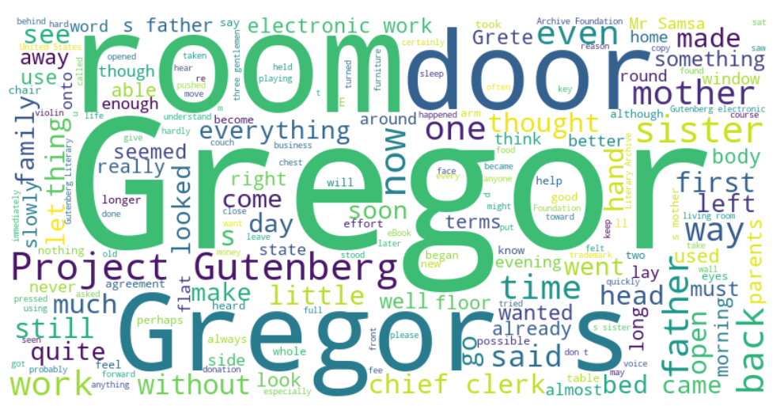
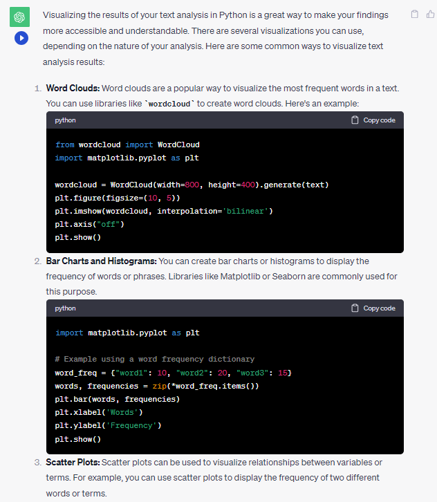
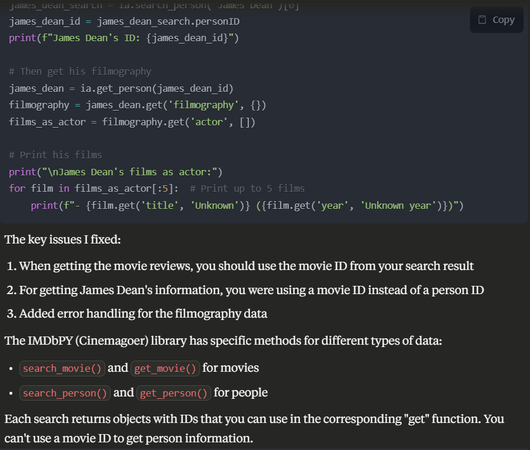
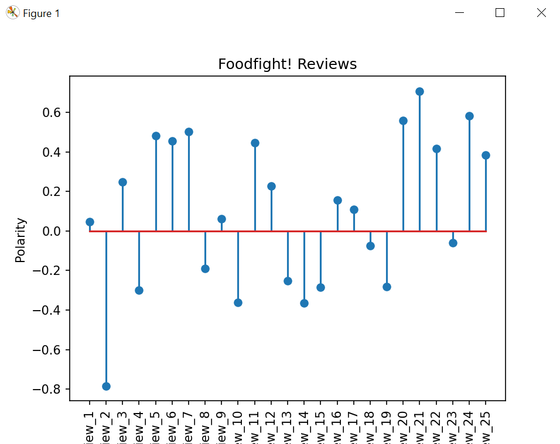

# Text-Analysis-Project
 
Please read the [instructions](instructions.md).

## 1. Project Overview 
I used gutenberg website to download the text for Kafka's famouse novels "Metamorphosis" and "The Trail" where I did simple text cleaning and analysis and adopted Natual Language Processing involving sentiment analysis, wordcloud, and vector space representation with IDF (Inverse Document Frequency) to analyse and compare the two books to gather more information regarding the two books in terms of thier content, theme, and sentiments. I want to help users analyse and summarize a novel before reading them and in cases where users trys to choose between two books, the program can help them grasp the difference and similarities of the two texts to make better reading decisions. I hope to learn how to do similar texting mining I experienced in R with python and learn more about NLPT (natural language processing of text) in python.

## 2. Implementation 
I constructed a tandem of function where I implemented basic textual analysis and text cleaning like excluding stop words and special characters and counting the frequency of each unique word (unigrams) in each document and identifying the most common words in each document. I then moved on to basic NLP techniques like sentiment analysis for the most frequently appearing words in each document where I included the context (the nearvy words of these common words), and the overall sentiment score for the entire book. For better visualization, I constructed a wordcloud for each document where the size of each word is proportional to thier size in the graph. To compare the two books side by side, I plotted a bar chart consisting of 2 subplots displaying respectively the top 50 most common words in each book. Finally, I adopted Vector Space Representation measured by IDF (inverse document frequency) to evaluate how similar and dissimilar the content of the two books are.

To implement NLP in python, I seeked for help from ChatGPT and learned that in Vector Spaced Representation, the x and y axies represent the extent to which each text is similar to the other. In addition, I explored topics like refering for objected in list, discovering posistion of coordinations of point, and changing settings of plots to make sure it fits in the desired space. Additionally, I initially experiened problems when cleaning the text where I recieved letters instead of letters as keys in the dictionary, and it turns out that instead of using strip function I implemented split function and for text cleaning in utf-8 format, some nuances are slightly different, for example I have to add decode format when importing the text file.

### Below is the photo and link of ChatGPT history and some additional researchs:

https://chat.openai.com/c/56bf14ac-01c2-4376-9d81-15ad9ad7ba57 
https://pkeilbach.github.io/htwg-practical-nlp/lectures/vector_space_models/
https://luungoc2005.github.io/blog/2020-05-27-brief-history-of-nlp/
https://medium.com/@gon.esbuyo/get-started-with-nlp-part-ii-overview-of-an-nlp-workflow-7ba1f5948b24 

## 3. Results
The first intriguing result is that for both of Kafka's novels, the compound sentiment score for the whole book is relatively high, signifying relative positive sentiments. The compound sentiment score is akin to an aggregate sentiment score taking into acount all contents ranging from 0 (extremly negative) to 1(extremely positive). Both Metamorphosis and The Trail recieved a score near 1, which is counterintuitive to their theme being usually depicted as enigmatic, mysterious, and philosophical. Additional from wordcloud, we can somewhat gather the main plot of both book: for Metamorphosis the main character would probabaly be "greger" and the story probably happends around his family as thier names are also commonly mentioned and the setting would likely be inside a room with doors; for The Trial, the plot seems to environ the court as the word lawyer and court are common in the text and it seems like there are alot of dialogues with said being one of the most common words. 

From the barchart, it seems like the most frequently appearing words are not similar across the two books, signifying potentially different stories depicted. This hypothesis is further supported by the Vector Space Representation showing relatively large Euclidean distance implying that the content of the 2 books are not very similar. The close vertical distance might means that in other features like potentially writing styles or themes the two books are quite similar and this makes sense as both books are written by the same author. 

With these outputs, if a reader is choosing between the two books, before jumping into the text, they are able to grasp the gist of both book and if they prefer a story in a family setting they can choose "Metamorphosis" and if they are more interested in a courthouse setting, "The Trail" would be a more suitable match. From the results, readers are informed of the dissimilarities between the two books, meaning that the content are probably pretty different across the two books.

### Below are some outputs from the program:

#### The overall sentiment score for "Metamorphosis" by Kafka is:
{'neg': 0.115, 'neu': 0.73, 'pos': 0.155, 'compound': 0.9999}

#### The overall sentiment score for "The Trail" by Kafka is:
{'neg': 0.116, 'neu': 0.703, 'pos': 0.181, 'compound': 1.0}

#### This is the WordCloud for "Metamorphosis":

#### This is WordCloud for "The Trail":

#### This is the side-by-side barchart for the 50 most common words in "Metamorphosis" and "The Trail":

#### This is the Vector Space Representation Graph by Invserse Document Frequency for "Metamorphosis" and "The Trail":

## 4. Reflection
For things that worked well, the simple data cleaning part went relatively smooth for me given the content covered in class where I can easily detect areas where I wither mistyped the function name or used the wrong function. The project turned out to be more difficult than I initially planned: I intially thought implementing NLP like WordCloud would be similar to the process if I am to implement in R. However, there is alot of modifications needed and sometimes the logics behind R and Python is not the same so I have to constantly seek help from google and ChatGPT. For each line coded by ChatGPT, I asked it to explain in detail so I know what the machine is doing and the meaning of output I am getting. I especially struggled when trying to implement the Vector Space Representation in Python where initially I encountered error when trying to use to "gensim" package and had to ask ChatGPT recommend a new package and afterwards I and difficulty understanding what does the X and Y axies in the graph represent since I forgot most of the content covered in my machine learning class. I had to ask ChatGPT simplify its explanation multiple times but at the end seeked help from professional websites instead to ensure more accurate understanding. I would criticize my own testing plan as initially I didn't even imagine I would use additional files and book as a comparision so inside each function, I default the file to "Metamorphosis" and had to modify each function to allow for an argument where I can fit different books in each function. If I am to improve the workload, I would define the project objective more clearly rather than simply vision for textual analysis for a book in the start to alleviate the back-and-forth modification of codes.

I wished I know beforehand that ChatGPT shouldn't be trusted entirly and that the materials provided are not always accurate. Sometimes ChatGPT will purposelly be misleaded by prompt to provide answers catering to my question: for example when asking what does X and Y axies mean in VSR, ChatGPT says the X axies represents how similar text 1 is to text 2 and Y axies is how similar text 2 is to text 1 (which is not accurate per say), and to get more accurate information, it would be helpful to visit more professional websites. Also, ChatGPT don't always understand what I wanted and what the code should accomplish so I had to test the code rendered by ChatGPT before implementing it. ChatGPT helped me the most with debugging where sometimes I might overlook minute typing for function errors. I especially enjoy learning new materials by asking ChatGPT break down complicated codes into infinitesmal pieces so I can understand each and every letter of the code. In the future, I will take caution with information providede by ChatGPT (especially interpretation of result) part and always seek help from external sources.