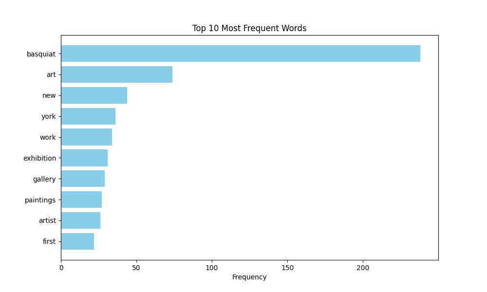

# Project Overview
For this project, I wanted to extract data from the Wikipedia article of Jean Michel Basquiat. I used a combination of text analysis techniques, which are described below:

1. **Data Source**: I obtained data from the Wikipedia page dedicated to Jean Michel Basquiat.
   
2. **Text Extraction**: I extracted text using the 'wikipedia-api' library to extract the raw text from Basquiat's Wikipedia page.
   
3. **Text Preprocessing**: I performed text processing using the Natural Language Toolkit (NLTK) library. This library allows for the tokenization of text, converting tokens to lowercase, removing punctuation, and eliminating stopwords.
   
4. **Sentiment Analysis**: I conducted a sentiment analysis on the text using the NLTK library to determine the actual emotional tone of the text.

5. Graphical Visualization: I added a graphical element to the project using matplotlib, a Python library used for visualization. This allowed me to create a horizontal bar chart to visually represent the frequencies of the top ten most used words in the article. This graphical representation offers a quick way to understand the importance of specific terms and key themes in the text.

In this project, I learned to retrieve a document from Wikipedia and also how to edit that document into the format I desired. I can now even determine, through the code techniques I learned in this project, if a piece of writing is biased by its emotion. This project provided a good introduction to text analysis and data visualization, which are enhancing my skills in understanding and interpreting textual data.

## Implementation
In my project, I implemented several key components. First, I used the 'wikipedia-api' library to obtain the raw text data from Jean-Michel Basquiat's Wikipedia page. Then I processed the raw text and preprocessed it using the NLTK Library. The preprocessing included tokenization and removal of stopwords and punctuation. For sentiment analysis, I leveraged the NLTK library to analyze the emotional tone of the text. By observing the emotional tone of the article, one can see its bias before even reading it. A crucial design decision was the choice of sentiment analysis technique. I had several alternatives, such as VADER (Valence Aware Dictionary and sEntiment Reasoner), SVM (Support Vector Machines), or Naive Bayes.

I made the choice of going with VADER because, given the scope of the project and data chosen, a more complex sentiment analysis would have definitely been overkill. VADER provided a straightforward and also interpretable way to gauge the emotional tone of the article, thus aligning well with the goals of understanding the sentiments regarding Jean-Michel Basquiat's life.

Addiotnally, I aldded a new element to the project by incorporating 'matplotlib', which is a visualization library. This allowed me to create a horizontal chart to visually represent the frequencies of the top ten most used in the article. This chart provides a quick way to see and observe which of the words have the highest importance within the article. 
### Results
In this project, I conducted a text analysis on Jean-Michel Basquiat's Wikipedia page, focusing on the sentiment and text preprocessing of the article. For the sentiment analysis, I used VADER, which revealed an interesting insight: the sentiment was notably positive, with a score of 0.999 (positive). This result was surprising considering that, in his early career during the 1980s, Jean-Michel Basquiat wasn't well-received by many influential artists. Since he started as a street artist, he wasn't initially as recognized as his contemporaries. Additionally, Basquiat's tumultuous life, marked by excessive drug use to cope with depression and isolation, could have implied a more negative portrayal. However, taking into account his profound influence on the abstract art community, this positive sentiment aligns with the impact he has had on the art world and culture.

I also explored the cleaned and tokenized text after preprocessing, providing a foundation for further analysis. As part of the new implementation, I visualized the top ten most frequent words in the article using Matplotlib, which revealed that "Basquiat" and "art" were the most prominent terms, offering a quick overview of key themes associated with Jean-Michel Basquiat's life and work.

#### Reflection 
From a process perspective, the project unfolded pretty smoothly. Extracting and processing the text from Jean-Michel Basquiat's Wikipedia page using the 'wikipedia-api' library and NLTK actually proved to be not just an effective approach but not as difficult as I first envisioned it. The decision to focus on sentiment analysis using VADER, given the chosen data, was actually a good choice because it allowed for the readers to see if the article is leanring towards a scpecific sentiment bias. This straightforward sentiment analysis technique offered a clear method to get the emotional tone of the article, which allowed for a better understanding of Jean-Michel Basquiat's life. The project's scope was appropriate and allowed for an in-depth text analysis.

However, I believe that there's room for improvement. In future projects, incorporating more advanced natural language processing techniques and could definitely enhance the depth of analysis. 

From a learning perspective, this project provided valuable insight on  the extraction, processing, and analysis of text data. ChatGPT played a pivotal role in offering me guidance on text analysis techniques, assisting in intepretation of my results and also suggesting code improvements. Looking back, a better understanding of advanced natural language processing tools and how to use them effectively would have been valuable for a more ccomplex analysis.

