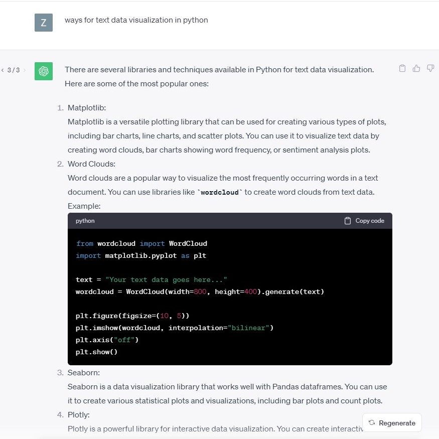
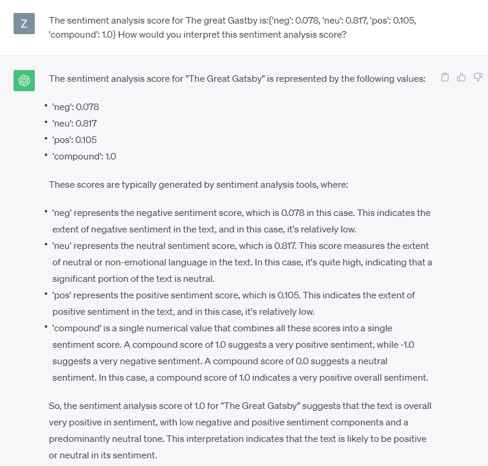
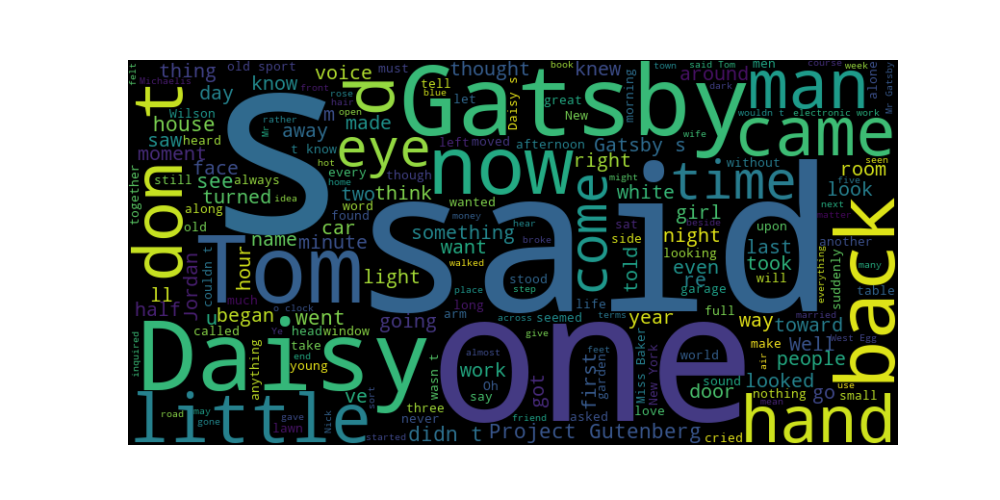
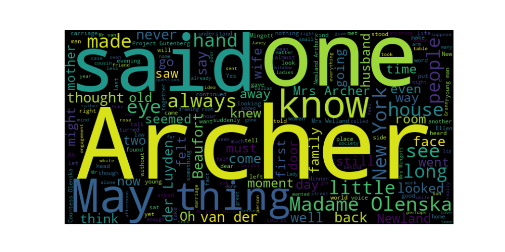
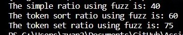

# Text-Analysis-Project
 
## Project Writeup and Reflection

### 1. Project Overview  

For the data sources of the project, I downloaded two books from Gutenberg. One is "The Great Gatsby" by F. Scott Fitzgerald, and the other one is the "The Age of Innocence" by Edith Wharton. They both offer insightful commentary on the upper class of the US. "The Great Gtasby" focuses on the extravagance and decadence of morality in the 1920s, while "The Age Of Innocence" focuses on the strict social norms in the late 19th century. Therefore, I thought it would be intersting to analyze these two texts together. The primary techniques I used to process and analyze the data are basic word statistics analysis, word cloud analysis, sentiment score analysis, and text similarity analysis. In this project, I hope to dive into comparing and contrasting between the two texts, "The Great Gatsby" and "The Age of Innocence", while using and studying different technique of data analysis and visualization using python. 

### 2. Implementation  

For my implementation, I adapted some codes from class exercises. To make the analyzation process easier, I first preprocessed the text data by conducting simple data cleaning. For example, stripping out unneeded characters, identifying when the text processing should start and end, and splitting each line into formatted words. The major component of this project are functions to calculate words statitics. For example, I used functions to calculate number of total words, number of different words, and common words' frequencies in each text. To better visualize the common words' frequencies of the two books, I generated word cloud usng the WordCloud library, which present the frequencies using different colors and font size. In addition, I utilized natural language processing by using the NLTK library to get the sentiment analysis score of the books. This helps to identify the negative, neutral, and positive sentiment in the text. After that, I used the fuzz library to learn about the text similarity ratio between the text. To better manage my program, I used the 'main' function to put various functions in one execution. 

One design decision I made was using word cloud to visualize the frequencies of common words being used in the text. I could also made histograms, heatmaps, frequency tables and so on. But I chose word cloud because it provides the best visualization, which is very visually appealing due to its different colors and word fonts. It allows users to easily notice the words with the highest frequencies and have a very basic understanding of what the text is mainly about. Regarding using chatGPT to learn new things, I asked ChatGPT for ways for data visualization in Python. I found it very helpful as it offered me many methods and gave me brief descriptiions of each. This allowed me to choose wordcloud, which is more appropriate for my data.

In addition, after getting the result of the nltk sentiment score analysis, I was a bit confused. So I asked ChatGPT to teach me interpret it. 

### 3. Results 

In my project, I got insightful text analysis results of my two books. First of all, I learned "The Age of Innocence" is much longer than "The Great Gatsby" with one time more number of words. However, the number of different words in each of the book are relative close. This represents that the number of total words in a book is not relative to the number of different words in a book.

In addition, from the result of the most common words and word cloud of each book, I found that "said" is frequently used in both book. This indicated that both novels include lots of dialogues between characters, representing the authors' common writing style regarding to dialogues. In addition, the word cloud is very helpful in giving audience a brief understanding of the book. For example, from the word cloud of "The Great Gatsby", we can learn that Gatsby, Daisy, and Tom are the main characters. Words like "don't", "came", "back", "time", "now" states the people's persistence on their American dreams during the era in the book. 

Word Cloud of "The Great Gatsby"：

Word Cloud of "The Age of Innocence"

Moreover, I used natural language processing to obtain the sentiment analysis score for the two books. I learned that the tones of both them are relatively neutral. I think this also shows the writing style of the authors are similar. Besides that, I calculated the simple, token sort, and token set ratio using fuzz to find the similarities between the two texts. I believe the result indicates that there's a degree of textual similarity between the two texts because they have similar themes and the authors have similar writing styles. 

### 4. Reflection 

Overall, I enjoyed doing this project as it helped me recap what I've learned and learn new things with the help of ChatGPT. What went well is that I didn't encouter too many challenges during the process. I'd say my biggest challenge was actually stripping out the unnecessary parts of the texts. Because the text structure is a bit different from what we've learned during class, I couldn't figure out what's wrong with my code. But under professor's instruction, I was able to successfully get the intended result. One thing I could improve is conducting more complex text visualization to make the text analysis more comprehensive, which I have limited knowledge about. I think my project was appropriately scoped and I had a good testing plan. I went over the whole project instruction first and had a rough outline before starting the actual work. 

From a learning perspective, I gained many insights on utilizing what we've learned during class in real life examples. I also learned the techniques of word cloud, fuzz ratio, and nltk sentiment analysis. ChatGPT was very helpful for learning new techniques like the word cloud. I used it to learn the example codes of word cloud and apply it on my own project. Going forward, I think I will keep using it to learn about techniques that I'm interested in and have not covered in class. I would also keep using it to conduct error debugging when I cannnot figure out the problem. Something I wish I knew beforehand that would have helped me succeed would be how to apply techniques like wordcloud, nltk sentiment analysis, and so on. This is would help me to work on my project more efficiently. In the future, I would also apply the text analysis techniques on analyzing other large text data. I believe this would provide many insights while saving lots of time. 