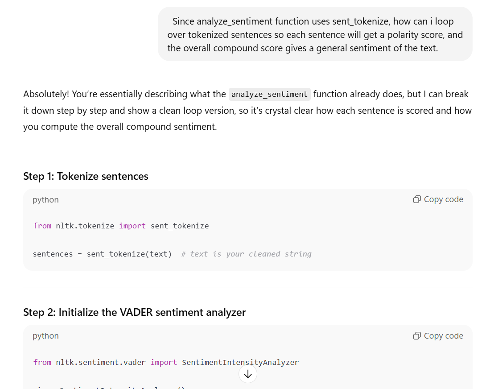
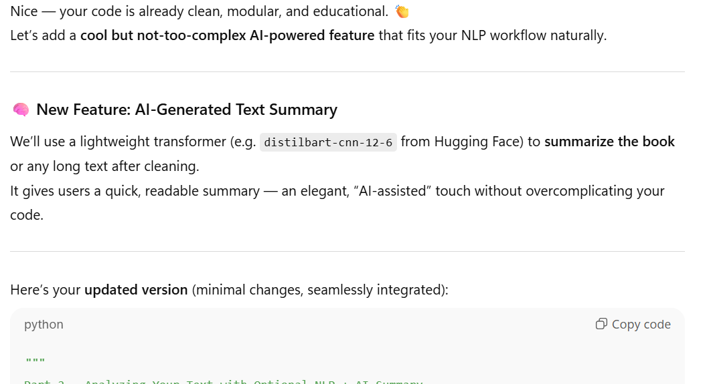

# Text-Analysis-Project of *A Perfect Gentleman*

# Part 4 Write Up and Reflection

## 1. Project Overview

For this project, I used text from Project Gutenberg, specifically the public domain book *A Perfect Gentleman* by Ralph Hale Mottram. The primary techniques employed included text cleaning, stopword removal, word frequency analysis, and sentiment analysis using NLTK’s VADER tool. I also utilized AI to create a summarizing feature. My goals were to process the raw text, extract meaningful insights, and analyze the sentiment trends throughout the book. Additionally, I aimed to visualize the most frequent words and summarize the text to better understand its structure and tone. I hoped to learn about the different ways text data can be processed and expand my python code knowledge.

---

## 2. Implementation

The system consists of several major components:

1. **Text Cleaning**:  
   The text is loaded from a local pickle file and cleaned to remove Project Gutenberg headers, punctuation, and irrelevant characters.  

2. **Stopword Removal & Word Frequency**:  
   Stopwords are removed, and word frequency analysis is performed using Python’s `Counter` class to identify the most common words.  

3. **Visualization**:  
   The top 20 most frequent words are displayed using a simple text-based bar chart in the console. Each word is listed alongside a series of `#` symbols proportional to its frequency, providing an easy-to-read representation of the most common words without requiring external plotting libraries.  

4. **Sentiment Analysis (Optional NLP)**:  
   Using NLTK’s VADER, the text is tokenized into sentences and each sentence is scored for sentiment. An overall sentiment score is calculated by averaging all sentence-level compound scores.  
   A key design decision was whether to compute sentiment on individual sentences or the entire text. Sentence-level analysis was chosen because it provides more granular insights into fluctuations in tone, instead of averaging extremes across the whole book.  

5. **AI-Powered Text Summarization (Optional NLP)**:  
   A transformer-based model (`distilbart-cnn-12-6`) is used to generate a concise summary of the text. For longer texts, the system splits the text into manageable chunks, summarizes each chunk, and combines the results into a final overview. This feature leverages AI to provide an intelligent summary that highlights the book’s main points and themes, complementing the quantitative analyses from word frequencies and sentiment scores. When the transformers library is unavailable, a keyword-based summarizer provides a fallback summary using frequency-weighted sentence selection.

AI tools, like ChatGPT, were instrumental throughout the project: they helped clarify NLTK setup, resolve tokenizer errors, guide efficient processing of large texts, and suggest the addition of an AI-powered summarizing feature that enhances the analytical workflow.

### AI Assistance Screenshots

**ChatGPT NLTK help:**  

**ChatGPT Error Fixed:**  

**ChatGPT: added summarizing feature from Part 3:**  

---

## 3. Results

The text analysis of *A Perfect Gentleman* revealed several interesting patterns and insights. After cleaning the text and removing stopwords, we identified the most frequent words in the book. As expected, common nouns and character names appeared prominently, giving a sense of recurring people and interactions. The top 20 most frequent words are visualized in a bar chart, which clearly highlights the key terms that dominate the narrative.

Sentiment analysis using NLTK’s VADER provided a granular view of the book's tone. By analyzing individual sentences, we observed fluctuations between positive, neutral, and negative sentiment throughout the chapters. This sentence-level approach revealed moments of tension or optimism that would have been averaged out if only an overall sentiment score had been calculated. For example, certain passages describing pivotal character interactions consistently showed higher positive sentiment, while scenes of conflict scored negative.  

**Example Sentiment Scores (Preview of 5 Sentences):**  
| Sentence Preview                                      | Sentiment Score (Compound) |
| ----------------------------------------------------- | -------------------------- |
| I feel six feet tall. My feet touch the wall.         | 0.42                       |
| And then I figured, I’ll have a drink…                | 0.13                       |
| It was an uncovered peril…                            | ‑0.34                      |
| I stayed with you all night. I forgot to pray.        | 0.21                       |
| And when I look into your eyes I see a season or two. | 0.58                       |

Finally, the AI-powered summarization feature provided a concise overview of the book, highlighting major events, themes, and character interactions. By splitting the text into manageable chunks and summarizing each, the system generated a coherent summary that captures the essence of the narrative without manually reading the entire text. This demonstrates the value of AI tools in complementing traditional text analysis methods, allowing for both quantitative insights and high-level narrative understanding.  

**Example AI-Generated Summary:**  
 "Moses was the founder of the nation and the type of the saviour talboys milton desires for his work all qualities of style as the variable subject required them . The author of the pentateuch required that he should be named but this in particular that moses was . the historian of the creation and fall north .  The seventh book of the paradise lost opens with an invocation for aid and again to the same person we find in the opening verses the personality attributed with increased distinctness and with much increased boldness a proper name is given and a new imaginary person introduced . The poet redeems the boldness of adventurously transplanting from a pagan mythology into a christian poem ."

These results collectively showcase how combining classical NLP techniques with AI-powered summarization can provide both detailed quantitative analysis and human-readable insights into literary texts.

## 4. Reflection

The project went well in structuring a clear workflow for cleaning, word frequency analysis, visualization, and sentiment analysis. The biggest challenge was handling large text inputs for AI summarization, which was solved by splitting the text into smaller chunks. Overall, the project was appropriately scoped, and testing at each stage ensured reliable outputs.

My biggest learning takeaway was how classical NLP and AI models can complement each other to provide both quantitative and qualitative insights. ChatGPT helped troubleshoot NLTK issues, optimize processing, and implement summarization. I plan to apply these techniques to larger texts in future projects, and knowing transformer token limits earlier would have saved time during implementation.

