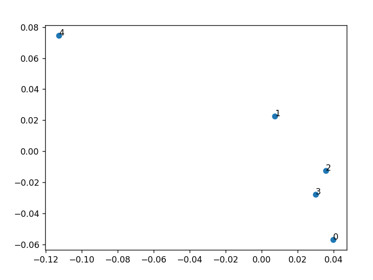

# Text-Analysis-Project
 ## Part 4: Project Writeup and Reflection

Write a summary of your project and your reflections on it in [`README.md`](README.md), using [Markdown format](https://docs.github.com/en/get-started/writing-on-github/getting-started-with-writing-and-formatting-on-github/basic-writing-and-formatting-syntax). There is no need to use fancy words or ChatGPT. The [`README.md`](README.md) file should consist of the following sections:

**1. Project Overview**

This project is aimed at utilizing skills I have learnt in my Python class to process and analyze a text of my choosing. For this project, I chose the novel "Phantom of the Opera" by Gaston Leroux as a txt file from Project Gutenberg. I used Natural Language Processing to get a sentiment score for each of the characters. I hoped to learn more about the process of understanding a text and language through Python Programming.

**2. Implementation** 

Describe your implementation at a system architecture level. You should NOT walk through your code line by line, or explain every function (we can get that from your docstrings). Instead, talk about the major components, algorithms, data structures and how they fit together. You should also discuss at least one design decision where you had to choose between multiple alternatives, and explain why you made the choice. Use shared links and/or screenshots to describe how you used ChatGPT to help you or learn new things.

To begin to understand the data, I decided to count the number of words in the file, then break up those words into a histogram. From there, I counted the number of times those words occurred in the book. Similar to our exercise, I used a dictionary to store the words, and used a frequency counter as values (while words were keys). Next, I dowloaded stop words as a txt file and used it to a create a list of stop words. Then I iterated over the file to add them to a list. I used this to remove a series of stop words from then on. 
I also created a list of the most common words found in the file, removing stop words to get only the most important words. Finally, I did a sentiment analysis, for every line containing a word referring to one of the main characters. This was done with help from Chat GPT, who pointed me to resources where I could learn more about NLTK. I also used Chat GPT to trouble shoot a lot of code.

**3. Results** 

Present what you accomplished in your project:
 From the data, the word with the highest frequency was "Christine" a protagonist from the novel. She is mentioned 397, while her complimentary protagonist Raoul is mentioned 341 times -- almost an equal amount. The word 'who' also occurs alot -- which makes sense, given the book is a mystery novel. The Phantom himself is mentioned many times in the top ten list: First as Erik (216 times) then as ghost (193) times. Overall, Erik seems to appear more than the two main characters in the text. 
 I also found the writer wrote the novel mostly neturally. But the text still leans in some interesting directions. The most expected aspect of analysis is realizing that Christine was the character given the most positive view in the text. She had a sentiment score of 52.13% ; meaning that 52% of the time, Christine was being mentioned in a positive way. The Phantom and similar scores: both around 47.5%. This is interesting, because for all intents and purposes, the Phantom is meant to be the villain-- yet his score is fairly similar to the main characters of the book, especially Raoul. 

**4. Reflection**

From this project, I have learnt that planning is probably the most essential part of programming. For some reason, I often have the instinct to get right into the problem with programming, instead of carefully planning my course in advance. This led to many bumps on the road. Because of these early bumps, I drastically shrank my scope, in order to allow for more time to learn and decrease my reliance on Chat GPT. 
I also encountered some of the limitations of Natural language processing. For example, my sentences for my sentiment analysis were not perfectly formulated. This was because words like "M.Chagny" (Mister Chagny) confused the program. Therefore I would get sentences like "Well, M." with the next sentence beginning with "Chagny was going to" and so on. 
But regardless of these limitations, NLTK is a powerful tool, and NLP is an interesting way to derive insights from large resources. 
Chat GPT was an incredible resource. It helped me understand what Natural Language processing was, and helped me trouble-shoot code throughout the process. Sometimes through, it was limited in trouble shooting -- probably due to a lack of the cmplete context. In those cases, I began to understand a little about troubleshooting myself. In those cases, my tactic was to follow the logical flow of a solution and talk to my water bottle (I did not have a rubber ducky at the time) in order to gain insight. 
From a process point of view, what went well? What could you improve? Was your project appropriately scoped? Did you have a good testing plan?

From a learning perspective, mention what you learned through this project, how ChatGPT helped you, and how you'll use what you learned going forward. What do you wish you knew beforehand that would have helped you succeed?
