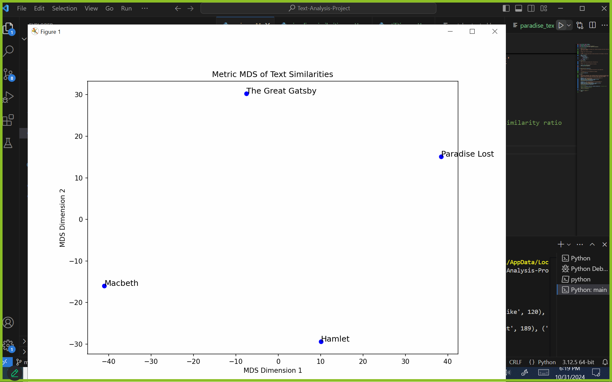

# Text-Analysis-Project

This is the repository for my text analysis project for OIM3640

## Project Overview

For this project, I began by analyzing The Great Gatsby by F.Scott Fitzgerald using project Gutenberg as my data source. I used techniques such as finding the most common words in the text and filtering out unnecessary things such as stop words, capitalization, punctuation, and other symbols that were affecting the outcome of my data. As having the data by itself was cool, I wanted a bigger purpose for this project, in which I decided to compare Gatbsy with another book from Fitzgerald, as I wanted to analyze the similarities between the texts. Later on, while already having written the function to download books from Project Gutenberg, I expanded by adding 2 Shakespeare books in order to find the similarities and differences between the writing styles of 2 different authors.

## Implementation
Initially, my goal was to create a function in which Visual Studio Code would be able to access my text file repeatedly without encountering any issues with Project Gutenberg, which is shown at the beginning of my utilities.py file. Once the text was already downloaded, I used word count techniques that we had learned in class in order for my text to show me the top words from the text as well as how many times they showed up throughout the entirety of the book. 

However, as the data was still coming out messy, I built on it by creating a function to clean out the text, in which I asked ChatGPT to show me how to filter out stop words with a NLTK library already downloaded in my computer. I wanted this to be in the main function in my repository, as I wanted for every time I downloaded a text for it to be filtered and cleaned up. 

Following my progress in section 2 for the assignment, I felt stuck on deciding what I wanted to do next. I found the idea of a Markov Synthesis interesting, however, while already having the function to download and analyze any text file from Gutenberg, I felt it would be more simple to compute a similarity matrix.
I asked chat GPT for help in conducting this, in which I was able to learn how to use MDS Visualisation to plot my results. 

Additionally, I asked chatGPT for help in structuring my docstrings and making my text look more organized.

## Results

From my text analysis, I was able to find the top 10 words with their counts in This Side of Paradise and The Great Gatsby, as well as a text similarity analysis which gave me a score of 44. From the top words, I did find a similarity in the use of the words “said” and “like” which both appeared in the top 10 for each book. Something interesting I found was that “Gatsby” was a common word in Gatsby, but “Paradise” wasn’t for This Side of Paradise, showing contrast in the writing styles for both books.

From my MDS Visualisation and text similarity analysis, I got more interesting results than when I only compared two books, as I felt at that time that the numbers from my first similarity analysis were harder to find a meaning as it felt that more data needed to be present in order to see more similarities between the text apart from what was originally being shown in my terminal. When seeing them visually, and comparing them with Shakespeare, I was able to see how on a surface level Gatsby and Paradise weren’t so similar, but then looking at them compared to another author, you could see how the author's style correlated with the other.
## Reflection
For me the biggest challenge was getting started, as the whole process felt confusing and overwhelming. However, I felt that I had to treat it on a step by step basis and prioritize simplicity and organization in order to not get lost in the whole process. Overall, I did feel like my project went well, I have an effective Main function that is able to analyze word frequencies and word counts in texts, and I conducted an effective text analysis. I learned a lot from this project, and using AI sporadically helped me understand complicated parts in the assignment from a step by step basis and helped me create functions to run my code effectively when I felt lost in the assignment. Additionally, chatGPT helped me with organizing my docstrings and making my code more readable and understandable. Going forward, I will use the tools I learned in order to be more organized when writing code, and to work together with Gen AI in future projects to visualize my ideas and translate them into actual code. 

