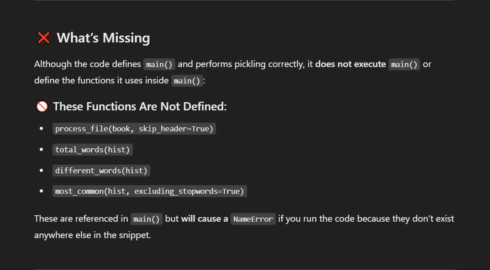

# Text-Analysis-Project
 
Please read the [instructions](instructions.md).

# Project Overview 
The data source used was a Reddit API and in particular, the main league of legends subreddit. Within the subreddit, I pulled comment data from all the post-match discussions during this year's world tournament. Taking all of the comments, I ran a sentiment analysis using the NLTK sentiment intensity analyzer. I then used the compound value, which is the overall score or sentiment, to score each comment. After each comment was scored, I would average the compound score grouped by the regional matches. The purpose of doing this project is to understand the sentiments surrounding between different regional matches and see this year which matchups seem to gather the most negativity. The negativity can be a result of many factors, either the fans are insulting the team they wanted to win but lost, or rivalries sparking heated debates, or fans complaining about what should have been done. Overall, the league community is a very toxic community and I wanted to see how toxic it is when discussing the worlds matches.  

# Implementation
The major component of this analysis was the creation of the dictionary that was used. At the world tournament, there are four major regions that are participating, NA, EU, China, and South Korea in a swiss stage format. This format ensures a lot of international match ups and I based the dictionary off of these match ups. Each key in the dictionary was a region vs region matchup, including same regions (NA vs NA). The values to these keys are the list of match ups that would categorize them based on one of the possible regional matchups. Because the dictioanry being used contains a list, multiple for loops was used to iterate by each post-match discussion page to get the individual comments. One design decision I had to make was the use of either a scatterplot or a bar chart. I had initially wanted to use a scatterplot, however, that was not practical as I would either have to come up with another int variable to go along with the compound score or make multiple separate scatterplots. So I instead decided to go with bar charts for its practicality and simplicity. ChatGPT was especially helpful in teaching me how to create a bar chart with my current code and to also include different colors in the case when a score is in the negatives. 

# Results
The results of the text analysis was for the most part expected but the details of it was still interesting. All of the regional matchups had average compund scores that were very close to 0, meaning it is largely neutral. I had expected this result as the toxicity of the community is often exaggerated in most cases. All regional matches except for one were leaning very slightly towards the positive side which was surprising as I had expected most would be leaning more so towards negativity. The regional match that was the most negative was EU vs EU with a negative average compound score of -0.07. This is not exactly surprising if you kept up with the tournament as this year, EU heavily underperformed and was the target of heavy criticism for their play. Adding on to this point, the lowest positive regional match up was NA vs EU which is again not very surprising considering the historic rivalry between the two. An interesting insight found within this analysis was that the positivity for China vs Korea was relatively higher than most. These two regions also have a historic rivalry with very dedicated fanbases. It is possible that the sentiment remained relatively high due to the nature of the matches that had occurred. Most of the matches were very close and entertaining to watch and so negative sentiment was less present compared to other regional match ups that had more one sided matches such as NA vs Korea. 

# Reflection
While the process about going to do a basic sentiment analysis based on Reddit comments was relatively smooth, there is a lot of room for improvement. I would have liked to include some form of metric that included the competitiveness of the match to go along with the sentiment score. I would have also liked to breakdown the sentiment score more on the various factors that commonly show up in the comments. For example, is there positivity because of good performance, entertaining match, or regional pride? The inclusion of pro player sentiments within the post-match discussion would have also added a lot more depth to the analysis. While the analysis was very basic, I do think the project was appropriately scoped in that I limited the data being collected to the main discussion threads for each match in order to paint a fair picture of sentiments. 

From a learning perspective, I was able to get a good taste of performing analysis through the use of python and APIs. To perform even a basic anaysis requires many iterations in order to get every important detail right and the process of those iterations helped me understand how to go about trying to solve or find out about a specific issue using python. This was also my first time using ChatGPT ever and I had not expected ChatGPT to be so helpful. The best use case of ChatGPT was debugging and helping me through any errors that I encountered in a very quick manner as long as I prompt it well. I was able to solidfy my understanding of dictionaries and lists within a dictionary which can help me perform better data analysis with the use of data structures. I do wish that I had a stronger foundation of python knowledge, especially dictionaries, that would have let me rely on ChatGPT a lot less than I would have wanted.