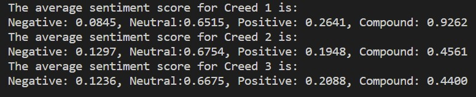
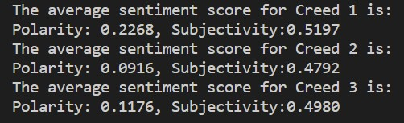

# Text-Analysis-Project
 
Please read the [instructions](instructions.md).

## Project Overview
The data source that I used to perform the text analysis is the IMDB Movie Reviews. This dataset provides a collection of movie reviews written by users of the IMDB website, which can be extracted and analyzed. Therefore, I decided to analyze the reviews for the movie series, “Creed,” which contains three movies: “Creed (2015)”, “Creed 2”, and “Creed 3”. In this text analysis project, I aim to perform a sentiment analysis of the three movie reviews. Based on the analysis, I hope to identify major patterns and overall user sentiment for each movie in order to draw comparisons and gain some insights. Throughout this project, I would also like to explore different Python libraries to process, analyze, and visualize my data. 

In order to better analyze the reviews, I will first process and clean the data by removing stopwords and unnecessary characters such as punctuations and whitespaces. To analyze the reviews, I will look at the frequency of words in all the reviews and determine the most frequent words used. I will then perform a sentiment analysis for each movie using two techniques with different Python libraries. Finally, I will compare the results to draw implications and analyses regarding the movies. 

## Implementation
Before beginning the text analysis process, I first processed and cleaned the data, which is coded in the file “movie_reviews.” I extracted the movie reviews from the IMDB database, and ended up with a total of 25 reviews for each movie, stored in a list. With the list of all the movie reviews, I processed the reviews by removing unnecessary characters such as stopwords, punctuations, and whitespaces. The cleaned reviews are then stored in a new list called “cleaned_reviews.” After performing these steps, I moved on to begin the text analysis process. To gain a general understanding of the key sentiment words and main themes of the reviews, I first wanted to analyze the frequency of the most common words used in all the reviews for each movie. In order to do so, I created a dictionary that contains words as keys and their corresponding frequency as the values. Using this dictionary, I generated the top 10 most frequent words and their count for each of the movies. 

Then, I began my sentiment analysis for the three movies. I started the process by using the `VADER` library in NLTK. Using the cleaned movie reviews from the “movie_reviews” file, I computed the sentiment scores for each movie. This would give me 25 sentiment scores for each of the reviews in the list. However, this would be challenging to summarize and draw comparisons between the movies. Therefore, I decided to compute an average score for each of the movies, which was done with ChatGPT’s assistance. 
<!--  -->

ChatGPT advised me to implement the `numpy` library, which would allow me to perform mathematical operations on multi-dimensional arrays. Since I stored all 25 sentiment scores in a large list, this library would help me compute the average scores after converting the list to an array. The scores are graphed with a bar chart to better visualize the data. The average sentiment scores and the bar chart is shown in the file “sentiment_analysis(vader).” Next, to further analyze the sentiment of the movie reviews and to get a more comprehensive view of users’ sentiments for the movies, I wanted to look at some different Python libraries for sentiment analysis. 
<!--  -->

From the list of Python libraries used for sentiment analysis that ChatGPT provided, I decided to use the `Textblob` library, which is also a sentiment analyzer tool. The structure of this analysis is very similar to the one done above. Using the cleaned movie reviews, I generated the average scores for each movie, which included the average polarity and subjectivity scores. To better visualize and compare the scores across the three movies, I plotted the data on a scatter plot based on polarity and subjectivity. The results are shown in the file “sentiment_analysis(textblob).” 

Before deciding to focus on the two sentiment analysis techniques, I originally wanted to explore computing a text similarity analysis between the reviews and create a clustering model using the K-means clustering algorithm to group and visualize the reviews for each movie. However, after building the model, I discovered that because my data is in high-dimension, it is very difficult to interpret the plots and draw useful implications. Additionally, the plot is also very scattered, which might be because the reviews are not very similar to each other or simply because the algorithm is not that effective at grouping the reviews. Therefore, I decided to just focus on the sentiment analysis and compare the results that the two libraries generated. *(The code for this is included in the file “text_similarity_clustering,” but it was not used as part of the analysis.)*
<!--  -->

<!--  -->

<!--  -->

## Results
From the output of the word frequency analysis, we see that the three movies have very similar frequent words in their reviews. The words “rocky,” “creed,” “film,” and “movie” appeared in the top 10 most frequent words for all three movie reviews. This result reveals that there might be some sort of connection or similarity between the three movies because users are using similar terms when writing the reviews. From the reviews of the movies, we are also able to gain information about some main characters in the films, which can be determined by character names in the word frequency output. This includes names such as “rocky,” “stallone,” “adonis,” “balboa,” “drago,” and “ivan.” The name “jordan” also appeared as one of the most frequent words in the reviews for both “Creed 1” and “Creed 3.” This is expected because Michael B. Jordan is one of the main cast in all three movies. These findings are interesting because it demonstrates that people are discussing common topics and themes across all three movies. It also reveals that the characters in the movies are what the audience pays the most of their attention to. This can suggest that those characters are particularly memorable or important in the audience’s perception. 
<!--  --> 

The sentiment analysis performed using the `VADER` library suggests that overall, users expressed a positive sentiment towards all three movies as the average compound scores for all three movies are positive. From the graph, we see that “Creed 1” has a very high compound score of around 0.926, which is significantly higher than the other two movies in the series. This signifies that this movie generated more positive sentiments among users. Although “Creed 1” has a similar percentage of neutral reviews as both “Creed 2” and “Creed 3,” it has a lower percentage of negative reviews and a higher percentage of positive reviews than the other two movies, which explains why the overall compound score is drastically higher. Furthermore, it is also very interesting to see that “Creed 2” and “Creed 3” have very similar scores across all categories, which can suggest that the two movies sparked similar types of sentiments among the audience. Although “Creed 2” has a slightly higher compound score than “Creed 3,” “Creed 3” has a slightly higher positive score and a slightly lower negative score than “Creed 2.” However, “Creed 2” ended up with an overall higher compound score. It is also interesting to note that the neutral scores are relatively high for all three movies, which can suggest that a lot of the reviews for the three movies are very objective and do not express a clear positive or negative emotion. 
<!--  --> 

<!--  --> 

The sentiment analysis output from the `Textblob` library provided a polarity and a subjectivity score for each of the movies, which is shown in the diagram. The results for all three movies suggest that, on average, all three movies have a positive sentiment as all the polarity values are positive. The subjectivity scores for all three movies indicate a moderate degree of subjective language used in the reviews, which means that the reviews contain both opinions and factual statements. The graph provides a clearer comparison between the three movies. We can see from the graph that “Creed 1” has the highest polarity score, which means that the reviews expressed an overall more positive sentiment than the other two movies. This result is also very consistent with the output from the `VADER` library. However, the sentiment scores for “Creed 2” and “Creed 3” suggests that although the difference in the polarity scores is relatively small, “Creed 3” has a slightly more positive sentiment than “Creed 2.” This is slightly different from the previous sentiment analysis result where “Creed 2” has a higher compound score than “Creed 3.” 
<!--  --> 

<!--  --> 

Overall, the sentiment analysis from the two libraries generated very similar results, with an overall positive sentiment across all three movie reviews. Additionally, “Creed 1” generated more positive sentiments among users than the other two movies. Although the results for “Creed 2” and “Creed 3” are inconsistent for the two libraries, the difference in the overall sentiment scores is relatively small. The IMDb website also provides a user rating for the three movies. The rating for “Creed 1” is 7.6, for “Creed 2” is 7.1, and for “Creed 3” is 7.3. When comparing the website ratings with my results, it is surprising to find that the ratings align with my sentiment analysis results. All three movies have a high rating of above 7, which is consistent with the movie reviews expressing an overall positive sentiment. Furthermore, “Creed 1” has a relatively higher rating, which also aligns with the sentiment outputs as it has a higher positive sentiment score. The inconsistent results from the two libraries for “Creed 2” and “Creed 3” can also be reflected in the small difference in the movie rating as they are only 0.2 points apart, which means that the audience might have similar sentiments for the two movies. This further demonstrates that movie ratings are somewhat associated with the overall sentiment the audience feels toward a movie. 

## Reflection
From a process point of view, I believe my project went quite successful as I was able to gain some insights regarding the movie reviews for the three movies in the “Creed” series. I was also able to compare the results between the movies with different approaches by generating insightful visualizations. Something that I can improve would be to use a larger dataset. Using the IMDB Movie Reviews data with the cinemagoer library, I extracted 25 reviews for each of the movies, which might not be sufficient to draw super accurate results. I could improve my result by using different text harvesting techniques, such as web scraping, to get more data to perform the analysis. Furthermore, I think my analysis would be stronger if I had a more sophisticated testing plan. For this project, I simply just tested the results by comparing them to the movie ratings on the website to see whether they were consistent or not. 

From this project, I learned multiple ways to process and analyze texts from various data sources. I was also exposed to a lot of different Python packages and libraries, which is something relatively new to me, yet I found it very fascinating and valuable. Additionally, I was able to gain a deeper understanding of Natural Language Processing in Python and how to apply them to analyze text. ChatGPT was a very helpful tool throughout my project as it provided guidance and suggestions regarding different analysis approaches. It also served as a useful assistant for debugging my codes and providing example codes for different analysis techniques. Moving forward, I could apply what I learned in this project to other similar text analysis tasks or projects, as text analysis is very useful in identifying patterns and developing insights from various data sources. Something that I wish I had known beforehand would be some different Python libraries for text analysis as well as their applications. I think this would be very beneficial because I would be able to spend more time exploring them and comparing the results that they generate instead of spending the time searching for different Python libraries and trying to understand how to use them. 

