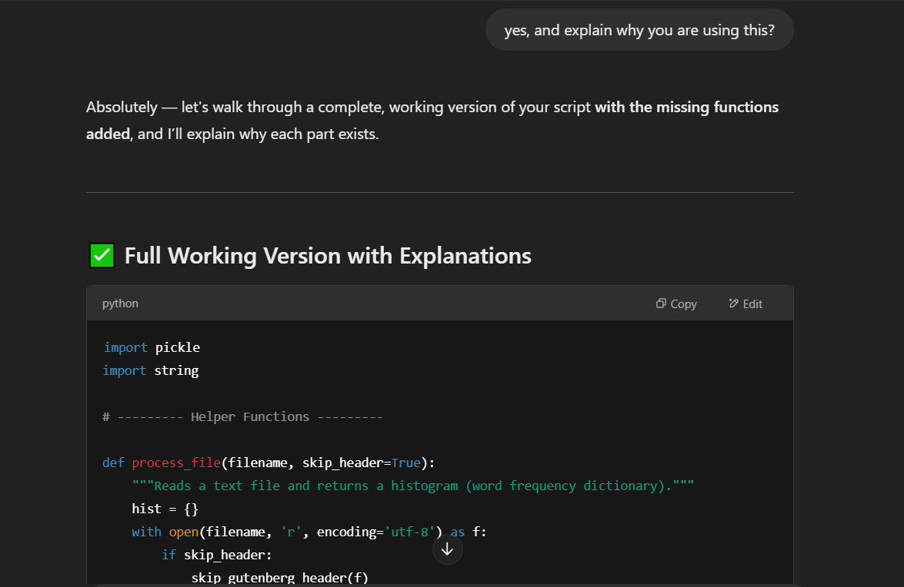

# Text-Analysis-Project
 
Please read the [instructions](instructions.md).
## Project Overview
### I used the website, Project Gutenberg, as the data source. I found the ebook "The Great Gatsby" on Project Gutenberg, and used its Plain Text UTF-8 link on the book's page. The techniques I used to process and analyze the data includes sentiment analysis, word frequency analysis, text similarity, and Markov text synthesis. The goal of my project is to efficiently process text analysis of a book. This could be helpful for students and scholars who need to work through a high amount of literatures.

## Implementation
### Data Processing
### I processed the text data to create a histogram that represents word frequency, remove stop words, and analyzed the sentiment of the entire "The Great Gatsby" book. I also performed a Markov text generator that analyzed the text data and generated new text based on the pattern it learned from reading "The Great Gatsby." I asked ChatGPT on how to remove stopwords before extracting the top 20 words in the Great Gatsby. Here's the link to the full conversation: https://chat.openai.com/share/a3f9671d-fbb7-4860-baed-5ba0b48b4437. After taking out stopwords, I ran into a problem that texts were all seperated apart. I wanted to rejoin the words for further analysis and ask ChatGPT on how to do that, as shown in the screenshot below. 

### Text Analysis
### The "process file" function tokenizes and processes the text. It creates a histogram of word frequencies. It also handles some text cleaning, such as stripping punctuation, converting words to lowercase, and removing stopwords. I used ChaptGPT for understanding the concept and asking for an example. For example, I asked chatGPT about what is Markov Text Synthesis, and it gave me a very detailed explanation. I followed up by asking chatGPT to provide me an example, but it didn't do a great job. 
###  Then, I rephrased my question and asked "can you provide me more detailed examples. show me how the model reads a sample, and learn how to generate random words" and followed up with another prompt of "showing example code in Python." Then, I was able to get sample code which I used as an template. Here is the link to the full conversation: https://chat.openai.com/share/eda06a43-6ab9-4fe4-ae5e-3bb9c8df7f61

## Results
### From the Sentiment analysis, it was very interesting to see that 81.7% of the words in "The Great Gatsby" are neutral. 10.5% of the words is positive, and 7.8% of the words is negative. Also, I compared the book "The Great Gatsby" to another book "This Side of Paradise" by the same author F. Scott Fitzgerald. The two books have 41% similarity, which is higher than I expected. I also generated a histogram of the top 20 words in "The Great Gatsby" that display the frequency that each word appears.
### 

### From the Markov text synthesizer, I got a very interesting output. "Necklace—or perhaps half an unrestrained “Huh!” and then back to someone said the conversation, but she explained, “or why did I asked her again. At eleven o’clock Michaelis and me if she said Wilson, swaying back at a straight chair and ice and floating in locating the intolerable part of Town Tattle over her sister Catherine to the room and then took dinner through Miss Baker from home, Daisy,” Tom’s girl and floating rounds of the butler went about it." I notice that the text is only consistant between two words sometime, but when pulling everything together, the sentence does not make sense at all. The reason is because the model is only reading "The Great Gatsby," and the sample is not large enough for learning purpose. If I train the model to read 100 books, the accuracy would improve. Here is a screenshot of the output of the Markov text synthesizer. 

## Reflection
### Overall I think the project went really well. I have successfully processed the text book and performed a few analysis. Future improvements could include more advanced natural language processing techniques and improve its accuracy by training the model by reading more textbooks. I think the project was appropriately scoped overall. Another improvement for the future can be using Python to analuze a larger database, such as books on Amazon. I could write code to read Amazon purchase reviews and perform sentiment analysis and filter out the ones with bad reviews. ChatGPT has helped me in understanding the sample code provided by the professor and helped me going forward when I'm stuck in writing the code. 