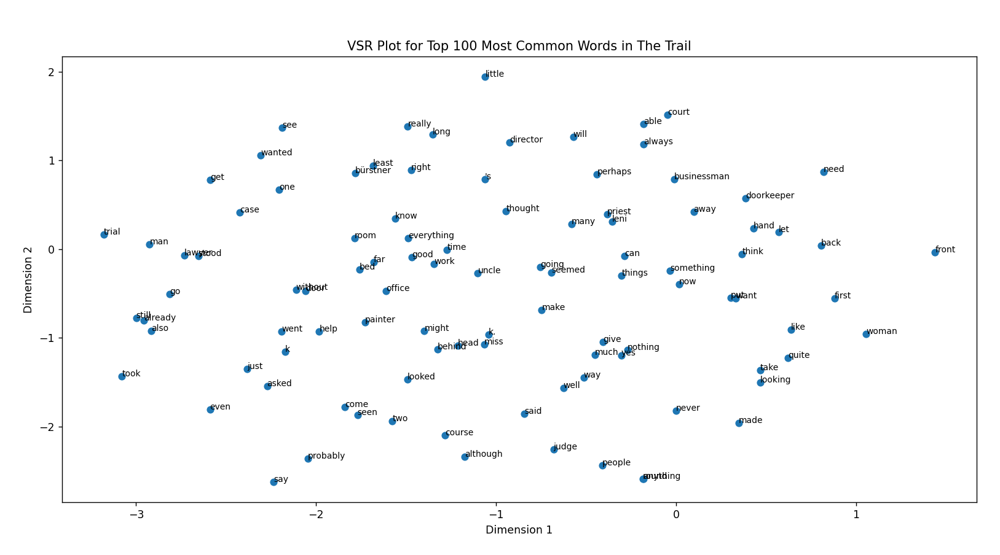

# Text-Analysis-Project
## Welcome to Assignment 2 
I hope you enjoy! :)

## 1. Project Overview
What data source(s) did you use? What technique(s) did you use to process or analyze them? What did you hope to create or learn through this project?

The data sources that I used for Assignment 2 came from Project Gutenberg (https://www.gutenberg.org/) and the two novels that I picked to be used was Frankenstein or The Modern Prometheus (https://www.gutenberg.org/cache/epub/84/pg84.txt) and The Great Gatsby (https://www.gutenberg.org/cache/epub/64317/pg64317.txt). I chose these two sources because of my connection with them back in high school when reading them and also writing my AP Lit papers on them. In terms of the process of analyzing them I first tried my best to clean the source material, find the total number of words after cleaning the text, found the 50 most common words, found the sentiment scores, created a markov text synthesis, did a entity recognition for the Great Gatsby for list of characters, made a Word Cloud for Frankenstein, and ended off with a scatter plot of a few terms from Frankenstein in terms of their usage frequency. What I hoped to learn from the project was just to see different ways to break down text and peak some of my interest in literary terms in Frakenstien and see the usage of words that have a deeper meaning. For Great Gatsby it was so interesting to see the amount of characters that are in the novel. Sentiment score was interesting to learn about and can add back to my appreciation of breaking down text when it comes to examining the tone of the different novels. 

## 2. Implementation
Describe your implementation at a system architecture level. You should NOT walk through your code line by line, or explain every function (we can get that from your docstrings). Instead, talk about the major components, algorithms, data structures and how they fit together. You should also discuss at least one design decision where you had to choose between multiple alternatives, and explain why you made the choice. Use shared links and/or screenshots to describe how you used ChatGPT to help you or learn new things.

Starting off one of the important aspects to consider was to makesure that I had the right packages installed and which needed to be imported. This would be a continuing process for me during the "Learning with ChatGPT part" which introduced me to new packages that I needed to install. Beginning I started with finding my text sources and then cleaning them with the help of NLTK (Natural Language Toolkit) to remove stop words and removing some of the punctuation. After cleaning the the data I decided to print the total amount of words from the text after removing the stop words. The begining aspect was losely based off the homework we did in class. Then I went to trying to find the 50 most common words and did a frequency distribution of the words. Following that I ran the SentimentIntensityAnalyzer which was super interesting in terms of seeing how it was able to breakdown the text between negative, positive, and neutral. I then decied to try a Markov Text Synthesis where I had no idea where to start from so I utilized ChatGPT to help me build the framework or the code and then troubleshoot it.

I decieded to try the Markov Text Synthesis because it sounded interesting and peaked my curiousity and was also curious if the results would be readable. I was one of the option provided that seem to me to stand out and be different from the others. 
I continued on with asking ChatGPT for some other options to analyze text and I chose to do a Entity Recognition from the list of alternative. 

The Entity Recognition on the text utilized a library called "spaCy" which allows the user to run Named Entity Recognition. The other design choice I made was asking ChatGPT for a way to visual the text anaylsis. ChatGPT in return gave me a few options and I chose to create a Word Cloud because of my familarity with using Word Clouds in the past. Word Clouds utlized its own unique library in order to have it generate.

I additionally decieded to end my text-analysis project with the creation of a scatterplot that highlighted a few terms from Frankenstein. 

## 3. Results 
Present what you accomplished in your project:

If you did some text analysis, what interesting things did you find? Graphs or other visualizations may be very useful here for showing your results.
If you created a program that does something interesting (e.g. a Markov text synthesizer), be sure to provide a few interesting examples of the program's output.

Starting off for some of the text analysis I looked at the total amount of words were left after cleaning the text of stop words for Frankenstein which returned a total of 37,291 words. Following that I looked into the 50 most common words from Frankenstein and The Great Gatsby. 
### 50 Most Commmon Words:
**(Frankenstein)**

When looking at the 50 most common words used in Frankenstien after cleaning the text showed some interesting results. Such as the words man and father both showing up for a total 269 times in the novel. Which is actually a main theme in the novel of the character Frankenstien trying to understand the world around him from being show as human or at times an animal. Other words from the most common words that stuck out too included eyes (104 times) and night (88 times) which are interesting since most of the time the novel takes place at night or the creature is in hiding. But I am surprised to see that eyes was used more then night in the novel. 

**(Great Gatsby)**

When looking at the 50 most used words in Great Gatsby seemed interesting since some of the words that were picked as the most used actually turned out to be names from Gatsby to Daisy to Tom. Yet Gatsby is technically not a word that would be found in the dictionary compared to daisy and tom which are real words that are found in the dictonary and have meanings from daisy being a flower and tom being a male cat. Also bring up the question of improving the code to sort out the names better and see if that changes the results. 

The next part of the text analysis was finding the sentiment scores for both of the novels. Sentiment scores are often interesting and I've used it in the past in some of my other classes to understand the overal sentiment of a companys social media account. 
### Sentiment Scores:
**(Frankenstein)**

**(Great Gatsby)**

The sentiment scores from each novels made sense to me since Frankenstien usually had more negative termology compared to The Great Gatsby. Frankenstein having a negative score of 0.136 due to the nature of the story. Both had similar Neutral scores and simliar positive scores too with some minor differences. I actually orginally thought that Frankenstein was going to have a higher negative score than the 0.136 due to the overall plot of the novel. From Frankenstien killing some of the characters in the book and having the tension between his emotions and thrist for knowledge and overall understanding his life and why he was created. 
### Entity Recognition 

Entity recognition was the next part of the anaylsis that I looked into for the Great Gatsby since the novel is filled with characters.Above is just a small snapshot of a list of characters in the novel but it is interesting to read through the list since some of the characters are actually not main characters but rather are literary allusions to famous icons in history from Rockefeller to Von Hindenburg. In the novel characters are often described as being like a famous historical character in order in some ways to save time of describing the actual character. Overall the list is very extensive with the amount of people listed from actual characters to literary allusions.

### Markov Text

The next aspect of the analysis was conducting a Markov Text Synthesis which seemed really interesting to see if the by random words could be used to form a sentence that was readable. Some of the issues I ran into this part was actually getting the code to run and forgetting to add a space in order to have proper spacing in the results. To my surprise from the output it actually was able to create sort of readable mini sentences that in some aspects made sense and actually had some meannings and ideas such as "student's thirst for knowledge" or "well as my companion contemplated with suspicion". But most of the time the output had some nice mini pieces yet sometimes wouldn't make any sense like "However, that's none of our minds" which does not make that much english sense of what that sentence is trying to convey. For the most part some of the sentences can be trimmed to the parts that actually makes snese. The output from the Great Gatsby is a bit more interesting since its not just regular sentences but actually has some dialoge between characters. Some of the output there sounds passable with phrases like "Hello!" or "See!". Yet most of the time the random collection of words does not equal to a cohesive sentence. 
### Word Cloud:

I additionally generated a word cloud of some of the most used words in Frankenstein which is a nice representation compared to my output for the 50 most used words in the novel. The graphic shows the more utilized words to be larger and is a great representation. The word "Father" plays an important role in the book and the same thing can be said with "friend" or "life" as Frankenstein is trying to navigate the world along with no friends or family figures.
### Word Frequency For Literary Terms:

I decieded to end my analysis of the text Frankenstein with a scatter plot of some of my terms I used to write about when working on my AP essays specifically on Frankenstein. These words include evil, light, love, and life. Its interesting to see "life" having the highest value of mentions (around 120) and adds to the novels plot of understanding what life is and Frankenstein understanding of life, as through the novel goes through periods of self reflection. "Love" is another interesting term with the relationship between Victor and Elizabeth and plays a major role in the development of the characters. "Light" with around 40ish mentions in the novel has a deeper meaning of life and knowedge. Scatter plot is a great visual aid when trying to compare different terms and could be a great use case in a AP lit class for a high school student. 

## 4 Reflection
From a process point of view, what went well? What could you improve? Was your project appropriately scoped? Did you have a good testing plan?

From a learning perspective, mention what you learned through this project, how ChatGPT helped you, and how you'll use what you learned going forward. What do you wish you knew beforehand that would have helped you succeed?

In terms of process I think I could've done a better time with managing my time when completing this project since I just dedicated an entire day just to work on it and spent my whole day in my room. Overall I am happy with having functional code and being able to run an analysis on a given text. I think other than improving my timing, I would also probably spend more time working on this assignment. This assignment is the perfect amount of work in terms of workload and expectations. I think my project was appropriatelty scoped, I think I tried my best to have a good amount of variety of different text analysis methods and it was nice to just focus on two different texts. I did have a good testing plan, there was a lot of trail and error. I think it just takes some time and breaks to work on the code. Ever time I made a function I would always run each small part and tried my best with the different trouble shooting techniques. Some of trouble shooting actually came from double checking my output and realizing that there was something was wrong like a mislabled variable that would give me the same output twice. 

Using ChatGPT for this assignment was super helpful in terms of experimenting with new methods and packages I literally had no idea about. ChatGPT was a great starting ground for me when trying to implment a new text analyze method because of the examples I was able to get and understanding what my output should look like. Additionally, was great for troubleshooting if I recieved an error that I could not figure out from variables not being defined to not getting an output after running the function. I think I like using ChatGPT to ask it different questions and basically I typically use it like if it was an actually professor with phrasing the questions to get to my point. Great tool when trying to learning something new or trying to fix or improve my code. Moving forward continue to use it as a tool and not just a resource that gives answers but an actual tool to help me come up with different solutions. I guess beforehand phrasing is really important when using ChatGPT and I just used the example in class with kind of creating a persona at the beginning to build a frame of reference for ChatGPT. 

Please read the [instructions](instructions.md).