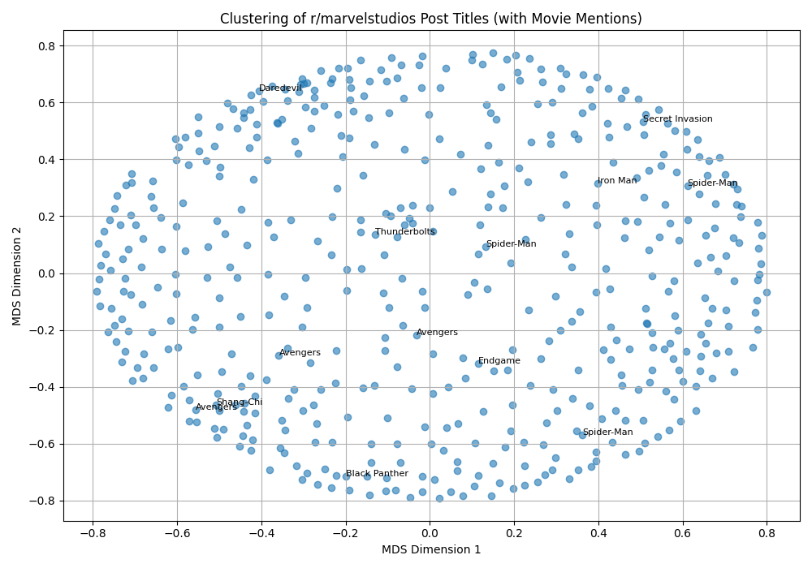

# Text-Analysis-Project

## Part 4: Project Writeup and Reflection

**1. Project Overview**
For this project, I used public domain texts from Project Gutenberg as my data source. I used <Alice's Adventures in Wonderland> and <Oliver Twist>. I accessed the texts using ```urllib.request``` to get the raw text directly from the urls.
To process the texts, I implemented several techniques. The first was text cleaning to convert all characters to lowercase and remove punctuation. Then I filtered out stopwords that didn't contribute to the analysis. Then I did a word frequency analysis to find the most frequently used words in '<Alice's Adventures in Wonderland>. After that, I applied the Levenshtein distance with the ```thefuzz``` library to compare how similar the two texts are, and finally I visualized those similarity scores with multidimensional scaling which was interesting to learn about. Throughout the project I learned more about all the different natural language processing techniques and how they can be applied to long data.


**2. Implementation**
To retrieve the data, I used ```urllib.request``` to download the full text files directly from Project Gutenberg. The preprocessing stage involved cleaning the text by converting it to lowercase, removing punctuation, and filtering out stopwords. To analyze the text, I used collections.Counter to compute word frequencies and thefuzz to calculate Levenshtein-based similarity scores between the books. These scores were then put into a similarity matrix, which I made into a dissimilarity matrix and visualized the relationship between the texts in the 2D space. 

One design decision I faced was how to compare the texts for similarity. I wasn't sure what the best approach would be, so I asked ChatGPT for advice on different ways to measure text similarity. It suggested a few methods, and based on that I decided to explore Levenshtein distance using the ```fuzz.ratio()``` function from thefuzz library. From there I followed ChatGPT's step-by-step guidance to implement the similarity calculation and build a matrix that could be used for visualization. I found this method effective to compare entire texts, and it helped me understand similarity scores and multidimensional scaling.

Another design decision I had to make was whether to structure my code in a single main script or separate each component - like clustering or similarity analysis - into different files. I chose to keep each section of analysis in its own file, even though it meant repeating some utility functions like ```fetch_text``` or ```clean_text```. I made the choice because it helped me stay organized and focus on one type of analysis at a time without getting overwhelmed by too many moving parts in one single script. It also made it easier for me to test and debug each part independently as I followed along with the ChatGPT suggestions step by step.

**3. Results** 
### Frequency Analysis
One of the first results I explored was the frequency analysis of <Alice's Adventures in Wonderland>. After cleaning the text and removing stopwords, I found the top 10 results were:
- said: 457
- alice: 383
- very: 140
- little: 126
- i: 123
- out: 113
- about: 100
- down: 98
- what: 94
- up: 94
Some of the results made sense in the context of the book, for others, I asked ChatGPT to help me undderstand why a word like "out" was repeated so much. Alice was expected, since she is the main character, and words like "little", "down", and "out", reflect the physical descriptions and movements that happen as Alice goes through magical worlds throughout the narrative.

### Sensitivity Analysis
To analyze the overall tone of Alice's Adventures in Wonderland I used the VADER sentiment tool in the NLTK library. The results showed that the text was 82.3% neutral, 9.4% positive, and 8.3% negative, with a compound score of 0.9999, showing positive overall sentiment.

This was an interesting result because I felt like the book included a lot of moments of confusion and conflict, which is probably why it is highly neutral. The high compound score shows the imaginative and playful tone of the book as a whole. Seeing these results helped me interpret the story from a data- perspective and understand better how sentiment tools interpret language.

### Text Clustering
When I compared <Alice's Adventures in Wonderland> and <Oliver Twist>, I found the two books were placed relatively far apart in the scatter plot, showing that even though they are both classic literature books, they are not highly similar in terms of content and structure. This still surprised me because they are both have a child as a main character, who is thrown into an unfamiliar or harsh environment. Both characters go through journeys that challenge their innocence and force them to grow. Similarly, both novels also have imaginary and exaggerated characters.



### Text Similarity

As mentioned previously, this low similarity score indicates that even though books are from the same literary period and feature young protagonists, their writing styles, themes, and vocabulary  are very different. The difference probably comes from the fact that Alice’s Adventures in Wonderland goes more toward magical fantasy, while Oliver Twist is based in social realism and darker themes. 

Results: 
Text Similarity:
Similarity between 'Alice's Adventures in Wonderland' and 'Oliver Twist': 26%

**4. Reflection**
One thing that went well in this project was how manageable the workflow became once I decided to split each part into its own script. I was a little overwhelmed when I saw the instructions, but after going through them and the sources to help understand/learn more about the tools we used I found it much easire. This helped me stay organized and on-track as I worked through each part. Another thing that helped was using GenAI to help problem-solve. I asked for clarification and step-by-step instructions when I didn't know how to implement something, and it helped me understand how new libraries and concepts worked. 

One challenge was deciding how I wanted to compare the two books, since there were many options to do it. All of them seemed good, so instead I focused on what type of analysis and results I wanted to get from this. I chose Levenshtein distance because it seemed relatively easy to implement but still gave meaningful insisghts. If I were to expand the project, I would try out other techniques that seemed more advanced like cosing similarity.

The project felt well organized for the time and tools we were given, and breaking it into small, testable parts worked well for debugging. My biggest takeaway from natural language processing methods is they can give meaningful results when applied thoughtfully, and it is an interesting approach to data analysis, rather than what I was used to doing, or the tools I have used in other classes to perform a sentiment analysis.
