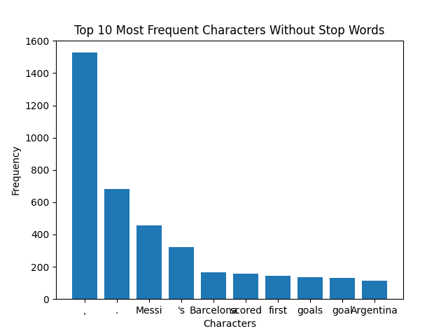

# Text Analysis Project

## Overview

The data is a short novel from Gutenberg.org. The program is designed to showcase the most important topic of a given text dataset. In this project, the dataset is the short novel, and each observation is a paragraph. The program will use an LDA topic model to output the most relevant topic of a given paragraph. The concept of topic modeling is commonly discussed in machine learning. The overall approach is inspired by these two scripts from Professor David:
- [`Text Mining Intro`](references/Text%20Mining%20Intro%20Fall%202023.R)
- [`Topic Modeling`](references/Topic%20Modeling%202023.R)

## Implementation

The entire program is designed in four parts: processing data (including data cleaning and stemming), finding parameters, creating the LDA model, and presentation. This process mimics the approach of the R code written by Professor David. The first part involves regular cleaning, including removing numbers, special characters, and other factors that do not contribute to the topic analysis of a novel. Note that the items removed are chosen based on the field of study. If the file were a math paper, a different cleaning process might be applied. Theoretically, I could create a dictionary of cleaning processes for different fields of study and use the corresponding one depending on the input data. However, due to time constraints, that idea was set aside. There can be different stop words for different fields, but for the same reasons, stemming and stopwords were handled using Potter's algorithm, which is the one used by Professor David in the R code.

The major part is the LDA model. The model we learned in machine learning is STM, but I couldn't find a corresponding package in Python. According to ChatGPT:

> "In Python, you can perform topic modeling using various libraries, such as gensim. Below, I'll outline the steps you would take to do topic modeling on your stemmed corpus. The process is conceptually similar to what you described in R with some syntactic and library differences."

As a result, I stuck with the LDA model provided by the gensim package. For context, topic modeling aims to find the most relevant set of words for a given document. The model needs a set number of topics to yield the result, so it will return the 'x' number of topics, set by me, that are most related to the document. However, I don't like that approach. So, I had this conversation with ChatGPT:
> 1. For the number of topics, is it possible to let the model decide how many there should be? For example, set a threshold that only if the topic passes through the threshold, then you use it. Like what we do in pruning a tree in random forest—only if the variance drop is significant enough, then we prune it.
> 2. For passes, is there a formula used to calculate how many passes are appropriate based on the number of words in the corpus?
> You can disagree with my approach.

And there was an answer about Coherence Score, which gives scores based on how interpretable the topics are. After running models with different numbers of topics, you can plot these metrics to identify a "knee point," which might indicate an optimal number of topics. That's the main part of the LDA model. I constructed a list of models using different numbers of topics, then found the Coherence Value (CV) for each model. The topic number that yields the highest CV is used for the model. Then I added a function to view the topic of a given document in the dataset. For this project, the dataset is the novel, so the topic analysis is for a given paragraph.

## Result

This graph of CV evaluation uses the `coherence_value_display()` function. The peak of the graph indicates the optimal number of topics to choose.

In another run, where I changed the parameters, the best model uses two topics. Let's look at the output:
The best model has 2 topics.

- Topic 0:
  - 'gregor': 0.028
  - 'would': 0.017
  - 'room': 0.014

- Topic 1:
  - 'gregor': 0.013
  - 'would': 0.010
  - 'could': 0.007

The program yields keywords for each relevant topic and their distribution. I then use this LDA model to analyze a single paragraph in the corpus: paragraph 32. The result is:

## Reflection

## Reflection

I believe this project has great practical use. The R code that we learned in machine learning was designed to analyze patent documents to measure criteria like non-obviousness or novelty. These criteria can be very subjective, and topic modeling helps a lot in making them more concrete and measurable. Similarly, the program I created can be used for tagging articles. For example, the corpus could be a dictionary of class codes and class descriptions. The program can automatically create tags for each class, facilitating a streamlined classification process.

ChatGPT definitely helped a lot, as every single line of code, including the markdown, was revised by ChatGPT. The part I struggled with the most was using the LDA model, with which I was not familiar at all. However, the logic is quite similar to STM, and after several conversations with ChatGPT, the issues were resolved. Plus, I finally learned how to use lambda to set a key, which is an essential aspect of functional programming that can simplify complex tasks.

By understanding the topics within texts, systems could better match content with readers' interests or help writers develop content strategies based on prevalent themes and concepts.

