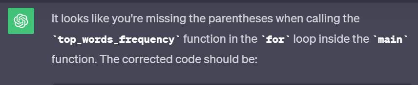

# Assignment 2 - Project Writeup and Reflection

## Project Overview
        The data source I used for this project was Wikipedia. I wanted my code to be able to parse through the content of any given Wikipedia page, that could be changed at any time, and have the resulting output be all of the text from that page. Most of the techniques I used to analyze the text came from the Natural Language Toolkit library in which I was able to import programs to help me remove stop words, tokenize the text, and find the frequency of characters. One of my main objectives from this project was to observe how much a text would change after the removal of stop words. Many stop words are common words that are used in everyday language, so I was interested to see how drastic of a change would occur once those common words were removed from the text.

## Implementation
        In order to accomplish my task of wanting to understand how the removal of stop words would affect the text I was analyzing, I needed to import the Natural Language Toolkit library, and from that library, find the appropriate programs for my analysis. The main programs I utilized were stopwords, word_tokenize, and FreqDist, and together I was able to use them to complete my objective. Furthermore, although I was able to write a function that told me the top ten characters/words in the text before and after the removal of all stop words, I thought that it would be more appealing to see that difference visually as well. Therefore, I used the matplotlib.pyplot library to help me create bar charts, where I could look at the difference side by side.
        During the process of writing out my functions, I was able to understand how helpful of a tool ChatGPT can be in the debugging process. Whereas normally it may take a long time to find where exactly in my code something goes wrong, ChatGPT is able to parse through it for me, find the issue, and explain to me why the code stopped working at that particular point. This method of having ChatGPT explain to me why my code failed was very helpful and made me realize that sometimes I have to slow down a bit, to ensure that I am referencing the correct things.

## Results
        The main text analysis I executed was to see the difference in the text once all of the stop words were removed. Stop words are those that are filtered out because they are insignificant, and do not provide much data. I compared the length of the texts, the top ten most frequent characters, and created bar charts of those top ten most frequent characters before and after the removal of the stop words from the text. Before removing the stop words, the total number of characters in the Wikipedia page for Lionel Messi was 132,613, and after removing all of the stop words, that number reduced to 102,497.
        In regards to the top ten most frequent characters/words, if we are to ignore the commas and periods, only one word stayed from before the removal of stop words to the after, being "Messi." From these results, I created bar charts, which can be seen below, as it makes it much easier to visualize that difference. As we can see from the charts, "Messi," which ranked ninth in the original bar chart, shoots up as the third most common character/word once the stop words are all removed.

## Reflection
        In my opinion, a lot went quite well, as I was able to obtain the results I was aiming to get at the start of the project. As mentioned previously, I really wanted to analyze how the removal of stop words would affect the text, as this was something that was gone over in one of my other classes this year, Quantitative Methods of Machine Learning. In that class, we discussed text analysis a bit as well, and it was interesting to me in how key it was to remove stop words in order to acquire the more important information. Seeing how the removal of stop words affected the data I was working with in that class led me to want to see how it would affect the text I analyzed for this project. Overall, I think my project was scoped well and I was truly able to see the changes in the text before and after removing the stop words.
        One thing I could have improved, however, was maybe taking a bit more time to debug my own code and see where the underlying issues were. Many times, the issue would just be that I would reference the wrong variable, or function name, and instead of trying to find that myself, I would have ChatGPT help me find where the issue was. I think I should have tried a bit more to find the issue, write it down and then ask ChatGPT to see if me and ChatGPT came to the same conclusion of where the error was. Something I wish that I started doing earlier is having ChatGPT really explain to me why my code was not running, or having it read through my code line by line and explain every step. For the most part, I would only ask ChatGPT to read through my code, find the errors, and just fix it. However, I think it is more beneficial if I prompt ChatGPT to go through the code and explain every step so I can see if I truly understand what I wrote and if ChatGPT understands it in the same manner.