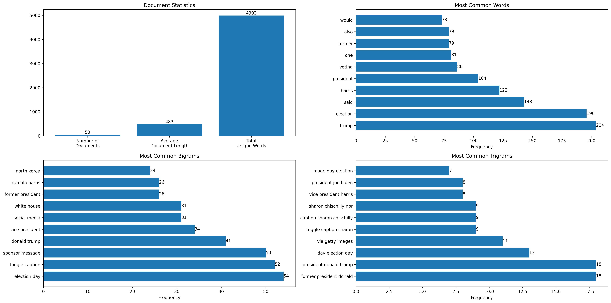
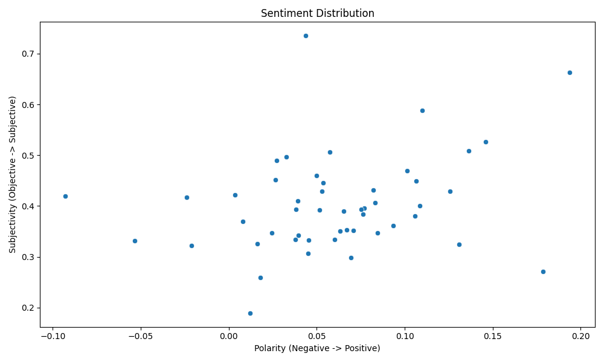
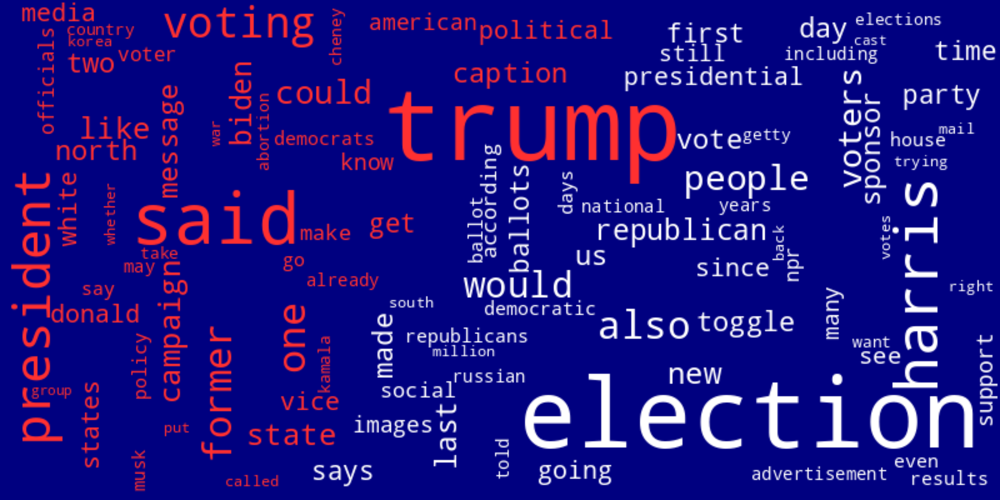
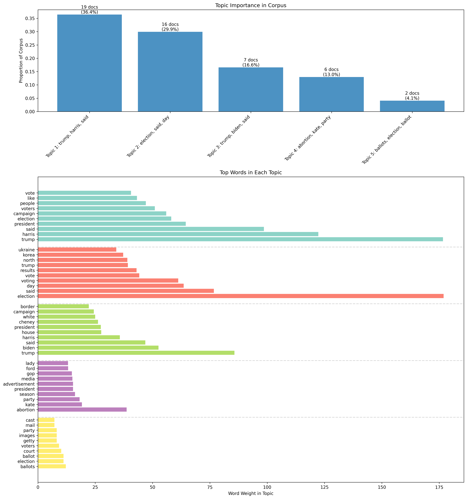

## Project Writeup and Reflection

**1. Project Overview** (~1 paragraph)

What data source(s) did you use? What technique(s) did you use to process or analyze them? What did you hope to create or learn through this project?

For this project, I used the News API to fetch election-related news articles. I then noticed that the News API only provides a small snippet of the article, but I found newspaper3k which allowed me to download the full articles. After getting the articles from News API, I took the json, converted it to a pandas dataframe, downloaded the full articles, and removed the stop words to get it ready for analysis. I then used a bunch of techniques to analyze the data, including word frequency analysis, n-gram analysis, topic modeling, sentiment analysis, and text similarity analysis. 

**2. Implementation** (~1-2 paragraphs)

Describe your implementation at a system architecture level. You should NOT walk through your code line by line, or explain every function (we can get that from your docstrings). Instead, talk about the major components, algorithms, data structures and how they fit together. You should also discuss at least one design decision where you had to choose between multiple alternatives, and explain why you made the choice. Use shared links and/or screenshots to describe how you used GenAI tools to help you or learn new things.

For the implementation, I used a class-based approach with 3 modules to organize the project. The first module is data_harvesting.py, containing the NewsDataHarvester class, and this class has all of the methods that interact with the News API and gather our data. It has functionality to use the other News API endpoints, but I only ended up using the get_everything endpoint, which fetches all articles that match our search query. The second module is data_processing.py, and contains the NewsDataProcessor class, which has all of the methods to process our news data and get it ready for analysis. The News API only gives us a truncated version of the article, and for text analysis, we of course want the whole document to have all of that data. Because of this, I first used newspaper3k, a library that allows us to download the full news article content from the url, parses it, and makes sure it is in a format that we can use for our analysis. Using GenAI, I described the problem I had with the truncated article, and it helped me discover the newspaper3k library, and I was able to use Articel from newspaper to help me get all of the data that I needed. Without GenAI, I would've had a harder time trying to figure out how to implement downloading the full articles to be able to analyze them. Then, since I got a lot of experience using pandas as part of my internship this summer, I converted the json to a pandas dataframe to use with our analysis. As a part of the conversion process to a dataframe, we ensure that only successfully downloaded articles are added, limit it to 50 articles, and then we get rid of stop words as well, using NLTK. Then, I also save it to a json file so I can re-use the data without having to download it again, since that is a timely process. I had an option here of pickling the data, or using json to store the results, and I've used both in the past. I prefer to use json as it is more readable, and in my experience, easier to use, so I chose to go with json. The results of our API calls also came in json format, so it was easier to deal with in this manner. I appreciate a lot of the data that pickling provides, but the readability and ease of json was what made me pick it in this case. My final module is text_analysis.py, which consists of the TextAnalyzer class, and this handles all of our text analysis, after we are able to harvest and process our data to be ready for these analysis steps.
I used many different libraries for all the analysis approaches that I took. I used numpy for some of the calculations, making arrays, and helping to plot linear spaces. I used Counter from collections to help with word frequency. I also used NLTK to help remove stopwords, to tokenize the corpus, and to do n-grams analysis to find the most common bigrams and trigrams. Scikit-learn also then came in handy to help with the tf-idf calculations, and some other scaling techniques. It also helped us do topic modeling with the LDA method. Textblob was then used for sentiment analysis, and helped us find the polarity and subjectivity of the documents in our corpus. Matplotlib and Seaborn helped us visualize our data in the many visualizations that I created, and having experience with both I was comfortable with using them. We then used wordcloud to make an amazing wordcloud. The structure of this class is fairly simple as we just go through and do all of the calculations and make the visualizations that I wanted to get for analysis. 

**3. Results** (~1-3 paragraphs + figures/examples)

Present what you accomplished in your project:

- If you did some text analysis, what interesting things did you find? Graphs or other visualizations may be very useful here for showing your results.
- If you created a program that does something interesting (e.g. a Markov text synthesizer), be sure to provide a few interesting examples of the program's output.

I analyzed the 50 most relevant articles after querying for 'election' in the past 3 days, and here are some of the interesting things I found:

The summary statistics were interesting, as we see mentions of Trump were higher than Harris, and was even higher than the word election itself! There was also an interesting common bigram in the data, 'north korea', which I would not have expected to see in election-related articles this close to the election.

Moving onto the sentiment analysis, it was also surprising to see that most of these articles had positive polarity. I expected there to be more neutral and negative articles, and was interested to see majority being positive. 

One of my favorite things that I produced from this analysis was the wordcloud. I made it red, white, and blue themed as well, to match our USA-themed colors of course. There were again some interesting commonly mentioned words across these 50 articles, like 'russian' and 'korea'. Additionally, 'trump' was very big on the wordcloud, and harris/ kamala was much smaller and not even noticable, which may be reflective of just how much coverage Trump is getting closer to the election, as he is a much more polarizing figure than Harris, which realistically makes more sense. 

Finally, one of the other coolest things that I got from my analysis was the topic modeling that I did. I specified for LDA to find 5 topics, with the top words in the top topic being "trump, harris, said, president, election, campaign, voters, people" which makes a lot of sense. The second topic was interesting, the one in red, as it mentions Ukraine, North Korea, and Trump, but not Harris, and also focuses on results. It was interesting to see the different 5 topics that LDA found, and these words that were most common to each topic, having the most word weight in the topic. 

**4. Reflection** (~1-2 paragraphs)

From a process point of view, what went well? What was the biggest challenge? How did you solve it? What could you improve? Was your project appropriately scoped? Did you have a good testing plan?

From a learning perspective, what was your biggest takeaway from this project? How did GenAI tools help yo? How will you use what you learned going forward? What do you wish you knew beforehand that would have helped you succeed?

From a process point of view, everything after the data harvesting went smoothly. I knew pretty quickly how I was going to analyze the data, and process it to be ready for analysis (take the json, put it into a dataframe, get rid of stopwords, etc.) but the hard part was getting the articles themselves. I first had a challenge with the article contents, as I thought that the NewsAPI would give me the full article content. However, it was truncated, and only gave around 60-70 words on average, which was not enough to do detailed analysis with. I also had some troubles with getting here in the first place, needing to make sure my query was in the right format and that I had the endpoint setup correctly. After realizing I had to get the full article contents, I turned to GenAI for help, and luckily found newspaper3k, which then helped me get the full article contents, and add them to my data. While this first part of the project was a bit rough, it was once again another good learning experience of how to deal with a roadblock, and use GenAI to swiftly help me recover and get back on track with the project. 

From then on, everything else went very well! I have a lot of experience working with json and pandas together, so processing the data and getting it ready to be used for analysis by all of our other libaries was not difficult. Besides just pandas, I've also used all these other libaries for different ML projects in the past, so it was nice to use them again, and I didn't really run into too many issues. Beforehand, I wish I knew that the NewsAPI only gave truncated articles, as I would've thought about how to incorporate that beforehand, and I'm sure could've saved myself some time. Overall, I think I scoped out the project well and had everything well-planned out though, and tested everything as I went along which I normally do for all of my projects. 

All around, this project was a lot of fun, and was a nice opportunity to do some analysis on real data with the election coming up! I had a great time working on this project, and learned a lot from it. 

---